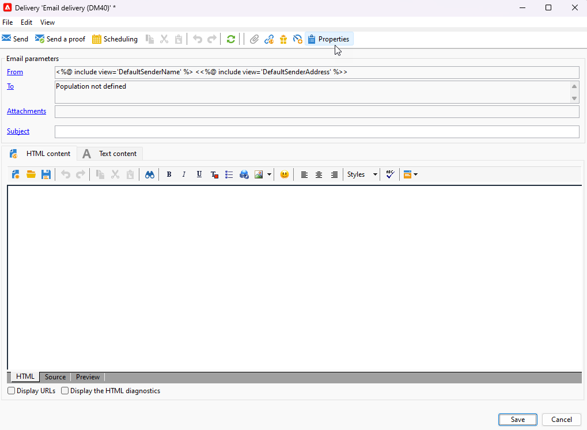
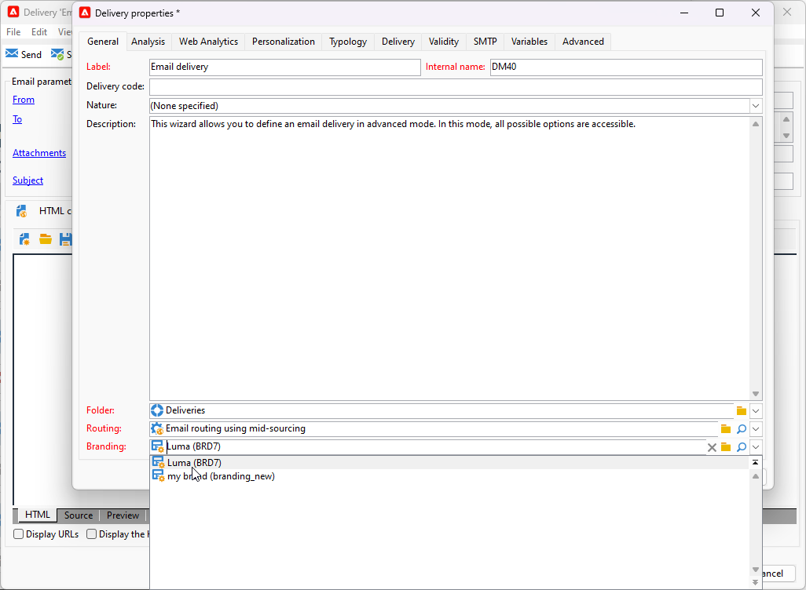

# Zuweisen Ihrer Marke {#branding-assign}

## Marken mit einer Vorlage verknüpfen {#linking-a-brand-to-a-template}

Um die für eine Marke definierten Parameter zu nutzen, muss diese mit einer Versandvorlage verknüpft sein. Dafür ist die Erstellung oder Anpassung einer Vorlage erforderlich.

Ihre Vorlage wird mit der Marke verknüpft. Im E-Mail-Editor werden die für die Marke konfigurierten Daten in den Feldern **Standard-E-Mail-Adresse des Absenders**, **Name des Standard-Absenders** oder **Logo** verwendet.

>[!BEGINTABS]

>[!TAB Adobe Campaign V8]

Um eine Versandvorlage zu erstellen, können Sie eine integrierte Vorlage duplizieren, einen bestehenden Versand in eine Vorlage konvertieren oder eine Versandvorlage von Grund auf erstellen. [Weitere Informationen](https://experienceleague.adobe.com/de/docs/campaign/campaign-v8/send/create-templates)

Nach der Erstellung Ihrer Vorlage können Sie sie mit einer Marke verknüpfen. Gehen Sie dazu folgendermaßen vor:

1. Navigieren Sie im Adobe Campaign-Explorer zu **[!UICONTROL Ressourcen]** `>` **[!UICONTROL Vorlagen]** `>` **[!UICONTROL Versandvorlagen]**.

1. Wählen Sie eine Versandvorlage aus oder duplizieren Sie eine vorhandene.

   

1. Rufen Sie die **[!UICONTROL Eigenschaften]** der ausgewählten Versandvorlage auf.

   

1. Wählen Sie auf der Registerkarte **[!UICONTROL Allgemein]** aus der Dropdown-Liste **[!UICONTROL Branding]** Ihre Marke aus.

   

1. Wählen Sie nach der Konfiguration **OK** aus.

Sie können diese Vorlage jetzt zum Durchführen Ihrer Sendungen verwenden.

>[!TAB Adobe Campaign Web]

Um eine Versandvorlage zu erstellen, können Sie eine integrierte Vorlage duplizieren, einen bestehenden Versand in eine Vorlage konvertieren oder eine Versandvorlage von Grund auf erstellen. [Weitere Informationen](https://experienceleague.adobe.com/de/docs/campaign-web/v8/msg/delivery-template)

Nach der Erstellung Ihrer Vorlage können Sie sie mit einer Marke verknüpfen. Gehen Sie dazu folgendermaßen vor:

1. Navigieren Sie im linken Menü **[!UICONTROL Sendungen]** zur Registerkarte **[!UICONTROL Vorlagen]** und wählen Sie eine Versandvorlage aus.

   

1. Klicken Sie auf **[!UICONTROL Einstellungen]**.

   

1. Greifen Sie auf der Registerkarte **[!UICONTROL Versand]** auf das Feld **[!UICONTROL Branding]** zu und wählen Sie die Marke aus, die Sie mit der Vorlage verknüpfen möchten.

   

1. Bestätigen Sie Ihre Auswahl und speichern Sie die Vorlage.

Sie können diese Vorlage jetzt zum Durchführen Ihrer Sendungen verwenden.

>[!ENDTABS]

## Zuweisen einer Marke zu Ihrem Versand {#assigning-a-brand-to-an-email}

>[!BEGINTABS]

>[!TAB Adobe Campaign V8]

Gehen Sie wie folgt vor, um einen neuen eigenständigen Versand zu erstellen.

1. Um einen neuen Versand zu erstellen, navigieren Sie zur Registerkarte **[!UICONTROL Kampagnen]**.

1. Klicken Sie auf **[!UICONTROL Sendungen]** und anschließend auf die Schaltfläche **[!UICONTROL Erstellen]** oberhalb der Liste der vorhandenen Sendungen.

   

1. Wählen Sie eine Versandvorlage aus.

1. Rufen Sie die **[!UICONTROL Eigenschaften]** der ausgewählten Versandvorlage auf.

   

1. Wählen Sie auf der Registerkarte **[!UICONTROL Allgemein]** aus der Dropdown-Liste **[!UICONTROL Branding]** Ihre Marke aus.

   

1. Wählen Sie nach der Konfiguration **OK** aus.

1. Personalisieren Sie Ihre Sendungen weiter. Weitere Informationen zum Erstellen einer E-Mail finden Sie im Abschnitt [Entwerfen und Senden von E-Mails](https://experienceleague.adobe.com/en/docs/campaign-web/v8/msg/email/create-email).

>[!TAB Adobe Campaign Web]

Gehen Sie wie folgt vor, um einen neuen eigenständigen Versand zu erstellen.

1. Navigieren Sie in der linken Leiste zum Menü **[!UICONTROL Sendungen]** und klicken Sie auf die Schaltfläche **[!UICONTROL Versand erstellen]**.

   

1. Wählen Sie als Kanal „E-Mail“ oder „Push-Benachrichtigung“ aus und wählen Sie eine Versandvorlage aus der Liste.

1. Klicken Sie zur Bestätigung auf **[!UICONTROL Versand erstellen]**.

1. Klicken Sie auf der Seite **[!UICONTROL Eigenschaften]** auf **[!UICONTROL Einstellungen]**.

   

1. Greifen Sie auf der Registerkarte **[!UICONTROL Versand]** auf das Feld **[!UICONTROL Branding]** zu.

   

1. Wählen Sie die Marke aus, die Sie mit der Vorlage verknüpfen möchten.

   

1. Personalisieren Sie Ihre Sendungen weiter. Weitere Informationen zum Erstellen einer E-Mail finden Sie im Abschnitt [Erstellen Ihrer ersten E-Mail](https://experienceleague.adobe.com/en/docs/campaign-web/v8/msg/email/create-email).

>[!ENDTABS]
