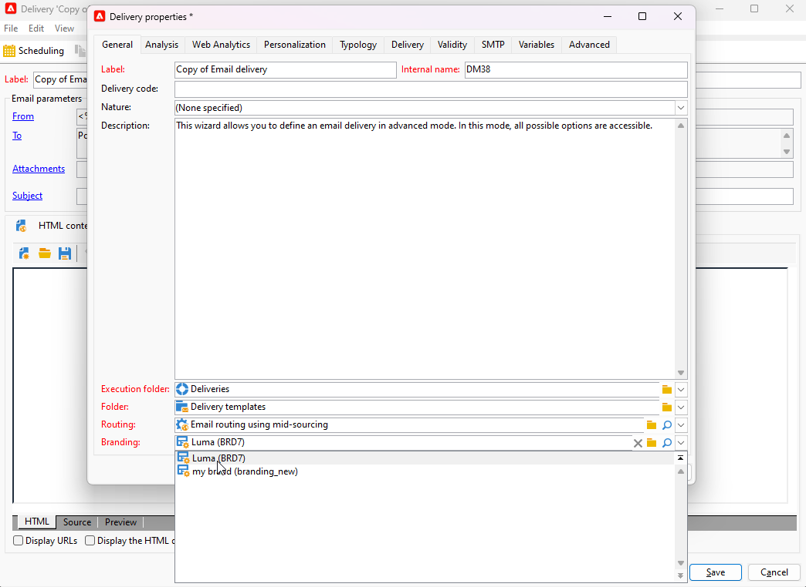

# Marke zuweisen {#branding-assign}

## Marken mit einer Vorlage verknüpfen {#linking-a-brand-to-a-template}

Um die für eine Marke definierten Parameter verwenden zu können, muss sie mit einer Versandvorlage verknüpft sein. Dafür ist die Erstellung oder Anpassung einer Vorlage erforderlich.

Ihre Vorlage wird mit der Marke verknüpft. Im E-Mail-Editor werden die für die Marke konfigurierten Daten in den Feldern **Standard-E-Mail-Adresse des Absenders**, **Name des Standard-Absenders** oder **Logo** verwendet.

>[!BEGINTABS]

>[!TAB Adobe Campaign V8]

Um eine Versandvorlage zu erstellen, können Sie eine integrierte Vorlage duplizieren, einen existierenden Versand in eine Vorlage konvertieren oder eine neue Versandvorlage erstellen. [Weitere Informationen](https://experienceleague.adobe.com/en/docs/campaign/campaign-v8/send/create-templates)

Nach der Erstellung Ihrer Vorlage können Sie sie mit einer Marke verknüpfen. Gehen Sie dazu folgendermaßen vor:

1. Navigieren Sie im Adobe Campaign-Explorer zu **[!UICONTROL Ressourcen]** `>` **[!UICONTROL Vorlagen]** `>` **[!UICONTROL Versandvorlagen]** .

1. Wählen Sie eine Versandvorlage aus oder duplizieren Sie eine vorhandene.

   

1. Rufen Sie die **[!UICONTROL Eigenschaften]** Ihrer ausgewählten Versandvorlage auf.

   

1. Wählen Sie auf der Registerkarte **[!UICONTROL Allgemein]** Ihre Marke aus der Dropdownliste **[!UICONTROL Branding]** aus.

   

1. Wählen Sie nach der Konfiguration **OK** aus.

Jetzt können Sie diese Vorlage verwenden, um Ihre Sendungen durchzuführen.

>[!TAB Adobe Campaign Web]

Um eine Versandvorlage zu erstellen, können Sie eine integrierte Vorlage duplizieren, einen existierenden Versand in eine Vorlage konvertieren oder eine neue Versandvorlage erstellen. [Weitere Informationen](https://experienceleague.adobe.com/de/docs/campaign-web/v8/msg/delivery-template)

Nach der Erstellung Ihrer Vorlage können Sie sie mit einer Marke verknüpfen. Gehen Sie dazu folgendermaßen vor:

1. Gehen Sie zum Tab **[!UICONTROL Vorlagen]** , wählen Sie im linken Menü **[!UICONTROL Sendungen]** eine Versandvorlage aus.

   

1. Klicken Sie auf **[!UICONTROL Einstellungen]**.

   

1. Rufen Sie im Tab **[!UICONTROL Versand]** das Feld **[!UICONTROL Branding]** auf und wählen Sie die Marke aus, die Sie mit der Vorlage verknüpfen möchten.

   

1. Bestätigen Sie Ihre Auswahl und speichern Sie die Vorlage.

Jetzt können Sie diese Vorlage verwenden, um Ihre Sendungen durchzuführen.

>[!ENDTABS]

## Marke Ihrem Versand zuweisen {#assigning-a-brand-to-an-email}

>[!BEGINTABS]

>[!TAB Adobe Campaign V8]

Gehen Sie wie folgt vor, um einen neuen eigenständigen Versand zu erstellen.

1. Gehen Sie zum Erstellen eines neuen Versands zum Tab **[!UICONTROL Kampagnen]** .

1. Klicken Sie auf **[!UICONTROL Sendungen]** und dann auf die Schaltfläche **[!UICONTROL Erstellen]** oberhalb der Liste der bestehenden Sendungen.

   

1. Wählen Sie eine Versandvorlage aus.

1. Rufen Sie die **[!UICONTROL Eigenschaften]** Ihrer ausgewählten Versandvorlage auf.

   

1. Wählen Sie auf der Registerkarte **[!UICONTROL Allgemein]** Ihre Marke aus der Dropdownliste **[!UICONTROL Branding]** aus.

   

1. Wählen Sie nach der Konfiguration **OK** aus.

1. Personalisieren Sie Ihre Sendungen weiter. Weiterführende Informationen zur Erstellung einer E-Mail finden Sie im Abschnitt [E-Mails entwerfen und senden](https://experienceleague.adobe.com/en/docs/campaign-web/v8/msg/email/create-email) .

>[!TAB Adobe Campaign Web]

Gehen Sie wie folgt vor, um einen neuen eigenständigen Versand zu erstellen.

1. Navigieren Sie in der linken Leiste zum Menü **[!UICONTROL Sendungen]** und klicken Sie auf die Schaltfläche **[!UICONTROL Versand erstellen]** .

   

1. Wählen Sie E-Mail oder Push-Benachrichtigung als Kanal aus und wählen Sie eine Versandvorlage aus der Liste aus.

1. Klicken Sie zur Bestätigung auf **[!UICONTROL Versand erstellen]**.

1. Klicken Sie auf der Seite **[!UICONTROL Eigenschaften]** auf **[!UICONTROL Einstellungen]**.

   

1. Rufen Sie im Tab **[!UICONTROL Versand]** das Feld **[!UICONTROL Branding]** auf.

   

1. Wählen Sie die Marke aus, die Sie mit der Vorlage verknüpfen möchten.

   

1. Personalisieren Sie Ihre Sendungen weiter. Weiterführende Informationen zur Erstellung einer E-Mail finden Sie im Abschnitt [Erste E-Mail erstellen](https://experienceleague.adobe.com/en/docs/campaign-web/v8/msg/email/create-email) .

>[!ENDTABS]
