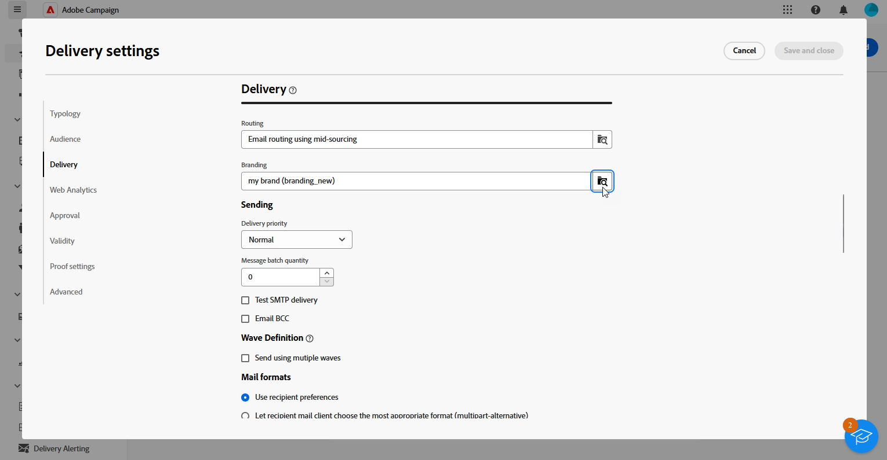

# Marke zuweisen {#branding-assign}

## Marken mit einer Vorlage verknüpfen {#linking-a-brand-to-a-template}

Um die für eine Marke definierten Parameter verwenden zu können, muss diese mit einer Versandvorlage verknüpft sein. Dafür ist die Erstellung oder Anpassung einer Vorlage erforderlich.

Ihre Vorlage wird mit der Marke verknüpft. Im E-Mail-Editor werden die für die Marke konfigurierten Daten in den Feldern **Standard-E-Mail-Adresse des Absenders**, **Name des Standard-Absenders** oder **Logo** verwendet.

>[!BEGINTABS]

>[!TAB Adobe Campaign v8]

Um eine Versandvorlage zu erstellen, können Sie eine integrierte Vorlage duplizieren, einen vorhandenen Versand in eine Vorlage konvertieren oder eine neue Versandvorlage erstellen. [Weitere Informationen](https://experienceleague.adobe.com/de/docs/campaign/campaign-v8/send/create-templates)

Nach der Erstellung Ihrer Vorlage können Sie sie mit einer Marke verknüpfen. Gehen Sie dazu folgendermaßen vor:

1. Adobe Campaign Navigieren Sie im **[!UICONTROL -Explorer zu Ressourcen]** `>` **[!UICONTROL Vorlagen]** `>` **[!UICONTROL Versandvorlagen]** .

1. Versandvorlage auswählen oder eine vorhandene duplizieren.

   

1. Rufen Sie **[!UICONTROL Eigenschaften]** der ausgewählten Versandvorlage auf.

   

1. Wählen **[!UICONTROL auf der Registerkarte]** Allgemein“ Ihre Marke aus der Dropdown-Liste **[!UICONTROL Branding]** aus.

   

1. Klicken Sie nach der Konfiguration auf **OK**.

Sie können diese Vorlage jetzt zum Senden Ihrer Sendungen verwenden.

>[!TAB Adobe Campaign Web]

Um eine Versandvorlage zu erstellen, können Sie eine integrierte Vorlage duplizieren, einen vorhandenen Versand in eine Vorlage konvertieren oder eine neue Versandvorlage erstellen. [Weitere Informationen](https://experienceleague.adobe.com/de/docs/campaign-web/v8/msg/delivery-template)

Nach der Erstellung Ihrer Vorlage können Sie sie mit einer Marke verknüpfen. Gehen Sie dazu folgendermaßen vor:

1. Navigieren Sie im linken Menü von **[!UICONTROL Sendungen]** zur Registerkarte **[!UICONTROL Vorlagen]** und wählen Sie eine Versandvorlage aus.

   

1. Klicken Sie auf **[!UICONTROL Einstellungen]**.

   

1. Öffnen Sie auf **[!UICONTROL Registerkarte]** das Feld **[!UICONTROL Branding]** und wählen Sie die Marke aus, die Sie mit der Vorlage verknüpfen möchten.

   

1. Bestätigen Sie Ihre Auswahl und speichern Sie die Vorlage.

Sie können diese Vorlage jetzt zum Senden Ihrer Sendungen verwenden.

>[!ENDTABS]

## Zuweisen einer Marke zu Ihrem Versand {#assigning-a-brand-to-an-email}

>[!BEGINTABS]

>[!TAB Adobe Campaign v8]

Gehen Sie wie folgt vor, um einen neuen eigenständigen Versand zu erstellen.

1. Um einen neuen Versand zu erstellen, gehen Sie zur Registerkarte **[!UICONTROL Kampagnen]** .

1. Klicken Sie **[!UICONTROL Sendungen]** und klicken Sie auf die Schaltfläche **[!UICONTROL Erstellen]** oberhalb der Liste der vorhandenen Sendungen.

   

1. Versandvorlage auswählen.

1. Rufen Sie **[!UICONTROL Eigenschaften]** der ausgewählten Versandvorlage auf.

   

1. Wählen **[!UICONTROL auf der Registerkarte]** Allgemein“ Ihre Marke aus der Dropdown-Liste **[!UICONTROL Branding]** aus.

   

1. Klicken Sie nach der Konfiguration auf **OK**.

1. Personalisieren Sie Ihre Sendungen weiter. Weitere Informationen zum Erstellen einer E-Mail finden Sie im Abschnitt [Entwerfen und Senden von E](https://experienceleague.adobe.com/en/docs/campaign-web/v8/msg/email/create-email)Mails“.

>[!TAB Adobe Campaign Web]

Gehen Sie wie folgt vor, um einen neuen eigenständigen Versand zu erstellen.

1. Navigieren Sie zum Menü **[!UICONTROL Sendungen]** in der linken Leiste und klicken Sie auf die Schaltfläche **[!UICONTROL Versand erstellen]**.

   

1. Wählen Sie E-Mail oder Push-Benachrichtigung als Kanal und wählen Sie eine Versandvorlage aus der Liste.

1. Klicken Sie zur Bestätigung auf **[!UICONTROL Versand erstellen]**.

1. Klicken Sie auf der **[!UICONTROL Eigenschaften]**-Seite auf **[!UICONTROL Einstellungen]**.

   

1. Greifen Sie auf **[!UICONTROL Registerkarte]** auf das Feld **[!UICONTROL Branding]** zu.

   

1. Wählen Sie die Marke aus, die Sie mit der Vorlage verknüpfen möchten.

   

1. Personalisieren Sie Ihre Sendungen weiter. Weitere Informationen zum Erstellen einer E-Mail finden Sie im Abschnitt [Erstellen Ihrer ersten E-Mail](https://experienceleague.adobe.com/en/docs/campaign-web/v8/msg/email/create-email).

>[!ENDTABS]
