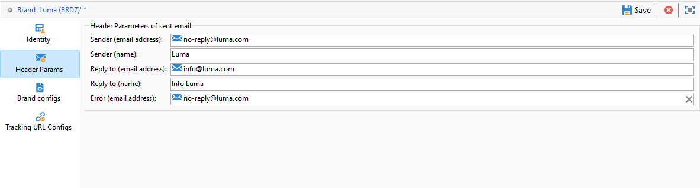

# Konfigurieren von Marken {#branding-configure}

>[!IMPORTANT]
>
>Marken können nicht vom Endnutzer erstellt oder geändert werden. Diese Aktionen müssen von einem technischen Adobe-Campaign-Administrator vorgenommen werden. Bei Fragen wenden Sie sich an die Adobe-Kundenunterstützung.

In Adobe Campaign V8 finden Sie Marken im Menü **[!UICONTROL Administration > Plattform > Branding]** .

Eine **[!UICONTROL Marke]** wird durch die folgenden Eigenschaften definiert:

* eine **[!UICONTROL Identität]**, durch die Ihre Marke definiert und personalisiert wird. Dieser Bereich weist folgende Felder auf:

   * **[!UICONTROL Titel]** (in der Benutzeroberfläche sichtbar)
   * **[!UICONTROL Kennung]**
   * **[!UICONTROL Markenname]**
   * **[!UICONTROL URL]** und **[!UICONTROL Titel]** der Marken-Website
   * **[!UICONTROL Markenlogo]**

  

* **[!UICONTROL In Header-Parameter für ausgehende E-Mails]** kann der Inhalt für die Empfänger Ihrer Kampagnen personalisiert werden. Dieser Bereich weist folgende Felder auf:

   * **[!UICONTROL Absender (E-Mail)]** mit der E-Mail-Adresse der Marke.
   * **[!UICONTROL Absender (Name)]** mit dem Namen der Marke.
   * **[!UICONTROL Antwortadresse (E-Mail)]** mit der E-Mail-Adresse, an die der Kunde eine Antwort senden kann.
   * **[!UICONTROL Antwortadresse (Name)]** mit dem Namen der Marke.
   * **[!UICONTROL Fehler (E-Mail)]** mit der E-Mail-Adresse, die im Falle eines Fehlers verwendet werden soll.

  >[!IMPORTANT]
  >
  >Sollten nach der Aktualisierung der E-Mail-Header-Parameter Name und E-Mail-Adresse des Absenders in einer neuen, auf dieser Vorlage basierenden E-Mail nicht geändert sein, überprüfen Sie die erweiterten Parameter der Vorlage.

  

* **[!UICONTROL Markenkonfigurationen]** definiert die Server, die zum Tracking auch für den Zugriff auf Landingpages verwendet werden. Dieser Bereich weist folgende Felder auf:

   * **[!UICONTROL Marken-Subdomain]** bezieht sich auf die spezifische Subdomain-URL für diese Marke, die von Adobe zur Delegierung angefordert wird.

  Beachten Sie, dass die Konfiguration für Tracking-, Mirror- und Anwendungsserver in separaten externen Konten gespeichert ist, die mit dem Routing verknüpft sind. Diese Einstellungen werden während der Bereitstellung angewendet und sollten nicht geändert werden. Um URLs anzuzeigen, greifen Sie von Ihrem externen Konto aus auf die Registerkarte **[!UICONTROL Branding-Präfixe]** zu.

  

* Das Menü **[!UICONTROL URL-Konfigurationen tracken]** ermöglicht es Ihnen, das URL-Tracking zu verbessern, indem Sie zusätzliche Parameter für die Integration mit Webanalysetools wie Adobe Analytics und Google Analytics definieren.

  Verwenden Sie das Menü **[!UICONTROL Zusätzliche URL-Parameter]** , um zusätzliche Parameter als Schlüssel-Wert-Paare zusammen mit ihren Anwendbarkeitsbedingungen zu erstellen. Jeder Parametername muss eindeutig und nicht leer sein und jeder Parameterwert darf nicht leer sein. Die Anwendbarkeitsbedingung kann leer sein, aber keiner dieser Werte kann JST-Tags enthalten.

  Diese Parameter werden auf getrackte URLs angewendet, die mit jedem Domänennamen übereinstimmen, der in der **[!UICONTROL Liste der Domänennamen]** angegeben ist und reguläre Ausdrücke enthalten kann.
