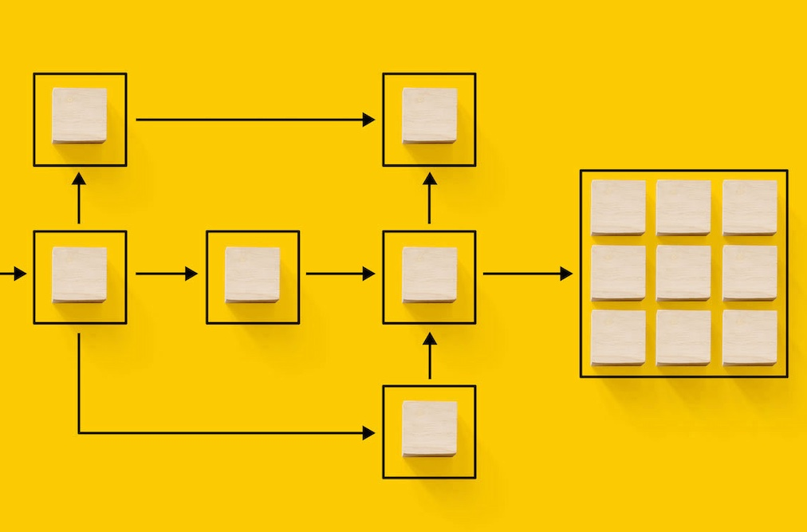

# Umstellung der Campaign Standard auf Campaign v8 {#triggers-home}

Als Campaign Standard, der zu Campaign v8 wechselt, können Sie jetzt von der neuen Adobe Campaign-Webbenutzeroberfläche und der leistungsstarken v8-Konsole profitieren. Die Umstellung ist scheinbar und ermöglicht die Verwendung aller intuitiven Funktionen, die die Erstellung personalisierter kanalübergreifender Kampagnen vereinfachen. Die Campaign-Webbenutzeroberfläche bietet außerdem eine verbundene Arbeitsfläche mit Adobe Experience Platform für ein einheitliches Erlebnis.

Darüber hinaus wird dieser Übergang viele Vorteile mit sich bringen:

* Robuste IT-Infrastruktur
* Verbesserte Unterstützung
* Integration mit Adobe Experience Platform
* Konsistente Benutzeroberfläche und Erlebnis

Weitere Informationen zu den wichtigsten Funktionen und Konzeptunterschieden finden Sie unter [diese Seite](https://experienceleague.adobe.com/en/docs/campaign-web/v8/rn/acs-migration.html).

## Neuerungen

Hier erhalten Sie einen Überblick über alle Funktionen und Funktionen von [Campaign-Webbenutzeroberfläche](https://experienceleague.adobe.com/de/docs/campaign-web/v8/campaign-web-home) und [Campaign v8](https://experienceleague.adobe.com/de/docs/campaign/campaign-v8/campaign-home).

Damit Sie den Übergang nahtlos durchführen können, haben wir wichtige Funktionen von Campaign Standard zu v8 hinzugefügt:

>[!BEGINTABS]

>[!TAB Dynamische Berichterstellung]

Sie können auf die dynamische Berichterstellung zugreifen, die vollständig anpassbare und in Echtzeit aktualisierte Berichte bietet, um die Wirkung Ihrer Marketing-Aktivitäten zu messen.

>[!TAB Zentralisiertes Branding]

Ihre technischen Administratoren können jetzt eine oder mehrere Marken definieren, um die Parameter zu zentralisieren, die sich auf die Identität einer Marke auswirken.

>[!TAB Rest-APIs]

Sie können REST-APIs verwenden, um Integrationen für Adobe Campaign zu erstellen und Ihr eigenes Ökosystem zu erstellen, indem Sie Adobe Campaign mit den von Ihnen verwendeten Technologien verbinden.

>[!ENDTABS]

## Beginnen Sie mit den Grundlagen

<table style="table-layout:fixed">
  <tr style="border: 0;">
    <td>
    
    
<strong>Erkunden der neuen Benutzeroberfläche</strong> 

    </td>
    <td>
    
    
<strong>Überarbeitete Arbeitsablauffläche</strong> 
 
    </td>
    <td>
    
    
<strong>Kennenlernen von E-Mail-Designer</strong> 
    
</td>
    <td>
    
    
<strong>Inhalte dynamisch gestalten</strong> 

    </td>
  </tr>
  <tr style="border: 0;">
    <td align="center"></td>
    <td align="center"></td>
    <td align="center"></td>
    <td align="center"></td>
    </tr>
</table>
