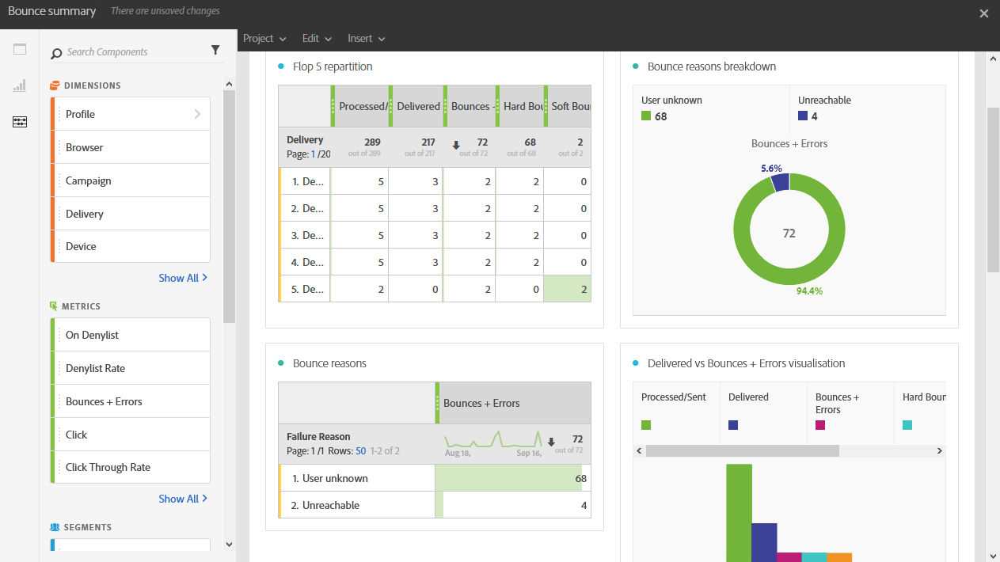

# Bounces{#bounce-summary}

Dieser Bericht zeigt die Gesamtheit aller Statistiken zu bei Sendungen aufgetretenen Hard- und Softbounces und der automatischen Bounce-Verarbeitung.

Für jede Tabelle werden Zusammenfassungen und Grafiken erstellt. Die Darstellung dieser Details können Sie in deren Einstellungen ändern.

Die Liste **Flop-5-Verteilung** enthält die fünf Sendungen mit der höchsten Anzahl von Adressen, die neu in Quarantäne sind.

Die Tabelle **Bounce-Gründe** enthält für jeden Versand alle verfügbaren Daten zur jeweiligen Fehlerursache der Bounces:

* **[!UICONTROL Unbekannter Nutzer]**: Fehler, der bei einem Versand erzeugt wird, wenn die E-Mail-Adresse ungültig ist.
* **[!UICONTROL Ungültige Domain]**: Fehler, der bei einem Versand erzeugt wird, wenn die E-Mail-Domain ungültig ist oder nicht mehr existiert.
* **[!UICONTROL Unerreichbar]**: Fehler, der in der Zeichenfolge des Nachrichtenversands erscheint (z. B. Domain vorübergehend unerreichbar).
* **[!UICONTROL Konto deaktiviert]**: Fehler, der bei einem Versand erzeugt wird, wenn eine Adresse nicht mehr existiert.
* **[!UICONTROL Postfach voll]**: Fehler, der erzeugt wird, wenn die Inbox des Empfängers voll ist. Vor der Generierung dieses Fehlers werden fünf Zustellversuche unternommen.
* **[!UICONTROL Nicht angemeldet]**: Fehler, der erzeugt wird, wenn das Mobiltelefon des Empfängers zum Zeitpunkt des Nachrichtenversands ausgeschaltet oder nicht mit dem Netz verbunden ist.

  >[!NOTE]
  >
  >Dieser Fehler bezieht sich nur auf Sendungen über den Mobile-Kanal.

* **[!UICONTROL Abgelehnt]**: Fehler, der erzeugt wird, wenn eine Adresse von einem ISP (Internet Service Provider) abgelehnt wird, wenn beispielsweise eine Sicherheitsregel von einer Anti-Spam-Software angewendet wurde.

In der Tabelle **Domänenverteilung** werden alle Probleme während des Versands entsprechend der Domain des Empfängers angezeigt.
