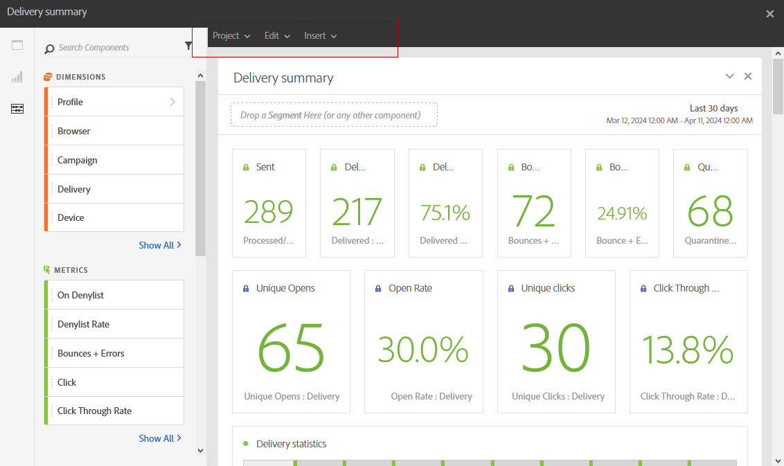
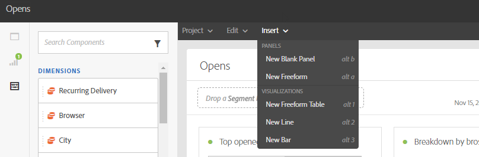

# Benutzeroberfläche für das Reporting{#reporting-interface}

Über die am oberen Seitenrand befindliche Symbolleiste können Sie beispielsweise einen Bericht ändern, speichern oder ausdrucken.

Im Tab **Projekt** haben Sie folgende Möglichkeiten:

* **Öffnen...**: Öffnet einen zuvor erstellten Bericht oder eine Vorlage.
* **Speichern unter...**: Dupliziert Vorlagen, damit sie geändert werden können.
* **Projekt aktualisieren**: Aktualisiert Ihren Bericht auf der Basis neuer Daten und Filteränderungen.
* **CSV herunterladen**: Exportiert Ihre Berichte in eine CSV-Datei.

Im Tab **Bearbeiten** haben Sie folgende Möglichkeiten:

* **Rückgängig**: Bricht die zuletzt im Dashboard ausgeführte Aktion ab.
* **Alle löschen**: Löscht alle Bedienfelder in Ihrem Dashboard.

Im Tab **Einfügen** können Sie Ihre Berichte anpassen, indem Sie Diagramme und Tabellen zu Ihrem Dashboard hinzufügen:

* **Neues leeres Panel**: Fügt ein Neues leeres Panel zu Ihrem Dashboard hinzu.
* **Neue Freiform**: Fügt eine neue Freiformtabelle zu Ihrem Dashboard hinzu.
* **Neue Zeile**: Fügt ein neues Liniendiagramm zu Ihrem Dashboard hinzu.
* **Neuer Balken**: Fügt ein neues Balkendiagramm zu Ihrem Dashboard hinzu.

**Verwandte Themen:**

* [Panels hinzufügen](adding-panels.md)
* [Visualisierungen hinzufügen](adding-visualizations.md)
* [Komponenten hinzufügen](adding-components.md)

## Registerkarten {#tabs}

In den linken Tabs können Sie nach Bedarf Berichte erstellen und Daten filtern.

Über diese Tabs haben Sie Zugriff auf folgende Elemente:

* **[!UICONTROL Panels]**: Fügt Ihrem Bericht ein leeres Panel oder eine Freiform hinzu, um Ihre Daten zu filtern. Weiterführende Informationen finden Sie im Abschnitt zum Hinzufügen von Bedienfeldern.
* **[!UICONTROL Visualisierungen]**: Legen Sie die gewünschten Visualisierungselemente ab, um Ihren Bericht grafisch aufzubereiten. Weiterführende Informationen finden Sie im Abschnitt zum Hinzufügen von Visualisierungen.
* **[!UICONTROL Komponenten]**: Passen Sie Ihren Bericht mit unterschiedlichen Dimensionen, Metriken, Segmenten und Zeiträumen an.

## Symbolleiste {#toolbar}

Die Symbolleiste befindet sich über Ihrem Arbeitsbereich. Sie besteht aus verschiedenen Tabs, mit denen Sie beispielsweise einen Bericht ändern, speichern oder ausdrucken können.

**Verwandte Themen:**

* [Panels hinzufügen](adding-panels.md)
* [Visualisierungen hinzufügen](adding-visualizations.md)
* [Komponenten hinzufügen](adding-components.md)

### Projekt-Tab {#project-tab}

Im Tab **Projekt** haben Sie folgende Möglichkeiten:

* **Öffnen...**: Öffnet einen zuvor erstellten Bericht oder eine Vorlage.
* **Speichern unter...**: Dupliziert Vorlagen, damit sie geändert werden können.
* **Projekt aktualisieren**: Aktualisiert Ihren Bericht auf der Basis neuer Daten und Filteränderungen.
* **CSV herunterladen**: Exportiert Ihre Berichte in eine CSV-Datei.
* **[!UICONTROL Drucken]**: Druckt den Bericht.

### Bearbeiten-Tab {#edit-tab}

Im Tab **Bearbeiten** haben Sie folgende Möglichkeiten:

* **Rückgängig**: Bricht die zuletzt im Dashboard ausgeführte Aktion ab.
* **Alle löschen**: Löscht alle Bedienfelder in Ihrem Dashboard.

### Einfügen-Tab {#insert-tab}

Im Tab **Einfügen** können Sie Ihre Berichte anpassen, indem Sie Diagramme und Tabellen zu Ihrem Dashboard hinzufügen:

* **Neues leeres Panel**: Fügt ein Neues leeres Panel zu Ihrem Dashboard hinzu.
* **Neue Freiform**: Fügt eine neue Freiformtabelle zu Ihrem Dashboard hinzu.
* **Neue Zeile**: Fügt ein neues Liniendiagramm zu Ihrem Dashboard hinzu.
* **Neuer Balken**: Fügt ein neues Balkendiagramm zu Ihrem Dashboard hinzu.
