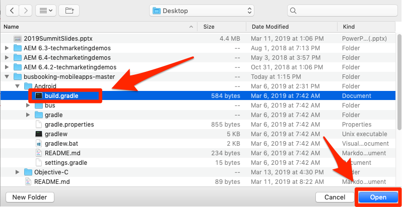
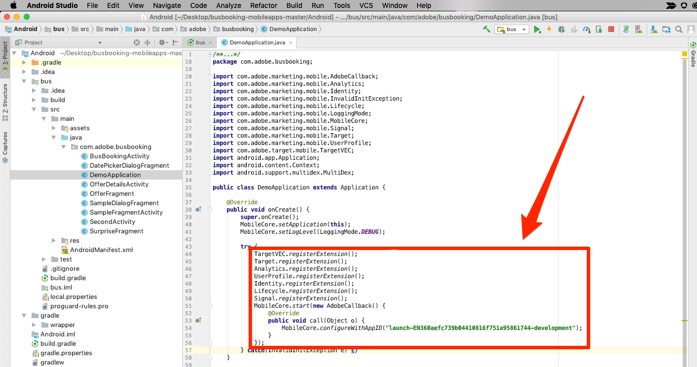

# Mobiles SDK installieren

In dieser Lektion implementieren Sie das Mobile SDK mit den Erweiterungen und Einstellungen, die der Entwicklungsumgebung Ihrer Launch-Eigenschaft entsprechen.

## Voraussetzungen 

In dieser Lektion beginnen wir mit dem Hinzufügen von Code zur Bus-Buchungsapp. Wenn Sie dies noch nicht getan haben:

1. Herunterladen und Installieren von [Android Studio](https://developer.android.com/studio)
1. Laden Sie die [Bus-Buchungs-App herunter](https://github.com/Adobe-Marketing-Cloud/busbooking-mobileapps)

## Lernziele

Dies können Sie am Ende dieser Lektion:

* Installationsanweisungen für die mobile Launch-Eigenschaft abrufen
* Den Unterschied zwischen einer Entwicklungs-, Staging- und Produktionsumgebung erläutern
* Aktualisieren Sie Ihre `build.gradle` Datei, um das Mobile SDK hinzuzufügen
* Mobile SDK in Ihre App importieren
* Überprüfen, ob das SDK erfolgreich implementiert wurde
* Lebenszyklusmetriken in der App aktivieren

## Installationsanweisungen abrufen

Die Installationsanweisungen für mobile Starteigenschaften sind eine Sammlung von Code-Snippets, die Sie an bestimmten Stellen in Ihrer mobilen App hinzufügen.

Klicken Sie auf die `Environments` Registerkarte in der oberen Navigation, um zur Seite "Umgebungen"zu gelangen. Beachten Sie, dass Entwicklungs-, Staging- und Produktionsumgebungen für Sie vordefiniert wurden. Diese entsprechen den typischen Umgebungen im Codeentwicklungs- und -veröffentlichungsprozess. Code wird zuerst von einem Entwickler in einer Entwicklungsumgebung geschrieben. Wenn sie ihre Arbeit abgeschlossen haben, senden sie den Code an eine Staging-Umgebung, in der QA- und andere Teams ihn überprüfen können. Sobald die Qualitätssicherungs- und anderen Teams zufrieden sind, wird der Code dann in der Produktionsumgebung veröffentlicht, der Umgebung für die Öffentlichkeit, in der Ihre Besucher Ihre App herunterladen.

Launch ermöglicht zusätzliche Entwicklungsumgebungen, was in großen Organisationen nützlich ist, in denen mehrere Entwickler gleichzeitig an verschiedenen Projekten arbeiten.

Entwicklung, Staging und Produktion sind die einzigen Umgebungen, in denen wir das Tutorial abschließen müssen.


Klicken Sie in der Zeile **[!UICONTROL Entwicklung]** auf das Symbol  Installation, um das Einbettungscode-Modal zu öffnen.


Gehen wir die Anweisungen Schritt für Schritt durch.

## Datei "build.gradle"aktualisieren

Wenn Sie zuvor Launch in Websites verwendet haben, stellen Sie zunächst fest, dass es viel mehr Installationsanweisungen für mobile Apps als für Websites gibt.

Das Adobe Mobile SDK for Android verwendet zur Verwaltung von Abhängigkeiten zwischen den verschiedenen Komponenten die Gradle. Als Erstes fügen wir die Adobe Mobile SDK-Abhängigkeiten zur Datei "build.gradle"der Bus Booking-App hinzu.

**So aktualisieren Sie die Datei "build.gradle"**

1. Android Studio öffnen
1. Wählen Sie "Vorhandenes Android Studio-Projekt öffnen"

   

1. Öffnen Sie die Datei "build.gradle"im Stammordner des Ordners "Bus Booking Android":

   

1. Öffnen Sie das Dropdown-Menü und wechseln Sie zur Projektansicht

   

1. Öffnen Sie die Datei **Android &gt; Bus &gt; build.gradle**

   

1. Stellen Sie in der Benutzeroberfläche "Starten"sicher, dass das Betriebssystem auf `Android`

1. Kopieren Sie die Abhängigkeiten in die Zwischenablage, indem Sie auf das Symbol  klicken

   

1. Fügen Sie in Android Studio die Abhängigkeiten aus der Zwischenablage direkt nach den vorhandenen Abhängigkeiten ein (aber vor dem Schließen `}`)
1. Wenn Sie die Adobe Target VEC-Erweiterung installieren, müssen Sie außerdem die folgenden Abhängigkeiten hinzufügen:

   ```java
   implementation 'com.google.code.gson:gson:2.8.2'
   implementation 'android.arch.lifecycle:extensions:1.1.1'
   implementation 'io.github.sac:SocketclusterClientJava:1.7.5'
   implementation 'com.android.support:support-annotations:28.0.0'
   implementation 'com.android.support:support-compat:28.0.0'
   implementation 'com.android.support:design:28.0.0'
   ```

1. Klicken Sie auf den Link "Jetzt synchronisieren", um das Projekt zu synchronisieren

   

## Anwendung aktualisieren

Jetzt ist es an der Zeit, die App zu aktualisieren, um das SDK zu importieren

**So importieren Sie das SDK**

1. Öffnen Sie die Datei "Hauptanwendung"in der App "Bus-Buchung", die sich unter **Android &gt; Bus &gt; src &gt; main &gt; java &gt; com.adobe.busbuchung &gt; DemoApplication befindet.**

   

1. Führen Sie in der Benutzeroberfläche "Starten"einen Bildlauf zum Abschnitt Initialisierungscode **[!UICONTROL hinzufügen]** durch.
1. Kopieren Sie die Importanweisungen, indem Sie auf das erste Symbol  im Abschnitt Initialisierungscode **[!UICONTROL hinzufügen]** klicken:

   

1. Fügen Sie diese Importanweisungen in Android Studio *vor* den vorhandenen Importen in die `DemoApplication` Datei ein. Beachten Sie, dass die Core-Erweiterung Bibliotheken zur Unterstützung von Rückrufen, dem Identitätsdienst, Lebenszyklusmetriken und der Konsolenprotokollierung unter anderem enthält.

   

1. Kopieren Sie in der Benutzeroberfläche "Start"die beiden Zeilen, die sich auf die Core-Erweiterung beziehen, indem Sie auf das zweite Symbol  im Abschnitt Initialisierungscode **[!UICONTROL hinzufügen]** klicken. Die zweite Zeile aktiviert die Anweisungen zur Konsolenprotokollierung (die verfügbaren Optionen sind "DEBUG", "VERBOSE", "WARNUNG"und "ERROR").

   

1. Fügen Sie diese Core-Anweisungen in Android Studio direkt nach `DemoApplication``super.onCreate()`
1. Entfernen Sie die `//` Kommentare vor den Zeilen `try` und `catch`

   

1. Kopieren Sie in der Benutzeroberfläche "Starten"die Erweiterungsanweisungen, indem Sie auf das dritte Symbol "  "im Abschnitt "Initialisierungscode [!UICONTROL hinzufügen"klicken] .

   

1. Fügen Sie diese Erweiterungsanweisungen in Android Studio in den `try` Abschnitt ein. Beachten Sie, dass dies die Kennung der Entwicklungsumgebung "Starten"Ihrer Eigenschaft `MobileCore.configureWithAppID` enthält. Dies ist wichtig, da Sie diesen Wert aktualisieren müssen, wenn wir bereit sind, die App in der Produktionsumgebung bereitzustellen.

   

>[!NOTE] Die in der Benutzeroberfläche "Start"bereitgestellten Anweisungen für die mobile Installation umfassen die Import- und Registrierungsanweisungen für Identitäts-, Lebenszyklus- und Signalerweiterungen sowie die Initialisierung der Lifecycle-Metriken. Diese Erweiterungen gelten als Teil der Mobile Core Extension. Wenn Sie diese Erweiterungen nicht in Ihrer App verwenden möchten, müssen Sie keinen anderen mit diesen Erweiterungen verknüpften Code importieren, registrieren oder implementieren.
>
> Es gibt außerdem zusätzliche Implementierungsoptionen, die bei Verwendung dieser Erweiterungen berücksichtigt werden sollten (Sie können z. B. die Lebenszyklussammlung anhalten/neu starten, wenn der Benutzer die App im Hintergrund bzw. im Vordergrund betrachtet). Weitere Informationen finden Sie in [der Dokumentation zur Mobile Core Extension](https://aep-sdks.gitbook.io/docs/using-mobile-extensions/mobile-core)

## Implementierung überprüfen

1. Android Studio-Projekt speichern
1. Führen Sie die App aus und starten Sie sie im Emulator. Wenn Sie keine Emulatorgeräte konfiguriert haben, konfigurieren Sie eines jetzt, und stellen Sie sicher, dass Sie ein Gerät mit Android 4.1 (API 16) oder höher konfigurieren.

   

1. Warten Sie, bis der Emulator gestartet ist, und öffnen Sie die App vollständig auf dem Buchungsbildschirm (dies kann einige Minuten dauern).

   

1. Vergewissern Sie sich, dass die Adobe-Server in Android Studio Logcat aufgerufen werden.

   

Im Folgenden finden Sie einige Beispiele für spezifische Aufrufe, nach denen Sie suchen können:

1. **Ruft die Startkonfiguration** ab (Filter Logcat zu `adobedtm.com`). Beachten Sie die Erweiterungskonfigurationen, die Sie in der vorherigen Lektion eingegeben haben. Während das Hinzufügen der Erweiterung eine Aktualisierung der App erfordert, können diese Einstellungen beim Starten extern verwaltet und jederzeit geändert werden:

   ```java
   03-14 16:30:29.484 24869-24930/com.adobe.busbooking D/ADBMobile: ConfigurationExtension - Cached configuration loaded.
    {"target.propertyToken":"","target.timeout":5,"global.privacy":"optedin","analytics.backdatePreviousSessionInfo":true,"analytics.offlineEnabled":true,"build.environment":"dev","rules.url":"https://assets.adobedtm.com/launch-EN360aefc739b04410816f751a95861744-development-rules.zip","experienceCloud.org":"7ABB3E6A5A7491460A495D61@AdobeOrg","target.clientCode":"techmarketingdemos","target.autoFetch":true,"target.fetchBackground":false,"lifecycle.sessionTimeout":300,"target.environmentId":"busbookingapp","analytics.server":"tmd.sc.omtrdc.net","analytics.rsids":"tmd-mobile-dev1","analytics.batchLimit":0,"property.id":"PRb4881271498b4f2cbaf67d38a8f3891a","global.ssl":true,"analytics.aamForwardingEnabled":true}
   ```

1. **Anforderung an den Identitätsdienst** (Filter Logcat to `IdentityExtension`) In diesem Beispiel wurde die ID (`d_mid`)bereits festgelegt und wird gerade erneut gemeldet)

   ```java
   03-14 17:01:18.526 7743-7803/com.adobe.busbooking D/ADBMobile: IdentityExtension - Sending request (https://dpm.demdex.net/id?d_mid=59651426340521082405908216148091920022&d_ver=2&d_orgid=7ABB3E6A5A7491460A495D61%40AdobeOrg)
   ```

1. **Analytics-Anforderung** (Filter Logcat to `AnalyticsExtension`)

   ```java
   03-14 17:01:18.509 7743-7777/com.adobe.busbooking D/ADBMobile: AnalyticsExtension - Sending Analytics ID call (https://tmd.sc.omtrdc.net/id?mcorgid=7ABB3E6A5A7491460A495D61%40AdobeOrg&mid=59651426340521082405908216148091920022)
   ```

Herzlichen Glückwunsch! Sie haben das SDK zu einer mobilen App hinzugefügt!

## Lebenszyklusmetriken in der App aktivieren

Lebenszyklusmetriken sind umweltrelevante Metriken und Dimensionen, die mit dem Experience Platform Mobile SDK problemlos in einer App aktiviert werden können. Da sie von mehreren Experience Cloud-Lösungen verwendet werden können, können wir sie hier aktivieren, bevor wir uns näher mit den einzelnen Lösungen befassen. Dies ist so einfach, als würde man unserer App am richtigen Ort ein paar Zeilen Code hinzufügen.

### Die Core-Bibliothek in die BusBookingActivity-Datei importieren

Um API-Aufrufe über das Adobe Experience Platform Mobile SDK durchzuführen, müssen Sie die Bibliotheken in die entsprechenden Dateien importieren. In diesem Fall müssen wir die Core-Bibliothek importieren, um den Lebenszyklus-API-Aufruf zu verwenden.

1. Öffnen Sie die App in Android Studio und öffnen Sie die Datei "BusBookingActivity", die sich im selben Ordner wie die DemoApplication-Datei befindet, in der Sie gearbeitet haben.
1. Fügen Sie oben in der Datei die folgende MobileCore-Importanweisung hinzu, damit Sie die zugehörigen API-Aufrufe verwenden können
   `import com.adobe.marketing.mobile.MobileCore;`


### Lebenszykluscode hinzufügen

Sie fügen den Lebenszykluscode jetzt der Funktion onResume() in der App hinzu, um die Lebenszyklusfunktionen auszulösen.

1. Öffnen Sie die Datei BusBookingActivity
1. Scrollen Sie nach unten am unteren Rand der Datei und suchen Sie die Funktion onResume()
1. Fügen Sie die folgenden beiden Codezeilen unter der `super.onResume()` Zeile hinzu:

   ```java
    MobileCore.setApplication(getApplication());
    MobileCore.lifecycleStart(null);
   ```


### Lebenszyklustreffer überprüfen

Wenn Sie Ihre App ausführen, sollten Sie jetzt eine oder mehrere Lebenszyklusmeldungen im Debugging-Abschnitt von Android Studio abrufen.

1. Führen Sie einen Build aus und wählen Sie einen Simulator, um die App auszuführen
1. Nachdem der Simulator ausgeführt wurde, klicken Sie in Android Studio auf den Abschnitt "Ausführen" des Debuggers
1. Suchen Sie nach `internalaction=Lifecycle`
1. Beachten Sie, dass es Zeilen gibt, die dieses Schlüssel/Wert-Paar sowie die anderen Lebenszyklusmetriken enthalten.

Beachten Sie, dass es sich bei den Zeilen, die Sie sehen werden, um Analytics-Aufrufe mit Lebenszyklusmetriken handelt.


[Weiter "Adobe Experience Platform Identity Service hinzufügen"&gt;](id-service.md)