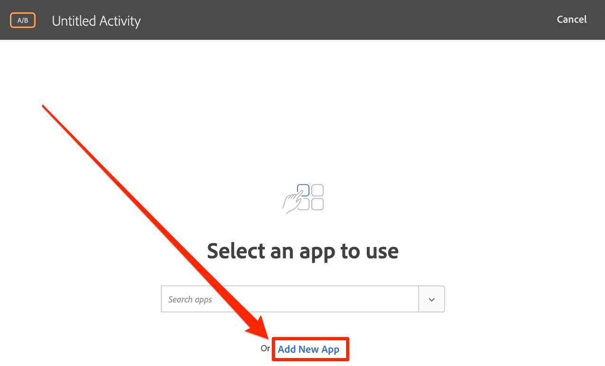
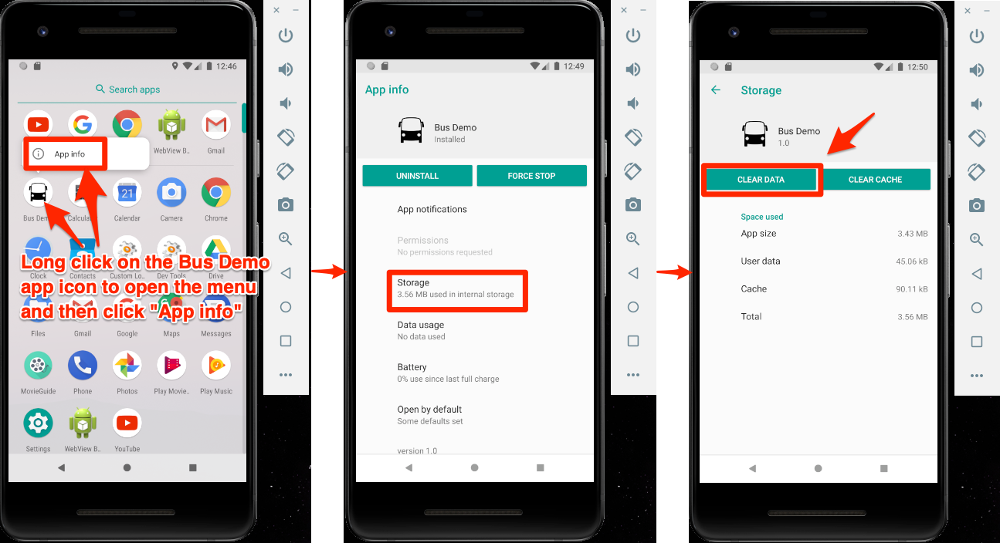
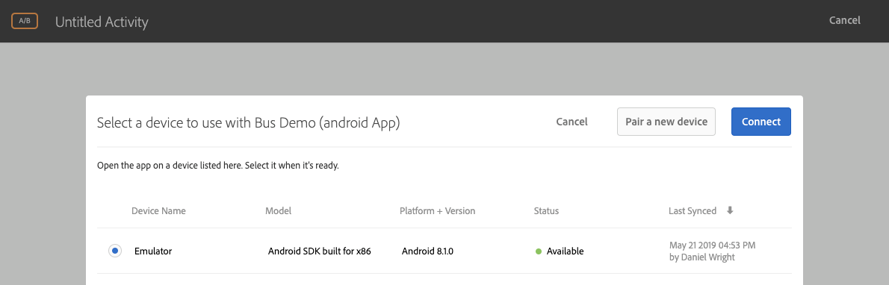

# Visual Experience Composer (VEC) von Adobe Target hinzufügen

In dieser Lektion aktivieren Sie den Visual Experience Composer (VEC) für mobile Apps.

[Adobe Target](https://docs.adobe.com/content/help/en/target/using/target-home.html) ist die Adobe Experience Cloud-Lösung, die alles bietet, was Sie zur Anpassung und Personalisierung der Kundenerfahrung benötigen, sodass Sie den Umsatz Ihrer Websites, mobilen Sites, Apps, sozialen Medien und anderer digitaler Kanäle maximieren können.

Mit Visual Experience Composer (VEC) für native mobile Apps können Sie Aktivitäten und personalisierte Inhalte in nativen mobilen Apps selbstständig erstellen, ohne von kontinuierlicher Weiterentwicklung und App-Release-Zyklen abhängig zu sein.

In der Lektion [Erweiterungen](launch-add-extensions.md)hinzufügen haben Sie die Target VEC-Erweiterung zu Ihrer Launch-Eigenschaft hinzugefügt. In der Lektion [Installieren des Mobile SDK](launch-install-the-mobile-sdk.md) haben Sie die Erweiterung in die Beispielanwendung importiert. Nur wenige kleinere Aktualisierungen sind erforderlich, um Aktivitäten im Visual Experience Composer von Target für mobile Geräte einrichten zu können!

>[!IMPORTANT] Sowohl die Target VEC Launch-Erweiterungen als auch Target VEC sind erforderlich, um Target VEC in Ihrer mobilen Anwendung zu verwenden.

## Lernziele

Dies können Sie am Ende dieser Lektion:

* Beispielanwendung für Target VEC aktivieren
* Parameter zur Target VEC-Anforderung hinzufügen
* Verbinden des Geräts mit dem VEC
* Erstellen einer Aktivität mit dem VEC

## Voraussetzungen 

Um die Unterrichtsstunden in diesem Abschnitt abzuschließen, müssen Sie:

* Schließen Sie die Unterrichtsstunden im Abschnitt [Start](launch-create-a-property.md) konfigurieren ab.
* Zugriff auf die Oberfläche von Adobe Target auf Genehmigerebene

## Die App-Ladeanforderung

Target löst eine Anforderung zum Laden der App aus, wenn die App aufgrund der Einstellungen, die wir beim Konfigurieren der Target VEC-Erweiterung ausgewählt haben, zum ersten Mal geladen wird. Diese Anforderung ruft alle Target VEC-Aktivitäten ab, die Sie für Ihre App erstellt haben.

Filtern Sie im Android-Studio Logcat in "Target r", um die Target-Anforderungen und -Antworten anzuzeigen. Beachten Sie die Parameter für den Anwendungsnamen und die Version. Alle von Ihnen erstellten Target VEC-Aktivitäten werden automatisch auf diese Eigenschaften ausgerichtet.


## Parameter hinzufügen

Wie Sie gerade in der letzten Übung gesehen haben, werden App-Lebenszyklusmetriken automatisch als Parameter in die Target-VEC-Anforderung einbezogen. Sie können den Anforderungen auch benutzerdefinierte Parameter hinzufügen, entweder global oder für bestimmte Ansichten in der App.

**So fügen Sie benutzerdefinierte Parameter global hinzu**

1. Öffnen Sie die `DemoApplication` Datei in Android Studio.
1. Importieren Sie die Target VEC-Erweiterung, indem Sie `import ACPTargetVEC` unterhalb des vorhandenen Imports
1. Fügen Sie den folgenden Beispielcode in die `onCreate()` Funktion ein, bevor die Erweiterungen registriert werden. Dieser Beispielcode zeigt, wie der TargetVEC-Anforderung reguläre Parameter, Profilparameter, Produkt- (oder Entitätsparameter) und Bestellparameter hinzugefügt werden können. In diesem Beispiel werden statische Werte verwendet, während Sie in Ihrer tatsächlichen App die Werte mit dynamischen Variablen füllen möchten. Und natürlich möchten Sie nur die Parameter füllen, die für alle Ansichten relevant sind:

   ```java
   Map<String, String>targetParams = new HashMap<>(); //params
   targetParams.put( "param1", "value1");
   Map<String, String>taregtProfileParams = new HashMap<>(); //profile params
   taregtProfileParams.put("profilekey1","profilevalue1");
   
   TargetVEC.setGlobalRequestParameters(new TargetParameters.Builder()
            .parameters(targetParams)
            .profileParameters(taregtProfileParams)
            .product(new TargetProduct("1234", "furniture"))
            .order(new TargetOrder("12343", 123.45, Arrays.asList("100", "200")))
            .build());
   ```

1. Möglicherweise treten in Android Studio Fehler auf, da für den obigen Parametercode die folgenden Importe erforderlich sind, die Sie der Datei hinzufügen müssen:

   ```java
   import com.adobe.marketing.mobile.TargetOrder;
   import com.adobe.marketing.mobile.TargetProduct;
   import com.adobe.marketing.mobile.TargetParameters;
   import java.util.Arrays;
   import java.util.Map;
   import java.util.HashMap;
   ```

   

Nachdem Sie der App nun Parameter hinzugefügt haben, müssen Sie sicherstellen, dass sie in der Anforderung übergeben werden.

**So überprüfen Sie die Parameter**

1. Android Studio-Projekt speichern
1. Erstellen Sie die App neu und warten Sie, bis sie im Emulator erneut geöffnet wird.
1. Öffnen Sie den Bereich "Logcat"von Android Studio
1. Filtern, um alle Anweisungen mit "Target r"anzuzeigen
1. Die benutzerdefinierten Parameter, die Sie gerade hinzugefügt haben, sollten in der Anforderung sichtbar sein

   

Weitere Informationen und Informationen zum Übermitteln von Parametern an bestimmte Ansichten finden Sie in [der Dokumentation](https://docs.adobe.com/content/help/en/target/using/implement-target/mobile-apps/composer/mobile-visual-experience-composer-android.html#parameters).

## Paarung der mobilen App mit der Target-Oberfläche

Um VEC-Aktivitäten in der Target-Oberfläche zu erstellen, müssen Sie zunächst Target mit Ihrer App verbinden. Diese Paarung wird durch den Einsatz von Deep Links erreicht.

### Deep Link erstellen

Android unterstützt die Verwendung von [Deep Links und Android-App-Links](https://developer.android.com/training/app-links/deep-linking) zum Erstellen von URLs, die direkt zu bestimmten Orten in Ihrer App führen. Sie verwenden diese wahrscheinlich bereits in Ihrer App. In diesem Fall können Sie Ihre vorhandene URL-Struktur verwenden, um eine Verbindung mit Target herzustellen. In diesem Lernprogramm überprüfen Sie den vordefinierten Deep Link in der App "Bustanbuchung", bestätigen, dass er funktioniert, und verwenden ihn dann, um Ihre App mit Target VEC für mobile Apps zu verbinden.

**So überprüfen Sie die Einrichtung der Deep-Verknüpfung**

1. Öffnen Sie in Android Studio die Datei "AndroidManifest.xml".
1. Beachten Sie, dass bereits ein Zielgruppenfilter für das Deep-Link-Schema der Buy Booking-App konfiguriert ist.
1. Beachten Sie, dass die `Host` und `Scheme` sind bereits auf `com.adobe.example.busbooking` bzw. `http`eingestellt. Das bedeutet, dass eine URL, wie `http://com.adobe.example.busbooking` beim Öffnen im Emulator, automatisch die Beispiel-App öffnen sollte

   

Der nächste Schritt besteht darin, zu bestätigen, dass das Deep-Link-Schema funktioniert

### Deep-Link überprüfen

Stellen Sie nun sicher, dass der Deep Link die App im Emulator öffnet. Möglicherweise haben Sie Ihre bevorzugte Methode, adb-Befehle auszuführen, die Sie sicherlich verwenden können.

**So überprüfen Sie den Deep Link mit adb (Mac®)**

1. Vergewissern Sie sich, dass der Android-Emulator ausgeführt wird
1. Schließen Sie die Bus-Buchungs-App, wenn sie bereits geöffnet ist
1. Terminalfenster öffnen
1. Navigieren Sie zum Ordner "Android platform-tools": `cd Library/Android/sdk/platform-tools/`
1. Vergewissern Sie sich, dass Ihr Emulator angehängt ist: `./adb devices`
1. Öffnen Sie die Adb-Shell: `./adb shell`
1. Im Adb-Shell-Test den Deep-Link: `am start -W -a android.intent.action.VIEW -d "http://com.adobe.example.busbooking" "com.adobe.busbooking"`
1. Vergewissern Sie sich, dass die Bus-Buchungsanwendung im Emulator gestartet wurde

   

Nachdem Sie Ihre Deep-Link-Struktur eingerichtet haben, können Sie mit Target VEC Aktivitäten einrichten!

## Erstellen einer Aktivität im Mobile VEC

Erstellen wir nun eine Aktivität in der Target-Oberfläche.

**So erstellen Sie eine Aktivität mit Target VEC**

1. Bei der [Adobe Experience Cloud anmelden](https://experiencecloud.adobe.com)
1. Verwenden Sie den Lösungsumschalter, um zu Target zu wechseln

   

1. Target starten

   

1. Klicken Sie auf die Schaltfläche **[!UICONTROL Aktivität]** erstellen und wählen Sie **[!UICONTROL A/B-Test]**
1. Mobile **[!UICONTROL App auswählen]**
1. Stellen Sie sicher, dass **[!UICONTROL Visual]** unter **[!UICONTROL Experience Composer auswählen ausgewählt ist.]**
1. Klicken Sie auf die Schaltfläche **[!UICONTROL Weiter]**

   

1. Klicken Sie im Bildschirm "App zur Verwendung **** auswählen"auf Neue App **[!UICONTROL hinzufügen]**

   

1. Geben Sie das soeben definierte URL-Schema im Feld URL **[!UICONTROL eingeben]** ein, z. B. `http://com.adobe.example.busbooking/`
1. Klicken Sie auf Deep Link **[!UICONTROL erstellen]**

   

   >[!NOTE] Sie haben einige Optionen, um den Deep Link zur App zu senden. Sie haben folgende Möglichkeiten:
   >
   >   1. E-Mail den Deep Link an eine gültige E-Mail-Adresse senden und dann den Link mit einer E-Mail-Anwendung auf dem Gerät öffnen
   >   1. Erstellen Sie ein Foto des QR-Codes von Ihrem Android-Gerät (in unserem Tutorial müsste das Gerät mit Android Studio verknüpft sein)
   >   1. Kopieren Sie den Deep Link aus der Target-Oberfläche und senden Sie ihn an das Gerät, wie Sie möchten


1. Klicken Sie auf die Registerkarte Link **[!UICONTROL kopieren und senden]** .
1. Klicken Sie auf die generierte URL (beachten Sie, dass die URL durch Klicken automatisch in die Zwischenablage kopiert wird)

   

1. Öffnen Sie ein Terminalfenster (oder wechseln Sie zurück, wenn es noch geöffnet ist)
1. Navigieren Sie zum Ordner "Android platform-tools"(möglicherweise sind Sie bereits hier): `cd Library/Android/sdk/platform-tools/`
1. Vergewissern Sie sich, dass Ihr Emulator angehängt ist: `./adb devices`
1. Öffnen Sie die Adb-Shell: `./adb shell`
1. Ersetzen Sie in der Adb-Shell [YOUR_TARGET_URL_WITH_TOKEN] im folgenden Befehl durch die URL, die Sie gerade in die Zwischenablage kopiert haben: `am start -W -a android.intent.action.VIEW -d "[YOUR_TARGET_URL_WITH_TOKEN]" "com.adobe.busbooking"`
1. Nachdem die App geladen wurde, wechseln Sie zurück zu Ihrer Browser-Registerkarte, in der Sie Target geöffnet haben. Ihre App sollte im VEC geladen werden.
1. Klicken Sie auf Text- und Bild-Assets in Ihrer App und Sie sollten Optionen zum Bearbeiten und Ersetzen sehen!

   

   > [!TIP] Wenn Sie nicht sehen, dass Mobile VEC nach dem Öffnen des Deep Links auf dem Mobilgerät automatisch in der Target-Oberfläche geöffnet wird, sollten Sie Folgendes versuchen:
   >
   >   1. Vergewissern Sie sich, dass Sie in der Target-Oberfläche exakt dieselbe URL verwenden und keine Zeichen versehentlich abgeschnitten haben. Stellen Sie beim Ausführen des Befehls in der Adb-Shell sicher, dass die URL in Anführungszeichen steht
      >
      >
      >   

   1. Vergewissern Sie sich, dass Sie der Datei "build.gradle"zusätzliche Abhängigkeiten hinzugefügt haben, die für Target VEC erforderlich sind. Diese Abhängigkeiten sollten während der Lektion zum [Installieren des Mobile SDK hinzugefügt werden](https://docs.adobe.com/content/help/en/experience-cloud/implementing-in-mobile-android-apps-with-launch/configure-launch/launch-install-the-mobile-sdk.html#update-the-buildgradle-file)
      >
      >
      >   

   1. Versuchen Sie, die in der App gespeicherten Daten zu löschen, wie im unten stehenden Bild dargestellt
      >
      >       
      


1. Nehmen Sie einige Änderungen am ersten Bildschirm der App vor
1. Positionieren Sie den Emulator jetzt bei geöffnetem VEC neben dem Browser
1. Navigieren Sie zu einem anderen Bildschirm in der App und bemerken Sie, wie VEC mit dem Emulator aktualisiert wird!
1. Sie können Aktualisierungen für mehrere Ansichten in Ihrer App in einer einzigen Aktivität vornehmen.

   

1. Sie können auch visuell Klick-Tracking-Metriken hinzufügen!
1. Speichern und genehmigen Sie Ihre Aktivität und vergewissern Sie sich, dass sie in der Beispielanwendung angezeigt wird.

Die Verbindung des Geräts mit dem VEC ist eine einmalige Aktion. Wenn Sie in Zukunft auf demselben Gerät weitere Aktivitäten erstellen, können Sie das Gerät aus einer Liste auswählen, wie unten dargestellt:



>[!TIP] Wenn Sie ein Gerät geöffnet haben, es jedoch im Auswahlmenü nicht verfügbar ist, versuchen Sie, die App auf dem Emulator oder Gerät zu schließen und erneut zu öffnen.

## Erstellen von Zielgruppen basierend auf Lifecycle-Metriken

Integrierte Lebenszyklusmetriken zur Verwendung der App durch den Besucher, die automatisch in Aufrufen des Adobe Mobile SDK enthalten sind. Sie können auf einfache Weise Zielgruppen in Target basierend auf diesen Metriken erstellen.

**So erstellen Sie eine Zielgruppe**

1. Klicken Sie in der Target-Oberfläche in der oberen Navigation auf **Zielgruppen** .
1. Click the **Create Audience** button

   

1. Name the Audience `Launches < 5`
1. Click **Add Rule &gt; Custom**

   

1. Wählen Sie im ersten Dropdown-Menü den Parameter **a.Launches** . Alle Lebenszyklusmetrikparameter beginnen mit dem "a". Präfix. Wir richten Inhalte auf Grundlage der Anzahl der App-Starts für den Benutzer ein. Dies ist eine hervorragende Möglichkeit, erstmalige Benutzer Ihrer App mit einer Anleitung und einem Erlebnis für den ersten Benutzer (FTUE) als Ziel festzulegen.
1. Wählen Sie im nächsten Dropdown-Menü **ist kleiner als**
1. Geben Sie im dritten Dropdown-Feld **5 ein.**
1. Klicken Sie auf **Speichern**

   

Beachten Sie, dass es in Target eine Vielzahl von vordefinierten Optionen zum Erstellen von Zielgruppen gibt. Darüber hinaus können Sie benutzerdefinierte Daten in der Target-Anforderung zum Erstellen von Zielgruppen senden, Zielgruppen verwenden, die aus anderen Experience Cloud-Lösungen wie Audience Manager und Analytics freigegeben wurden, und CRM-Daten, die mit Target gemeinsam verwendet werden, mithilfe der Funktion "Kundenattribute"des People Core Service.

[Nächste "Adobe Target hinzufügen"&gt;](target.md)