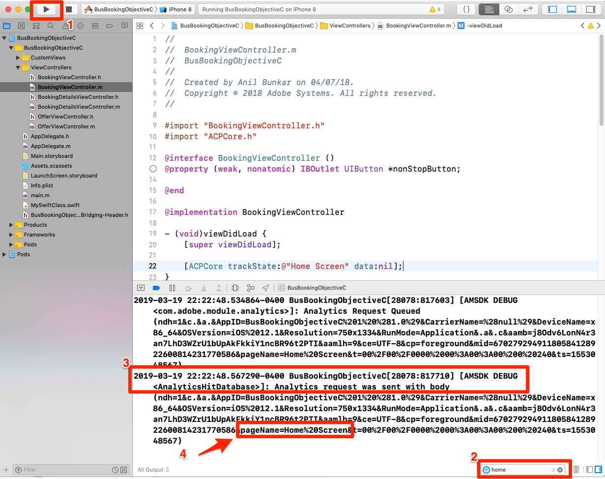

# Hinzufügen von Adobe Analytics

In dieser Lektion aktivieren Sie die Adobe Analytics-Verfolgung in Ihrer App.

[Adobe Analytics](https://docs.adobe.com/content/help/en/analytics/landing/home.html) ist eine branchenführende Lösung, mit der Sie Ihre Kunden besser verstehen und Ihr Geschäft mit Customer Intelligence steuern können.

In den Lektionen [Erweiterungen](launch-add-extensions.md) hinzufügen und das Mobile SDK[ ](launch-install-the-mobile-sdk.md)installieren haben Sie die Adobe Analytics-Erweiterung zu Ihrer Launch-Eigenschaft hinzugefügt und in die Beispielanwendung importiert.  Jetzt müssen Sie nur noch Code hinzufügen, um die Zustände und Aktionen in Ihrer App zu verfolgen!

## Lernziele

Dies können Sie am Ende dieser Lektion:

* Überprüfen, ob Lebenszyklusmetriken an Adobe Analytics gesendet werden
* Fügen Sie Code hinzu, um Zustände in Ihrer App mit zusätzlichen Daten zu verfolgen
* Fügen Sie Code hinzu, um Aktionen in Ihrer App mit zusätzlichen Daten zu verfolgen

Es gibt viele Dinge, die in Analytics in Launch implementiert werden könnten. Diese Lektion ist nicht erschöpfend, sollte Ihnen aber einen soliden Überblick über die wichtigsten Techniken geben, die Sie für die Implementierung in Ihrer eigenen App benötigen.

## Voraussetzungen 

You should have already completed the lessons in the [Configure Launch](launch-create-a-property.md) section. In diesem Abschnitt haben Sie die Analytics-Erweiterung hinzugefügt und Ihre Tracking-Server- und Report Suite-ID(s) konfiguriert.

## Lebenszyklusmetriken und Adobe Analytics

Lebenszyklusmetriken sind umweltrelevante Metriken und Dimensionen, die mit dem Experience Platform Mobile SDK problemlos in einer App aktiviert werden können. Sie haben sie sogar schon hinzugefügt!

Sie haben die Lebenszyklusmetriken bereits aktiviert, wenn Sie die Core-Erweiterung zu Ihrer Eigenschaft hinzugefügt haben und die Anweisungen zur Installation für Mobilgeräte befolgt haben, die auf der Oberfläche bereitgestellt wurden. Diese Metriken und Dimensionen, einschließlich umwelt- und anwendungsspezifischer Metriken wie App-Version, Anzahl der beteiligten Benutzer, Betriebssystemversion, Zeitaufteilung, Tage seit der letzten Verwendung usw. kann bei der Analyse Ihrer App sehr hilfreich sein, insbesondere wenn Sie daraus Analytics-Segmente erstellen, die auf alle Ihre Berichte angewendet werden. Die vollständige Liste der Metriken finden Sie in der [Dokumentation](https://docs.adobe.com/content/help/en/mobile-services/ios/metrics.html).

### Ansicht des Analytics-Lebenszyklustreffers

Obwohl Sie die Lebenszyklustreffer in jedem Debuggingprogramm/Paket-Sniffer sehen können, werden diese einfach in der Xcode-Debugging-Konsole angezeigt.

1. Erstellen Sie Ihr Projekt in Xcode und führen Sie es aus, damit der Simulator gestartet wird
1. Geben Sie in der Xcode-Debugging-Konsole unten `lifecycle` in den Filter ein, um die Anzeige zu beschränken, was nach oben angezeigt wird, und scrollen Sie dann zum Ende der Einträge
1. Beachten Sie den `Analytics request was sent with body` Abschnitt
1. Zu den Lebenszyklusmetriken zählen AppID, CarrierName, DayOfWeek, DaysSinceFirstUse und andere in der [Dokumentation aufgelistete Metriken/Dimensionen](https://docs.adobe.com/content/help/en/mobile-services/ios/metrics.html)

   

## ACPCore-Bibliothek importieren

In den nächsten Übungen verwenden Sie APIs, um Status ("trackState") und Aktionen ("trackAction") in Ihrer App zu verfolgen. Um diese APIs verwenden zu können, müssen Sie die Bibliothek importieren, die diese enthält.  Im neuen Experience Cloud Platform Mobile SDK wurden die trackState- und trackAction-APIs von der Analytics-Bibliothek in die Core-Bibliothek verschoben, sodass diese APIs für andere Zwecke als die Adobe Analytics-Verfolgung genutzt werden können.

In diesem Lernprogramm verfolgen Sie nur einen Status. In der eigentlichen App sollten Sie jedoch mehrere Status verfolgen.

**So importieren Sie die ACPCore-Bibliothek**

1. Öffnen Sie die Datei "BookingViewController.m"in Xcode
1. Fügen Sie oben in der Datei - normalerweise neben anderen Importanweisungen - `#import "ACPCore.h"`
1. Speichern
1. Sie können nun trackState- oder trackAction-APIs in dieser Datei verwenden

   <!---->

## Statusverfolgung

In Ihrer App stehen Ihnen möglicherweise viele verschiedene Inhaltsbildschirme zur Verfügung, die Sie Ihren Benutzern bereitstellen. Dies entspricht den Seiten einer Website. Adobe Analytics bietet eine Methode, mit der Sie diese "Seitenansichtstreffer"senden und in denselben Berichten anzeigen können, die Sie für Ihre Webeigenschaften verwendet haben. Diese Methode heißt "trackState".

In dieser Übung platzieren Sie den Code für einen trackState-Aufruf in nur einem Bildschirm (Seite) in Ihrer App. Im echten Leben wird dies auf allen anderen Bildschirmen/Status in Ihrer App repliziert. Sie werden auch einige verschiedene Möglichkeiten zum Senden von Daten (Schlüssel/Wert-Paare) mit dem Treffer untersuchen.

Nachstehend finden Sie eine Syntax und ein Codebeispiel aus der Dokumentation, die Sie in diesem Lernprogramm oder in Ihrer eigenen App kopieren und einfügen können.

**Syntax:**

```objective-c
+ (void) trackState: (nullable NSString*) state data: (nullable NSDictionary*) data;
```

**Beispiel:**

```objective-c
[ACPCore trackState:@"state name" data:@{@"key":@"value"}];
```

### Status ohne Daten verfolgen

1. Öffnen Sie die Beispielanwendung in Xcode, gehen Sie zu BookingViewController.m und fügen Sie in der `viewDidLoad()` Funktion einen trackState-Methodenaufruf hinzu
1. Legen Sie den `state name` Wert auf "Startbildschirm"fest.
1. Fügen Sie im Methodenaufruf anstelle des Hinzufügens zusätzlicher Daten `null` als Platzhalter hinzu
1. Kopieren Sie oder fügen Sie Folgendes ein:

   ```objective-c
   [ACPCore trackState:@"Home Screen" data:nil];
   ```

   

>[!NOTE] Wenn Sie die Lektionen zur Implementierung von Target VEC abgeschlossen haben, erhalten Sie zusätzlichen Code in der Funktion viewDidLoad(), der in den Screenshots dieser Übung nicht angezeigt wird. Dies ist zu erwarten und soll den Schwerpunkt auf die vorliegende Aufgabe legen.

**So validieren Sie den trackState**

1. Speichern, Erstellen und Ausführen des Projekts
1. Wenn der Simulator ausgeführt wird und den Startbildschirm der App öffnet, zeigen Sie die Xcode-Konsole an
1. Filtern Sie die Konsole auf Einträge mit "home"und sehen Sie sich den unteren Eintrag an, der zeigt, dass die `Analytics request was sent with body`
1. Beachten Sie, dass die Variable "pageName"auf `Home Screen`festgelegt ist und es keine weiteren benutzerspezifischen Datenpaare gibt. Obwohl Sie technisch gesehen einen "Statusnamen"und nicht einen "Seitennamen"festlegen, wird der Parametername verwendet, `pageName` um die Konsistenz mit Website-Implementierungen zu gewährleisten.

   

### Status mit Daten verfolgen

1. Gehen Sie zurück zu BookingViewController.m und kommentieren Sie in der `viewDidLoad()` Funktion den grundlegenden trackState-Aufruf (keine Daten hinzugefügt) aus der letzten Übung aus (oder löschen Sie ihn)
1. Fügen Sie einen neuen trackState-Methodenaufruf mit Daten hinzu, wobei `key1` als Schlüssel und `value1` als Wert
1. Lassen Sie die `state name` Option "Startbildschirm"
1. Oder kopieren und einfügen in:

   ```objective-c
   [ACPCore trackState:@"Home Screen" data:@{@"key1":@"value1"}];
   ```

   

**So validieren Sie den trackState mit Daten**

1. Speichern, erstellen und führen Sie das Projekt erneut aus
1. Wenn der Simulator ausgeführt wird und den Startbildschirm der App öffnet, zeigen Sie die Xcode-Konsole an
1. Lassen Sie den Filter als "Home" und sehen Sie sich den unteren Eintrag an, der zeigt, dass die `Analytics request was sent with body`
1. Sehen Sie jetzt, dass Sie neben dem pageName-Wert auch das Schlüssel/Wert-Paar haben, das beim Treffer gesendet wurde

   

>[!NOTE] Wenn Sie in Analytics mit "props and eVars"vertraut sind, werden Sie feststellen, dass diese Variablennamen nicht im SDK enthalten sind. Alle Schlüssel/Wert-Daten aus dem SDK werden als [contextData-Variablen](https://docs.adobe.com/content/help/en/analytics/implementation/javascript-implementation/variables-analytics-reporting/context-data-variables.html)gesendet und müssen daher mithilfe von [Verarbeitungsregeln](https://docs.adobe.com/content/help/en/analytics/admin/admin-tools/processing-rules/processing-rules.html) in der Analytics-Benutzeroberfläche Props oder eVars (oder anderen Variablen) zugeordnet werden.

### Zusätzliche Optionen zum Senden von Daten

In den beiden vorherigen Übungen haben Sie zwei Anforderungen gestellt, eine mit zusätzlichen Daten und eine ohne. Was ist jedoch zu tun, wenn Sie mehrere Datenpunkte mit einem Bildschirm- oder Statusladevorgang an Analytics senden möchten? Nachfolgend sind zwei Optionen aufgeführt.

#### Option 1: Mehrere Schlüssel-/Wertpaare

Im trackState-Aufruf haben Sie die Möglichkeit, mehrere Schlüssel/Wert-Paare zu senden, indem Sie sie einfach durch Komma im Datensatz trennen. Beispiel:

```objective-c
[ACPCore trackState:@"Home Screen" data:@{@"key1":@"value1",@"key2":@"value2",@"key3":@"value3"}];
```

#### Option 2: Wörterbuchobjekt

Sie können auch ein Wörterbuch im Code definieren und es dann auch mit trackState senden. Wenn Sie bereits einige Wörterbuchobjekte in Ihrem Code definiert haben und diese an Analytics senden möchten, ist dies natürlich die perfekte Option für Sie. Beispiel:

```objective-c
NSDictionary *theStuff = @{@"key1": @"value1",@"key2": @"value2"};
[ACPCore trackState:@"Home Screen" data:theStuff];
```

**Extra Guthaben** Gehen Sie vor und versuchen Sie diese beiden Optionen aus Ihrem Code, die Ergebnisse in der Xcode Debugging-Konsole. Sie können denselben Filter wie zuvor verwenden und die Ergebnisse überprüfen, um sicherzustellen, dass die Variablen und Werte durchkommen

## Aktionen verfolgen

Ähnlich wie bei Aktionen ohne Seitenladevorgang auf einer Website möchten Sie häufig eine Aktion verfolgen, die ein Benutzer in Ihrer App ausführt, z. B. Klicks auf Dinge, die keinen anderen Bildschirm laden. Dies wird ähnlich wie der zuvor verwendete trackState behandelt, allerdings wird diese Methode aufgerufen `trackAction`.

Nachstehend finden Sie eine Syntax und ein Codebeispiel aus der Dokumentation, die Sie kopieren und in dieses Lernprogramm oder in Ihre eigene App einfügen können.

**Syntax:**

```objective-c
+ (void) trackAction: (nullable NSString*) action data: (nullable NSDictionary*) data;
```

**Beispiel:**

```objective-c
[ACPCore trackAction:@"action name" data:@{@"key":@"value"}];
```

### Interaktion mit dem Kontrollkästchen "Keine Schritte"verfolgen

In dieser Beispiel-Bus-Buchungs-App gibt es ein Kontrollkästchen, mit dem Benutzer entscheiden können, ob sie ihre Suchergebnisse auf Optionen beschränken möchten. Sie haben beschlossen, die Interaktion mit diesem Kontrollkästchen in Adobe Analytics zu verfolgen.


Dieses Kontrollkästchen wird in der Datei BookingViewController.m im Beispielprojekt gesteuert. In dieser Übung senden Sie einen trackAction-Treffer, wenn Personen das Kontrollkästchen aktivieren oder deaktivieren.

#### Festlegen des trackAction-Codes

1. Öffnen Sie das Beispielprojekt in Xcode, gehen Sie zu BookingViewController.m und suchen Sie die Funktion "nonStopButtonToggled"
1. In der `if` Anweisung wird das Kontrollkästchen im ersten Abschnitt deaktiviert, wenn es bereits ausgewählt ist. In diesem Szenario möchten Sie einen Treffer mit dem Wert "off"mit folgendem Code senden:

   ```objective-c
   [ACPCore trackAction:@"NonStop Button Interaction" data:@{@"NonStop":@"off"}];
   ```

1. Im nächsten Abschnitt (Abschnitt "else") wird das Kontrollkästchen aktiviert, wenn es nicht bereits markiert ist. In diesem Szenario möchten Sie einen Treffer mit dem Wert "on"mit folgendem Code senden:

   ```objective-c
   [ACPCore trackAction:@"NonStop Button Interaction" data:@{@"NonStop":@"on"}];
   ```

Beachten Sie die anderen Anpassungen im Code:

* Sie legen die `action name` Einstellung auf "NonStopp-Schaltflächeninteraktion"fest. Dieser Wert füllt den Parameter "action"der Anforderung und den benutzerspezifischen Link-Bericht/die Dimension in Adobe Analytics
* Der Name des `key` verwendeten ist "NonStop". Dies ist der Schlüsselname, nach dem Sie in Verarbeitungsregeln in der Analytics Admin-Konsole suchen können, damit Sie diese Werte einer Eigenschaftsvariable oder eVar zuordnen können.

Die Funktion sieht nun wie folgt aus:


#### So validieren Sie den trackAction-Code

1. Speichern Sie nach dem Hinzufügen des Codes das Projekt, führen Sie aus und erstellen Sie
1. Klicken Sie auf das Müllsymbol, um die Konsole zu löschen
1. Markieren Sie das Kästchen im Simulator und stellen Sie fest, dass zwei Anforderungen in der Konsole angezeigt werden. Die letzte ist das Senden der Daten aus dem soeben hinzugefügten Code an Adobe Analytics.
1. Beachten Sie, dass sowohl die Parameter action als auch pev2 auf "NonStopp-Schaltflächeninteraktion"(mit kodierten Leerzeichen) eingestellt sind
1. Beachten Sie, dass das Schlüssel/Wert-Paar "NonStop=on"vorhanden ist und anschließend in Verarbeitungsregeln einer prop/eVar zugewiesen werden kann
1. Beachten Sie den Schlüssel/Wert "pe=lnk_o", der anzeigt, dass es sich hierbei um einen Treffer für einen "benutzerspezifischen Link" handelt, der von trackAction ausgelöst wird.

   

Gute Arbeit! Sie haben die Analytics-Lektion abgeschlossen. Natürlich können Sie noch viele andere Dinge tun, um unsere Analytics-Implementierung zu verbessern, aber hoffentlich haben Sie dadurch einige der Kernkompetenzen erhalten, die Sie benötigen, um die restlichen Anforderungen zu erfüllen.

## Zusätzliche Vorteile von trackState und trackAction

In diesen letzten Übungen konnten Sie Daten aus der App mithilfe der trackState- und trackAction-APIs an Adobe Analytics senden. Da das Experience Platform Mobile SDK in Launch wurzelt, gibt es viele weitere Dinge, die Sie in der Benutzeroberfläche "Start"tun können, wobei Sie den soeben hinzugefügten Code nutzen.

Beim Start können Sie Regeln erstellen, die von den trackState- und trackAction-APIs ausgelöst werden, und zusätzliche Aktionen ausführen lassen, z. B. Anforderungen an andere Adobe-Lösungen oder externe Partner.

[Weiter "Adobe Audience Manager hinzufügen"&gt;](audience-manager.md)
