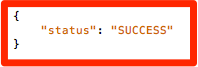

# Adobe Audience Manager hinzufügen

Diese Lektion führt Sie durch die Schritte zur Implementierung von Adobe Audience Manager in Experience Platform Mobile SDK mithilfe der serverseitigen Weiterleitung.

[Adobe Audience Manager](https://docs.adobe.com/content/help/en/audience-manager/user-guide/aam-home.html) (AAM) bietet branchenführende Dienste für das Online-Management von Zielgruppendaten. So erhalten Digital-Advertiser und -Herausgeber die Werkzeuge, die sie zur Steuerung und Nutzung ihrer Datenelemente benötigen, um den Erfolg ihrer Verkäufe zu fördern.

## Lernziele

Dies können Sie am Ende dieser Lektion:

1. Beschreiben Sie die zwei Hauptmethoden zum Implementieren von Audience Manager in einer mobilen App
1. Hinzufügen von Audience Manager mithilfe der serverseitigen Weiterleitung des Analytics-Beacons
1. Validieren der Implementierung von Audience Manager

## Voraussetzungen 

Um diese Lektion abzuschließen, benötigen Sie:

1. Um die Lektionen im Abschnitt zum Konfigurieren des Starts abgeschlossen zu haben, d. h. eine [Starteigenschaft](launch-create-a-property.md)erstellen, Erweiterungenhinzufügen, eine Bibliothekerstellen und das Mobile SDKinstallieren.

1. Administratorzugriff auf Adobe Analytics, damit Sie die serverseitige Weiterleitung für die Report Suite aktivieren können, die Sie für dieses Lernprogramm verwenden. Alternativ können Sie auch einen Administrator in Ihrem Unternehmen bitten, dies anhand der unten stehenden Anweisungen für Sie zu übernehmen.

Wenn Sie Audience Manager noch nicht implementiert haben, befolgen Sie diese Anweisungen, um Ihre Audience Manager-Subdomäneabzurufen.

## Implementierungsoptionen

Es gibt zwei Möglichkeiten, Audience Manager in einer App zu implementieren:

* Serverseitige Weiterleitung (SSF) - Für Kunden mit Adobe Analytics ist dies die einfachste und empfohlene Methode zur Implementierung. Adobe Analytics leitet Daten an AAM im Back-End von Adobe weiter, damit Sie keine Anforderungen aus der App direkt an Audience Manager senden müssen. Dies ermöglicht auch wichtige Integrationsfunktionen und entspricht unseren Best Practices für die Implementierung und Bereitstellung von Audience Manager-Code.

* Clientseitiges DIL - Dieser Ansatz richtet sich an Kunden, die nicht über Adobe Analytics verfügen. Audience Manager-Methoden in der App senden Daten direkt an Audience Manager. In diesem Fall würden Sie die Audience Manager-Erweiterung in Launch verwenden, wenn Sie die Eigenschaft "Mobilstart"einrichten.

Wenn Sie die Analytics-Erweiterung zuvor im Abschnitt "Erweiterungen [hinzufügen](launch-add-extensions.md) "dieses Lernprogramms eingerichtet haben, haben Sie das Kontrollkästchen aktiviert, um die serverseitige Weiterleitung von Daten aus Analytics an Audience Manager zu starten. Dadurch wird dynamisch der Code eingefügt, der für die Verarbeitung der Antwort von Audience Manager-Segmenten benötigt wird, und wieder in Ihre App. Die Erweiterung Audience Manager wird in diesem Lernprogramm nicht hinzugefügt, da dies wiederum nur für den Fall gilt, dass Sie NICHT über Adobe Analytics verfügen.

## Aktivieren der serverseitigen Weiterleitung

Es gibt zwei Hauptschritte bei der Durchführung einer SSF-Implementierung:

1. Aktivieren Sie einen "Switch"in der Analytics Admin-Konsole, um Daten von Analytics an Audience Manager *pro Report Suite* weiterzuleiten.
1. Platzieren des SDK-Codes, **den Sie über "Launch"erstellt haben** , indem Sie einfach das Kontrollkästchen in der Analytics-Erweiterung aktivieren, um Daten an AAM weiterzuleiten.

### Aktivieren der serverseitigen Weiterleitung in der Admin Console

Eine Konfiguration in der Adobe Analytics Admin-Konsole ist erforderlich, um Daten von Adobe Analytics an Adobe Audience Manager weiterzuleiten. Bitte beachten Sie, dass es bis zu vier Stunden dauern kann, bis das System die Daten weiterleitet. Denken Sie daran, wenn Sie die Weiterleitung bearbeiten.

#### So aktivieren Sie SSF in der Analytics Admin-Konsole

1. Melden Sie sich über die Experience Cloud-Benutzeroberfläche bei Analytics an. Wenn Sie keinen Administratorzugriff auf Analytics haben, müssen Sie mit Ihrem Experience Cloud- oder Analytics-Administrator sprechen, um Ihnen Zugriff auf diese Schritte zu gewähren oder sie abzuschließen.

   

1. Wählen Sie in der oberen Navigation in Analytics " **[!UICONTROL Admin"&gt; "Report Suites]**"und wählen Sie in der Liste die Report Suites aus (oder wählen Sie sie aus), die Sie an Audience Manager weiterleiten möchten.

   

1. Wählen Sie im Bildschirm "Report Suites"und bei Auswahl der Report Suite(s) "Einstellungen **[!UICONTROL bearbeiten"&gt; "Allgemein"&gt; "Serverseitige Weiterleitung]**".

   

   >[!WARNING] Wie oben angegeben, müssen Sie über Administratorberechtigungen verfügen, um dieses Menüelement anzuzeigen.

1. Lesen Sie auf der Seite "Serverseitige Weiterleitung"die Informationen und markieren Sie das Kästchen zum **[!UICONTROL Aktivieren der serverseitigen Weiterleitung]** für die Report Suite(s).

1. Klicken Sie auf **[!UICONTROL Speichern]**

   

>[!NOTE] Da SSF pro Report Suite aktiviert werden muss, sollten Sie diesen Schritt für Ihre echten Report Suites wiederholen, wenn Sie SSF in der Report Suite Ihrer eigentlichen App bereitstellen.
>
>Wenn die SSF-Option ausgegraut ist, müssen Sie die Report Suite(s) auch Ihrer Experience Cloud-Organisation zuordnen, um die Option zu aktivieren. Dies wird in der [Dokumentation](https://docs.adobe.com/content/help/en/core-services/interface/about-core-services/report-suite-mapping.html) näher erläutert.

Dieser Switch startet die tatsächliche Weiterleitung der Daten an AAM, solange der Adobe Experience Platform Identity Service implementiert ist. Der Rest der SSF-Implementierung findet im Code statt, der beim Start verarbeitet wurde, als Sie das Kontrollkästchen in der Analytics-Erweiterung aktiviert haben, um an AAM weiterzuleiten.

Serverseitiger Weiterleitungscode ist jetzt für Ihre App implementiert!

### Validieren der serverseitigen Weiterleitung

Die wichtigste Methode, um zu überprüfen, ob die serverseitige Weiterleitung betriebsbereit ist, besteht darin, die Antwort auf Ihre Adobe Analytics-Treffer zu überprüfen, die von der App kommen.

Wenn Sie keine serverseitige Weiterleitung (SSF) von Daten von Analytics an Audience Manager durchführen, gibt es keine Antwort auf den Analytics-Beacon (außer einem 2x2 Pixel). Sobald Sie jedoch SSF aktiviert haben, gibt es Elemente, die Sie in der Analytics-Anforderung und -Antwort überprüfen können, um Sie darauf hinzuweisen, dass diese ordnungsgemäß funktioniert.

Da die Xcode-Konsole nicht die Antwort auf die Beacons anzeigt, sollten Sie einen anderen Debugger/Paket-Sniffer verwenden, der die Antwort anzeigt, wie z. B. Charles Proxy (was ich in meinem Screenshot unten zeigen werde).

1. Öffnen Sie den Debugger und filtern Sie nach `b/ss`, wodurch die Anzeige auf Adobe Analytics-Anforderungen beschränkt wird
1. Erstellen und Ausführen der Beispielanwendung aus vorherigen Übungen
1. Sehen Sie sich die Antwort für Ihre Analytics-Anforderungen an. Es sollte einen `dcs_region` Parameter, einen `uuid` Parameter und auch ein "stuff"-Objekt enthalten. Bei diesem Objekt werden AAM-Segment-IDs zurück an den Browser gesendet (für alle Segmente, denen der Benutzer angehört und die in AAM einem Cookie-Ziel zugewiesen sind). Wenn Sie das Objekt "stuff" haben, funktioniert SSF!

   

>[!WARNING] Achten Sie auf den falschen "Erfolg"- Wenn es eine Antwort gibt und alles funktioniert, stellen Sie **sicher** , dass Sie dieses "Zeug"-Objekt haben. Andernfalls wird in der Antwort möglicherweise eine Meldung angezeigt, die lautet "status":"SUCCESS". So verrückt das auch klingen mag, das ist tatsächlich ein Beweis dafür, dass es **NICHT** richtig funktioniert. Wenn dies angezeigt wird, bedeutet dies, dass Sie den Schritt in "Launch"abgeschlossen haben, um ihn an AAM weiterzuleiten, die Weiterleitung in der Analytics Admin Console jedoch noch nicht abgeschlossen ist. In diesem Fall müssen Sie sicherstellen, dass Sie SSF in der Analytics Admin-Konsole aktiviert haben. Wenn Sie das haben, und es war noch nicht 4 Stunden, dann seien Sie geduldig.

[Weiter "Eigenschaft veröffentlichen"&gt;](publish.md)