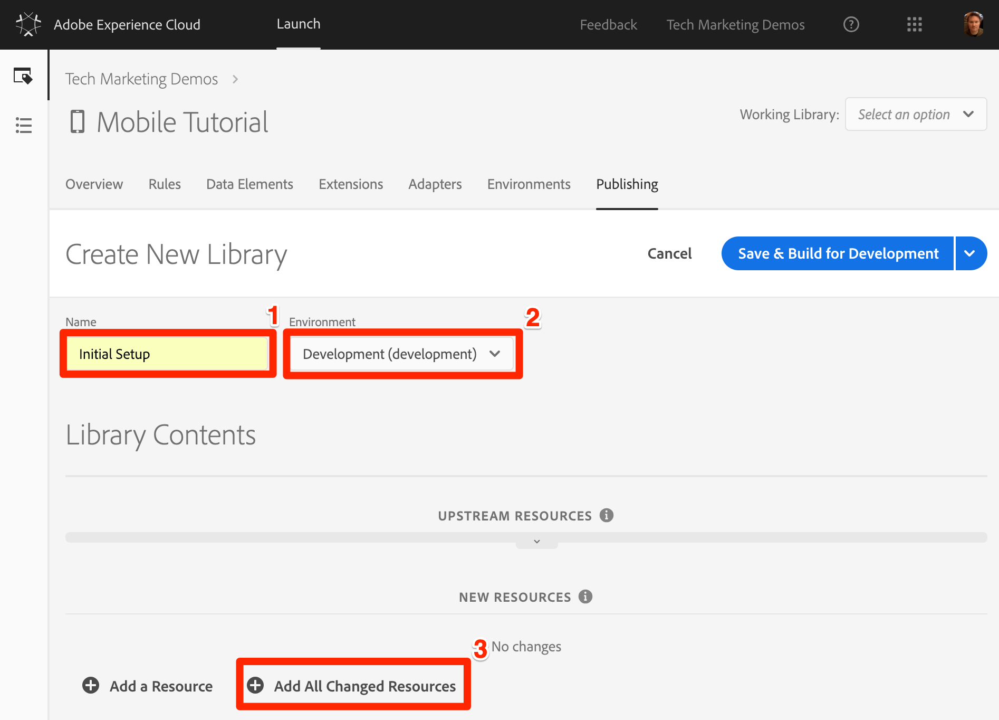

# Bibliothek hinzufügen

In dieser Lektion erstellen Sie eine Bibliothek für Ihre neue Launch-Eigenschaft. Eine Bibliothek packt alle gewünschten Starteinstellungen zusammen und generiert die spezifischen Implementierungsanweisungen, die zum Installieren der Bibliothek in Ihrer mobilen App erforderlich sind.

## Lernziele

Dies können Sie am Ende dieser Lektion:

* Erstellen einer Bibliothek
* Hinzufügen von Änderungen zu einer Bibliothek
* Bibliothek erstellen

## Speichern Ihrer Änderungen in einer Bibliothek

Nachdem Sie die Erweiterungen konfiguriert haben, müssen Sie sie in einer Bibliothek packen, die Sie in Ihrer App bereitstellen können, damit Sie Ihre Lösungen verwenden können.

**So fügen Sie eine Bibliothek hinzu und erstellen sie**

1. Go to the **[!UICONTROL Publishing]** tab

1. Click **[!UICONTROL Add New Library]**

   

1. Name the Library `Initial Setup`

1. Wählen Sie **[!UICONTROL Umgebung &gt; Entwicklung]**

1. Klicken Sie auf **[!UICONTROL Alle geänderten Ressourcen hinzufügen]**

   

1. Beachten Sie, dass nach dem Klicken auf "Alle geänderten Ressourcen **** hinzufügen starten"die Änderungen, die Sie gerade beim Hinzufügen von Erweiterungen vorgenommen haben, zusammengefasst werden.

1. Klicken Sie auf **[!UICONTROL Speichern und Build zur Entwicklung erstellen]**

   

1. Nach einigen Augenblicken wird der Statuspunkt grün, was anzeigt, dass die Bibliothek erfolgreich erstellt wurde.

   

[Weiter "Install the Launch Property and the SDK"&gt;](launch-install-the-mobile-sdk.md)
