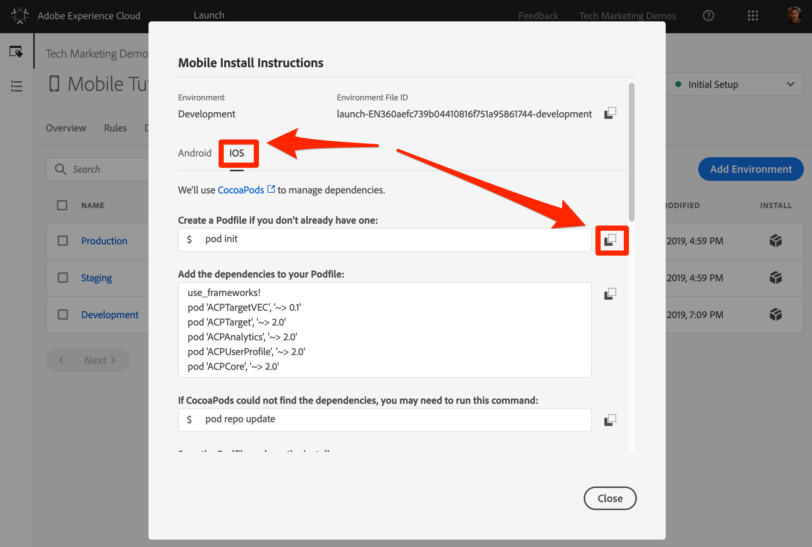
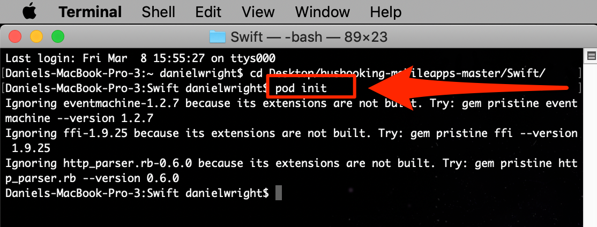
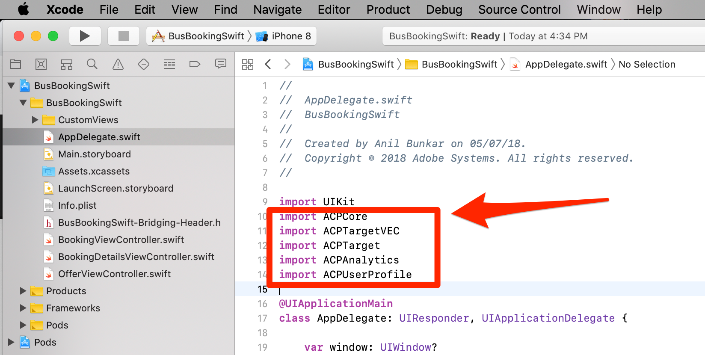
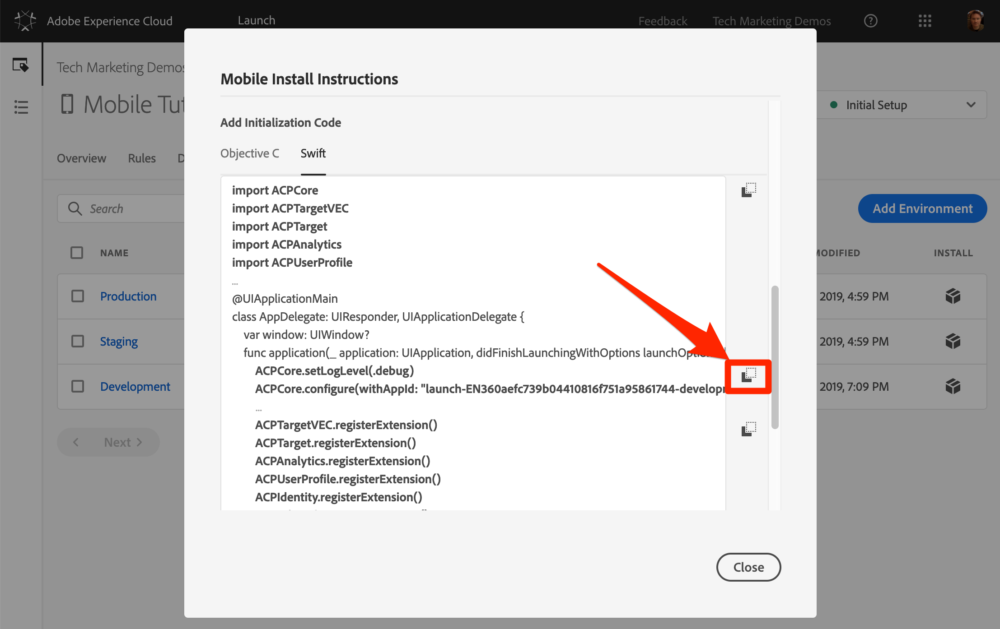

# Mobiles SDK installieren

In dieser Lektion implementieren Sie das Mobile SDK mit den Erweiterungen und Einstellungen, die der Entwicklungsumgebung Ihrer Launch-Eigenschaft entsprechen.

## Lernziele

Dies können Sie am Ende dieser Lektion:

* Installationsanweisungen für die mobile Launch-Eigenschaft abrufen
* Den Unterschied zwischen einer Entwicklungs-, Staging- und Produktionsumgebung erläutern
* Podfile erstellen und bearbeiten
* Mobile SDK in Ihre AppDelegate-Datei importieren
* Überprüfen, ob das SDK erfolgreich implementiert wurde

## Installationsanweisungen abrufen

Die Installationsanweisungen für mobile Starteigenschaften sind eine Sammlung von Code-Snippets, die Sie entweder im Terminal ausführen oder an bestimmten Stellen in Ihrer mobilen App hinzufügen.

Klicken Sie auf die `Environments` Registerkarte in der oberen Navigation, um zur Seite "Umgebungen"zu gelangen. Beachten Sie, dass Entwicklungs-, Staging- und Produktionsumgebungen für Sie vordefiniert wurden. Diese entsprechen den typischen Umgebungen im Codeentwicklungs- und -veröffentlichungsprozess. Code wird zuerst von einem Entwickler in einer Entwicklungsumgebung geschrieben. Wenn sie ihre Arbeit abgeschlossen haben, senden sie den Code an eine Staging-Umgebung, in der QA- und andere Teams ihn überprüfen können. Sobald die Qualitätssicherungs- und anderen Teams zufrieden sind, wird der Code dann in der Produktionsumgebung veröffentlicht, der Umgebung für die Öffentlichkeit, in der Ihre Besucher Ihre App herunterladen.

Launch ermöglicht zusätzliche Entwicklungsumgebungen, was in großen Organisationen nützlich ist, in denen mehrere Entwickler gleichzeitig an verschiedenen Projekten arbeiten.

Entwicklung, Staging und Produktion sind die einzigen Umgebungen, in denen wir das Tutorial abschließen müssen.


Klicken Sie in der Zeile **[!UICONTROL Entwicklung]** auf das Symbol  Installation, um das Einbettungscode-Modal zu öffnen.


Gehen wir die Anweisungen Schritt für Schritt durch.

## Erstellen Sie die Poddatei und installieren Sie die Pods

Wenn Sie zuvor Launch in Websites verwendet haben, werden Sie als Erstes feststellen, dass es in diesem Modal viel mehr Informationen gibt als für Webeigenschaften.

Das Adobe Mobile SDK for iOS verwendet die CocoaPods, um Abhängigkeiten zwischen den verschiedenen Komponenten zu verwalten. Wenn Sie [CocoaPods](https://cocoapods.org/) nicht bereits in Ihrer Entwicklungsumgebung installiert haben, befolgen Sie die Installationsanweisungen auf ihrer Website. Wenn Sie die [Bus-Buchungsanwendung](https://github.com/Adobe-Marketing-Cloud/busbooking-mobileapps)noch nicht heruntergeladen haben, speichern Sie sie auf Ihrem lokalen Computer und extrahieren Sie das ZIP-Archiv auf Ihren Desktop.

**So erstellen Sie die Profildatei**

1. Öffnen Sie die `Terminal` Anwendung auf Ihrem Mac®

1. Navigieren Sie zu dem Projektordner, in dem Sie die Bus Booking Swift-App gespeichert haben (z.B. `cd Desktop/busbooking-mobileapps-master/Swift/`)

   

1. Ändern Sie in der Benutzeroberfläche "Starten"das Betriebssystem in `iOS`

1. Kopieren Sie die erste iOS-Anweisung `pod init`, indem Sie auf das Symbol  klicken

   

1. Führen Sie in Ihrer Terminal-App den `pod init` Befehl aus und warten Sie, bis er abgeschlossen ist

   

1. Öffnen Sie in Ihrer Terminal-App die Poddatei mit dem `open podfile` Befehl

   

1. Ihr Computer öffnet möglicherweise ein Dialogfeld, in dem Sie gefragt werden, mit welcher Anwendung Sie die Datei öffnen möchten. Wählen Sie einen beliebigen Texteditor, z. B. `TextEdit`

1. Kopieren Sie in der Benutzeroberfläche "Starten"die Liste der Abhängigkeiten, indem Sie auf das Symbol "  "klicken. Beachten Sie, dass es eine Zeile gibt, die jeder der Erweiterungen entspricht, die Sie in der vorherigen Lektion hinzugefügt haben. Jede Erweiterung verfügt über einen eigenen Code-Satz, der auf der Mobile Core Extension aufbaut und nur mit einem App-Update hinzugefügt oder entfernt werden kann:

   

1. Fügen Sie in Ihrem Texteditor die Abhängigkeiten aus der Zwischenablage direkt nach der Zeile ein `# Pods for BusBookingSwift`

1. Speichern Sie die Aktualisierungen in der Poddatei in Ihrem Texteditor

   

1. Sie können jetzt Ihren Texteditor schließen

1. Kopieren Sie in der Benutzeroberfläche "Start"die nächste iOS-Anweisung `pod repo update`durch Klicken auf das Symbol 

   

1. Führen Sie in Ihrer Terminal-App den `pod repo update` Befehl aus und warten Sie, bis er abgeschlossen ist (dies kann einige Minuten dauern).

   

1. Kopieren Sie in der Benutzeroberfläche "Start"die nächste iOS-Anweisung `pod install`durch Klicken auf das Symbol 

   

1. Führen Sie in Ihrer Terminal-App den `pod install` Befehl aus und warten Sie, bis er abgeschlossen ist

   

1. Sie können Ihr Terminalfenster jetzt schließen

1. Öffnen Sie ein Finder-Fenster, navigieren Sie zu dem Ordner, in dem Sie die Bus-Buchungs-App gespeichert haben, und bestätigen Sie, dass die Datei BusBookingSwift.xcworkspace, die Poddatei, die Datei Podfile.lock sowie der Ordner Pods erstellt wurden.

   

## AppDelegate aktualisieren

Jetzt ist es an der Zeit, die App zu aktualisieren, um das SDK zu importieren

1. Öffnen Sie die `BusBookingSwift.xcworkspace` Datei in Xcode
1. Öffnen Sie die `AppDelegate.swift` Datei

   

1. Blättern Sie in der Benutzeroberfläche "Starten"zum Abschnitt "Initialisierungscode **[!UICONTROL hinzufügen"]** und wählen Sie als verwendete iOS-Sprache " **[!UICONTROL Swift]** "aus.
1. Kopieren Sie die Importanweisungen, indem Sie auf das erste Symbol  im Abschnitt Initialisierungscode **[!UICONTROL hinzufügen]** klicken:

   

1. Fügen Sie diese Importanweisungen in Xcode nach dem Import für die `AppDelegate.swift``UIKit`

   

1. Kopieren Sie in der Benutzeroberfläche "Start"die beiden Zeilen, die sich auf die Core-Erweiterung beziehen, indem Sie auf das zweite Symbol  im Abschnitt Initialisierungscode **[!UICONTROL hinzufügen]** klicken. Die erste Zeile aktiviert die Anweisungen zur Konsolenprotokollierung (die verfügbaren Optionen sind "debug", "verbose", "warning"und "error"). Die zweite Zeile verweist auf die eindeutige Kennung der Startumgebung. Dies ist wichtig, da Sie diesen Wert aktualisieren müssen, wenn wir bereit sind, die App in der Produktionsumgebung bereitzustellen.

   

1. Fügen Sie in Xcode diese Core-Anweisungen oben in der `application(_:didFinishLaunchingWithOptions:)` Methode in die AppDelegate-Datei ein:

   

1. Kopieren Sie in der Startschnittstelle die Erweiterungsanweisungen, indem Sie auf das dritte Symbol  im Abschnitt [!UICONTROL Initialisierungscode] hinzufügen klicken:

   

1. Fügen Sie in Xcode diese Erweiterungsanweisungen direkt vor der `return true` Zeile der `application(_:didFinishLaunchingWithOptions:)` Methode in die Datei AppDelegate ein:

   

>[!NOTE] Die in der Benutzeroberfläche "Start"bereitgestellten Anweisungen für die mobile Installation umfassen die Import- und Registrierungsanweisungen für Identitäts-, Lebenszyklus- und Signalerweiterungen sowie die Initialisierung der Lifecycle-Metriken. Diese Erweiterungen gelten als Teil der Mobile Core Extension. Wenn Sie diese Erweiterungen nicht in Ihrer App verwenden möchten, müssen Sie keinen anderen mit diesen Erweiterungen verknüpften Code importieren, registrieren oder implementieren.
>
> Es gibt außerdem zusätzliche Implementierungsoptionen, die bei Verwendung dieser Erweiterungen berücksichtigt werden sollten (Sie können z. B. die Lebenszyklussammlung anhalten/neu starten, wenn der Benutzer die App im Hintergrund bzw. im Vordergrund betrachtet). Weitere Informationen finden Sie in [der Dokumentation zur Mobile Core Extension](https://aep-sdks.gitbook.io/docs/using-mobile-extensions/mobile-core)

## Implementierung überprüfen

1. Xcode-Projekt speichern
1. Führen Sie die App aus und starten Sie sie im Simulator. Wenn Sie keine Simulatorgeräte konfiguriert haben, konfigurieren Sie eines jetzt, und stellen Sie sicher, dass Sie ein Gerät mit iOS 10+ konfigurieren. Wir verwenden gerne einen iPhone 8 Simulator, weil es einfach ist, mit der Maus auf die `Home` Schaltfläche zu klicken.

   

1. Warten Sie, bis der Simulator gestartet ist, und öffnen Sie die App vollständig im Buchungsbildschirm (dies kann einige Minuten dauern).

   

1. Überprüfen Sie, ob Aufrufe an die Adobe-Server in der Xcode-Konsole erfolgen

   

Im Folgenden finden Sie einige Beispiele für spezifische Aufrufe, nach denen Sie suchen können:

1. **Ruft die Startkonfiguration** ab (filtern Sie Ihre Konsole `adobedtm.com`). Beachten Sie die Erweiterungskonfigurationen, die Sie in der vorherigen Lektion eingegeben haben. Während das Hinzufügen der Erweiterung eine Aktualisierung der App erfordert, können diese Einstellungen beim Starten extern verwaltet und jederzeit geändert werden:

   ```swift
   2019-01-15 12:11:44.518220-0500 BusDemoSwift[52399:5056293] [AMSDK DEBUG <RulesDownloader>]: Successfully downloaded Rules from 'https://assets.adobedtm.com/launch-EN360aefc739b04410816f751a95861744-development-rules.zip'
   
   {"target.propertyToken":"","target.timeout":5,"global.privacy":"optedin","analytics.backdatePreviousSessionInfo":true,"analytics.offlineEnabled":true,"build.environment":"dev","rules.url":"https://assets.adobedtm.com/launch-EN360aefc739b04410816f751a95861744-development-rules.zip","target.clientCode":"techmarketingdemos","experienceCloud.org":"7ABB3E6A5A7491460A495D61@AdobeOrg","target.autoFetch":true,"target.fetchBackground":true,"lifecycle.sessionTimeout":300,"target.environmentId":"busbookingapp","analytics.server":"tmd.sc.omtrdc.net","analytics.rsids":"tmd-mobile-dev1","analytics.batchLimit":0,"property.id":"PRb4881271498b4f2cbaf67d38a8f3891a","global.ssl":true,"analytics.aamForwardingEnabled":true}
   ```

1. **Anforderung an den Identitätsdienst** (Filtern Sie Ihre Konsole nach `demdex.net`) In diesem Beispiel wurde die ID (`d_mid`) bereits festgelegt und wird gerade erneut gemeldet)

   ```swift
   2019-01-15 12:11:45.164590-0500 BusDemoSwift[52399:5056322] [AMSDK DEBUG <com.adobe.module.identity>]:
   
   Sending request (https://dpm.demdex.net/id?d_rtbd=json&d_ver=2&d_orgid=7ABB3E6A5A7491460A495D61@AdobeOrg&d_mid=17179986463578698626041670574784107777&d_blob=j8Odv6LonN4r3an7LhD3WZrU1bUpAkFkkiY1ncBR96t2PTI&dcs_region=9)
   ```

1. **Antwort vom Identitätsdienst** (Filtern Sie Ihre Konsole auf `ID Service`). Beachten Sie, wie der `mid` Wert mit dem `d_mid` Wert in der oben stehenden Anforderung übereinstimmt:

   ```swift
   2019-01-15 12:11:45.681821-0500 BusDemoSwift[52399:5056322] [AMSDK DEBUG <com.adobe.module.identity>]:
   
   ID Service - Got ID Response (mid: 17179986463578698626041670574784107777, blob: j8Odv6LonN4r3an7LhD3WZrU1bUpAkFkkiY1ncBR96t2PTI, hint: 9, ttl: "604800000 ms")
   ```

1. **Analytics-Anforderung** (Filtern Sie Ihre Konsole nach `Analytics request`)

   ```swift
   2019-01-15 12:11:45.828465-0500 BusDemoSwift[52399:5056336] [AMSDK DEBUG <AnalyticsHitDatabase>]: Analytics request was sent with body
   
   (ndh=1&c.&a.&AppID=BusDemoSwift%201%20%281.0%29&CarrierName=%28null%29&DayOfWeek=3&DaysSinceFirstUse=0&DaysSinceLastUse=0&DeviceName=x86_64&HourOfDay=12&LaunchEvent=LaunchEvent&Launches=3&OSVersion=iOS%2012.1&Resolution=828x1792&RunMode=Application&TimeSinceLaunch=0&ignoredSessionLength=-1547572244&internalaction=Lifecycle&locale=en-US&.a&.c&aamb=j8Odv6LonN4r3an7LhD3WZrU1bUpAkFkkiY1ncBR96t2PTI&aamlh=9&ce=UTF-8&cp=foreground&mid=17179986463578698626041670574784107777&pageName=BusDemoSwift%201%20%281.0%29&pe=lnk_o&pev2=ADBINTERNAL%3ALifecycle&t=00%2F00%2F0000%2000%3A00%3A00%200%20300&ts=1547572305)
   ```

Herzlichen Glückwunsch! Sie haben das SDK zu einer mobilen App hinzugefügt!

[Weiter "Adobe Experience Platform Identity Service hinzufügen"&gt;](id-service.md)