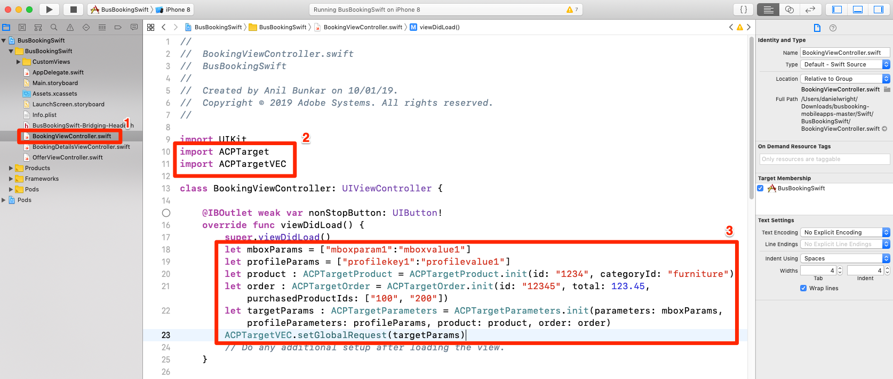
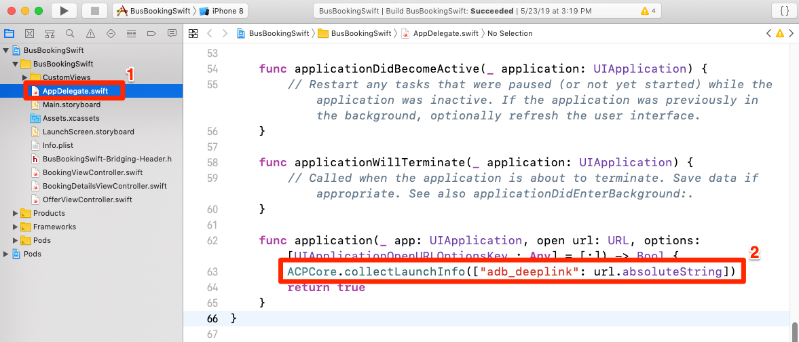
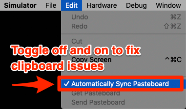
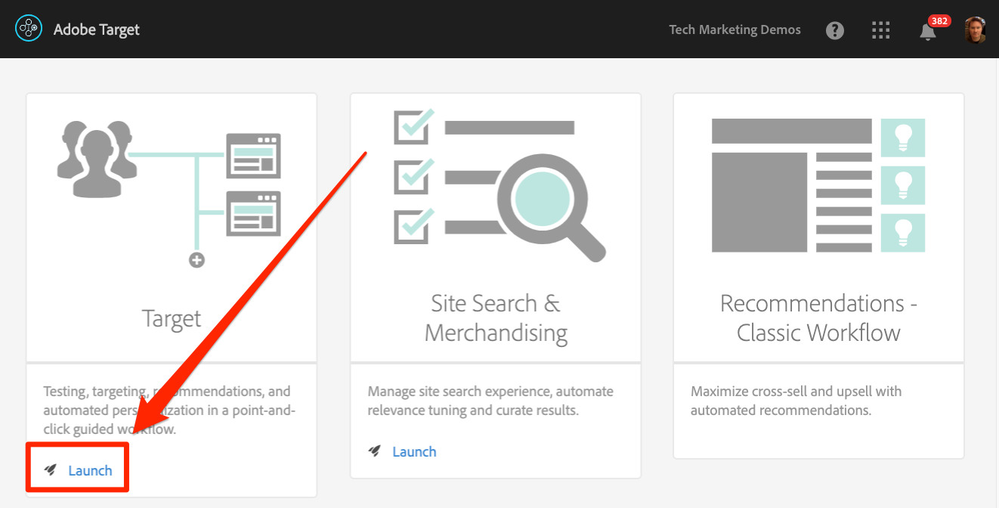
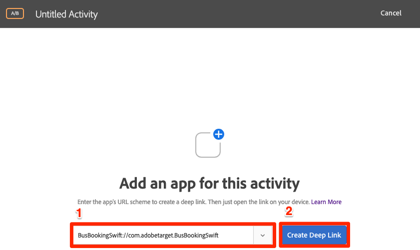
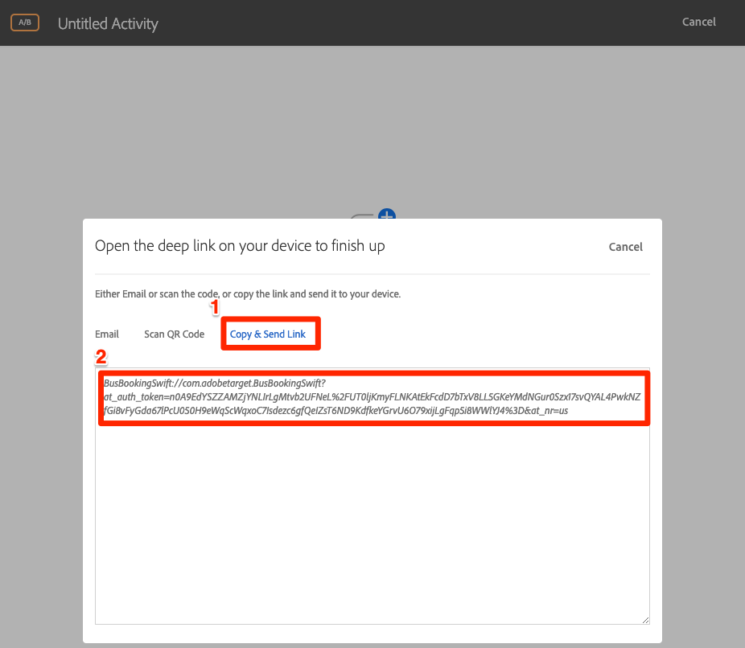
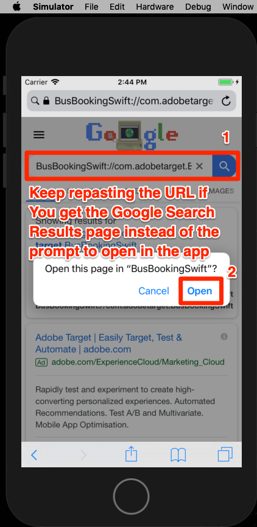
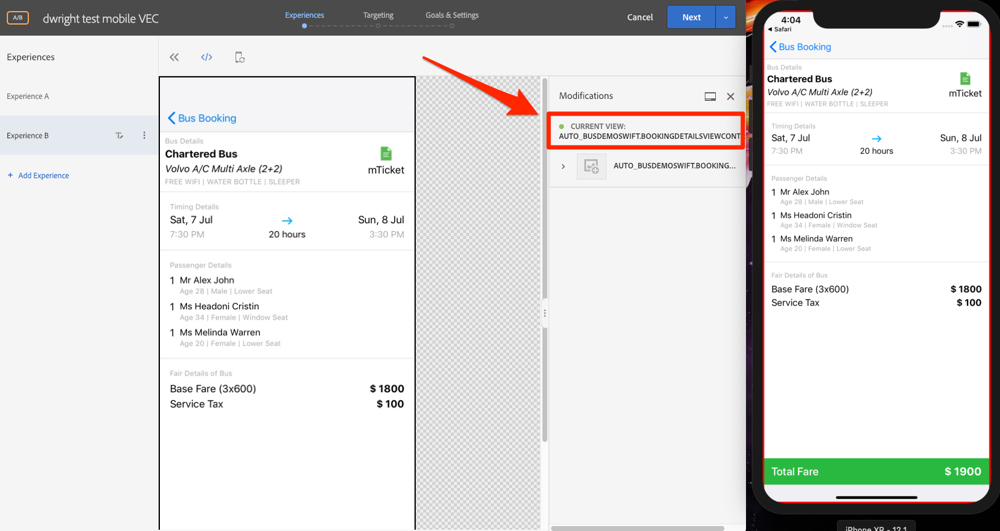
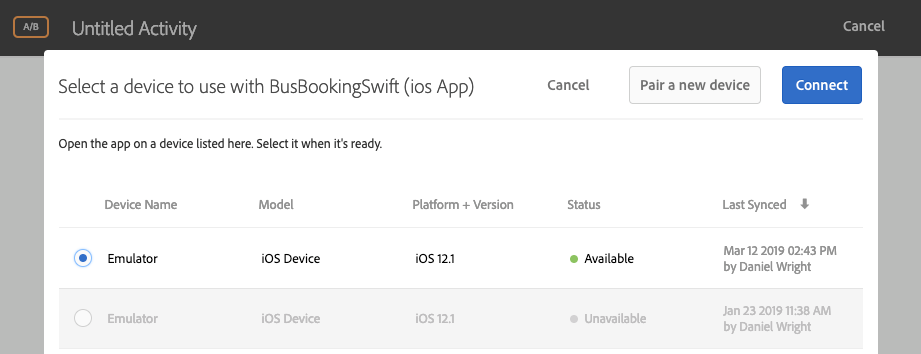

# Visual Experience Composer (VEC) von Adobe Target hinzufügen

In dieser Lektion aktivieren Sie den Visual Experience Composer (VEC) für mobile Apps.

[Adobe Target](https://docs.adobe.com/content/help/en/target/using/target-home.html) ist die Adobe Experience Cloud-Lösung, die alles bietet, was Sie zur Anpassung und Personalisierung der Kundenerfahrung benötigen, sodass Sie den Umsatz Ihrer Websites, mobilen Sites, Apps, sozialen Medien und anderer digitaler Kanäle maximieren können.

Mit Visual Experience Composer (VEC) für native mobile Apps können Sie Aktivitäten und personalisierte Inhalte in nativen mobilen Apps selbstständig erstellen, ohne von kontinuierlicher Weiterentwicklung und App-Release-Zyklen abhängig zu sein.

In der Lektion [Erweiterungen](launch-add-extensions.md)hinzufügen haben Sie die Target VEC-Erweiterung zu Ihrer Launch-Eigenschaft hinzugefügt. In der Lektion [Installieren des Mobile SDK](launch-install-the-mobile-sdk.md) haben Sie die Erweiterung in die Beispielanwendung importiert. Nur wenige kleinere Aktualisierungen sind erforderlich, um Aktivitäten im Visual Experience Composer von Target für mobile Geräte einrichten zu können!

>[!WARNING] Sowohl die Target VEC Launch-Erweiterungen als auch Target VEC sind erforderlich, um Target VEC in Ihrer mobilen Anwendung zu verwenden.

## Lernziele

Dies können Sie am Ende dieser Lektion:

* Beispielanwendung für Target VEC aktivieren
* Parameter zur Target VEC-Anforderung hinzufügen
* Verbinden des Geräts mit dem VEC
* Erstellen einer Aktivität mit dem VEC

## Voraussetzungen 

Um die Unterrichtsstunden in diesem Abschnitt abzuschließen, müssen Sie:

* Abschließen der Lektionen in den Abschnitten [Start](launch-create-a-property.md) konfigurieren
* Zugriff auf die Oberfläche von Adobe Target auf Genehmigerebene

## Parameter hinzufügen

Lebenszyklusmetriken werden automatisch als Parameter in die Target VEC-Anforderung einbezogen. Sie können den Anforderungen auch benutzerdefinierte Parameter hinzufügen.

**So fügen Sie benutzerdefinierte Parameter hinzu**

1. Öffnen Sie die `BookingViewController.swift` Datei in Xcode. Diese Datei wird vom Startbildschirm verwendet.
1. Importieren Sie die VEC-Erweiterungen von Target und Target unter den vorhandenen Importen

   ```swift
   import ACPTarget
   import ACPTargetVEC
   ```

1. Fügen Sie in der `viewDidLoad()` Funktion nach der Zeile den folgenden Code `super.viewDidLoad()` hinzu. Dieser Beispielcode zeigt, wie Parameter, Profilparameter, Produkt- (oder Entitätsparameter) und Bestellparameter der TargetVEC-Anforderung hinzugefügt werden können. In diesem Beispiel werden statische Werte verwendet, während Sie in Ihrer eigentlichen App dynamische Variablen zum Ausfüllen der Werte verwenden möchten. Und natürlich würden Sie nur die Parameter ausfüllen wollen, die mit der Ansicht zusammenhängen:

   ```swift
   let params = ["param1":"value1"]
   let profileParams = ["profilekey1":"profilevalue1"]
   let product : ACPTargetProduct = ACPTargetProduct.init(id: "1234", categoryId: "furniture")
   let order : ACPTargetOrder = ACPTargetOrder.init(id: "12345", total: 123.45, purchasedProductIds: ["100", "200"])
   let targetParams : ACPTargetParameters = ACPTargetParameters.init(parameters: params, profileParameters: profileParams, product: product, order: order)
   ACPTargetVEC.setGlobalRequest(targetParams)
   ```

   

Nachdem Sie der App nun Parameter hinzugefügt haben, müssen Sie sicherstellen, dass sie in der Anforderung übergeben werden.

**So überprüfen Sie die Parameter**

1. Xcode-Projekt speichern
1. Erstellen Sie die App neu und warten Sie, bis sie im Simulator erneut geöffnet wird
1. Klicken Sie im Konsolenbereich von Xcode
1. Drücken Sie die Taste F, um das Feld Suchen zu öffnen
1. Suchen `targetvec` im Feld "Suchen"
1. Treffer `Enter` zum Aufrufen der Target-Anforderung und des Beitragskörpers. Suchen Sie die benutzerdefinierten Parameter, die Sie der Anforderung hinzugefügt haben:

   

## Paarung der mobilen App mit der Target-Oberfläche

Um VEC-Aktivitäten in der Target-Oberfläche zu erstellen, müssen Sie zunächst Target mit Ihrer App verbinden. Diese Paarung wird durch den Einsatz von Deep Links erreicht.

### Erstellen des Deep-Link-Schemas

iOS unterstützt die Verwendung von [universellen Links](https://developer.apple.com/documentation/uikit/core_app/allowing_apps_and_websites_to_link_to_your_content) und [benutzerdefinierten URL-Schemas](https://developer.apple.com/documentation/uikit/core_app/allowing_apps_and_websites_to_link_to_your_content/defining_a_custom_url_scheme_for_your_app) zum Erstellen von Deep Links zu Ihrer App. Sie verwenden wahrscheinlich bereits benutzerdefinierte URL-Schemas in Ihrer App. In diesem Fall können Sie diese vorhandenen Links verwenden, um eine Verbindung mit Target herzustellen. Für dieses Lernprogramm müssen Sie ein benutzerdefiniertes URL-Schema erstellen.

**So registrieren Sie Ihr URL-Schema**

1. Doppelklicken Sie in Xcode auf Ihre App, um den Anzeigebereich "Einstellungen"zu öffnen
1. Klicken Sie im Anzeigebereich "Einstellungen"auf die `Info` Registerkarte
1. Abschnitt erweitern `URL Types`
1. Beachten Sie, dass der **[!UICONTROL Bezeichner]** auf `com.adobetarget.BusBookingSwift`eingestellt ist. Sie können diesen Bezeichner verwenden oder ihn gegebenenfalls ändern.
1. Beachten Sie, dass das **[!UICONTROL URL-Schema]** lautet `BusBookingSwift`. Sie können dieses Schema verwenden oder es ändern, wenn Sie möchten.
1. Stellen Sie sicher, dass **[!UICONTROL Rolle]** auf **[!UICONTROL Editor eingestellt ist.]**

   

1. Wenn Sie den Bezeichner oder das Schema aktualisiert haben, klicken Sie auf die `General` Registerkarte, damit das Schema gespeichert wird.  Klicken Sie auf die `Info` Registerkarte zurück, erweitern Sie den `URL type` Abschnitt und vergewissern Sie sich, dass Ihr Bezeichner oder Schema gespeichert wurde.

Der nächste Schritt besteht darin, dem Deep Link einen Handler hinzuzufügen.

**So behandeln Sie die Deep Links**

1. Öffnen Sie die `AppDelegate.swift` Datei
1. Fügen Sie die Zeile `ACPCore.collectLaunchInfo(["adb_deeplink": url.absoluteString])` zum `AppDelegate:application:openURL` Abschnitt hinzu, wie unten dargestellt
   

### Deep-Link überprüfen

Wenn ein Benutzer mit installierter App eine URL wie `BusBookingSwift://com.adobetarget.BusBookingSwift` (oder ein beliebiges Schema) im Simulator öffnet, wird die Anwendung geöffnet.

**So überprüfen Sie die Deep-Link-Regelung**

1. Xcode-Projekt speichern
1. App neu erstellen
1. Öffnen Sie im Simulator Safari
1. Geben Sie die URL `BusBookingSwift://com.adobetarget.BusBookingSwift` (oder das von Ihnen definierte Schema) in die Adressleiste ein. Falls Sie Schwierigkeiten haben, lesen Sie den Abschnitt Tipp unten.
1. Sie sollten mit einem Modal zur Meldung "Öffnen Sie diese Seite in "BusBookingSwift". Falls Sie Schwierigkeiten haben, lesen Sie den Abschnitt Tipp unten.
1. Klicken Sie auf `Open`
1. Dadurch sollte die App "Bustanbuchen"geöffnet werden

   > [!TIP] Wenn Sie beim Kopieren und Einfügen der URL von Ihrem Desktop in den Simulator nicht erfolgreich sind, hat dies in der Regel zwei Gründe:
   >
   >   1. **Die von der Target-Oberfläche kopierte URL fügt nicht in den Simulator** ein. Dies geschieht, wenn die Zwischenablagen für Desktop und Simulator nicht synchronisiert werden.  In diesem Fall versuchen Sie, die `Automatically Sync Pasteboard` Einstellung im Simulator zu deaktivieren und wieder zu kopieren/einzufügen:
      >
      >      
      
      >
      >   
   1. **Einfügen der URL landet auf der Google-Suchergebnisseite** Versuchen Sie, die Deep-Link-URL in die Adressleiste zu kopieren und drücken Sie `Enter`. Vielleicht müssen Sie das ein paar Mal wiederholen.


   

Nachdem Sie Ihre Deep-Link-Struktur eingerichtet haben, können Sie mit Target VEC Aktivitäten einrichten!

## Erstellen einer Aktivität im Mobile VEC

Erstellen wir nun eine Aktivität in der Target-Benutzeroberfläche.

**So erstellen Sie eine Aktivität mit Target VEC**

1. Bei der [Adobe Experience Cloud anmelden](https://experiencecloud.adobe.com)
1. Verwenden Sie den Lösungsumschalter, um zu Target zu wechseln

   

1. Target starten

   

1. Klicken Sie auf die Schaltfläche **[!UICONTROL Aktivität]** erstellen und wählen Sie **[!UICONTROL A/B-Test]**
1. Mobile **[!UICONTROL App auswählen]**
1. Stellen Sie sicher, dass **[!UICONTROL Visual]** unter **[!UICONTROL Experience Composer auswählen ausgewählt ist.]**
1. Klicken Sie auf die Schaltfläche **[!UICONTROL Weiter]**

   

1. Klicken Sie im Bildschirm "App zur Verwendung **** auswählen"auf Neue App **[!UICONTROL hinzufügen]**

   

1. Geben Sie das soeben definierte URL-Schema im Feld URL **[!UICONTROL eingeben]** ein, z. B. `BusBookingSwift://com.adobetarget.BusBookingSwift`
1. Klicken Sie auf Deep Link **[!UICONTROL erstellen]**

   

   >[!NOTE] Sie haben einige Optionen, um den Deep Link zur App zu senden. Sie haben folgende Möglichkeiten:
   >
   >   1. E-Mail den Deep Link an eine gültige E-Mail-Adresse senden und dann den Link mit einer E-Mail-Anwendung auf dem Gerät öffnen
   >   1. Nehmen Sie ein Foto des QR-Codes von Ihrem iOS-Gerät (in unserem Tutorial müsste das Gerät mit Xcode verknüpft sein)
   >   1. Kopieren Sie den Deep Link aus der Target-Oberfläche und senden Sie ihn an das Gerät, wie Sie möchten


1. Klicken Sie auf die Registerkarte Link **[!UICONTROL kopieren und senden]** .
1. Klicken Sie auf eine beliebige Stelle auf den Link, um den Link automatisch in die Zwischenablage zu kopieren

   

1. Zurück zum Simulator wechseln
1. Safari im Simulator öffnen
1. Fügen Sie die Deep-Link-URL in die Adressleiste ein.
1. Klicken Sie auf die `Open` Schaltfläche, um die App zu öffnen

   > [!TIP] Wenn Sie beim Kopieren und Einfügen der URL von Ihrem Desktop in den Simulator nicht erfolgreich sind, hat dies in der Regel zwei Gründe:
   >
   >   1. **Die von der Target-Oberfläche kopierte URL fügt nicht in den Simulator** ein. Dies geschieht, wenn die Zwischenablagen für Desktop und Simulator nicht synchronisiert werden.  In diesem Fall versuchen Sie, die `Automatically Sync Pasteboard` Einstellung im Simulator zu deaktivieren und wieder zu kopieren/einzufügen:
      >
      >      
      
      >
      >   
   1. **Einfügen der URL landet auf der Google-Suchergebnisseite** Versuchen Sie, die Deep-Link-URL in die Adressleiste zu kopieren und drücken Sie `Enter`. Vielleicht müssen Sie das ein paar Mal wiederholen.


   

1. Nachdem die App geladen wurde, wechseln Sie zurück zu Ihrer Browser-Registerkarte, in der Sie Target geöffnet haben. Ihre App sollte im VEC geladen werden.
1. Klicken Sie auf Text- und Bild-Assets in Ihrer App und Sie sollten Optionen zum Bearbeiten und Ersetzen sehen!

   

1. Nehmen Sie einige Änderungen am ersten Bildschirm der App vor
1. Positionieren Sie jetzt den Simulator bei geöffnetem VEC neben dem Browser
1. Navigieren Sie zu einem anderen Bildschirm in der App und sehen Sie, wie der VEC mit dem Simulator aktualisiert wird!
1. Sie können Aktualisierungen für mehrere Ansichten in Ihrer App in einer einzigen Aktivität vornehmen.
   
1. Sie können auch visuell Klick-Tracking-Metriken hinzufügen!
1. Speichern und genehmigen Sie Ihre Aktivität und vergewissern Sie sich, dass sie in der Beispielanwendung angezeigt wird.

Die Verbindung des Geräts mit dem VEC ist eine einmalige Aktion. Wenn Sie in Zukunft auf demselben Gerät weitere Aktivitäten erstellen, können Sie das Gerät aus einer Liste auswählen, wie unten dargestellt:



>[!TIP] Wenn Sie ein Gerät geöffnet haben, es aber im Auswahlmenü nicht verfügbar ist, hinterlegen Sie den Hintergrund der App, indem Sie zum Startbildschirm zurückkehren und dann die App wieder in den Vordergrund verschieben, um sie wieder verfügbar zu machen.

## Erstellen von Zielgruppen basierend auf Lifecycle-Metriken

Integrierte Lebenszyklusmetriken zur Verwendung der App durch den Besucher, die automatisch in Aufrufen des Adobe Mobile SDK enthalten sind. Sie können auf einfache Weise Zielgruppen in Target basierend auf diesen Metriken erstellen.

**So erstellen Sie eine Zielgruppe**

1. Klicken Sie in der Target-Oberfläche in der oberen Navigation auf **Zielgruppen** .
1. Click the **Create Audience** button

   

1. Name the Audience `Launches < 5`
1. Click **Add Rule &gt; Custom**

   

1. Wählen Sie im ersten Dropdown-Menü den Parameter **a.Launches** . Alle Lebenszyklusmetrikparameter beginnen mit dem "a". Präfix. Wir richten Inhalte auf Grundlage der Anzahl der App-Starts für den Benutzer ein. Dies ist eine hervorragende Möglichkeit, erstmalige Benutzer Ihrer App mit einer Anleitung und einem Erlebnis für den ersten Benutzer (FTUE) als Ziel festzulegen.
1. Wählen Sie im nächsten Dropdown-Menü **ist kleiner als**
1. Geben Sie im dritten Dropdown-Feld **5 ein.**
1. Klicken Sie auf **Speichern**

   

Beachten Sie, dass es in Target eine Vielzahl von vordefinierten Optionen zum Erstellen von Zielgruppen gibt. Darüber hinaus können Sie benutzerdefinierte Daten in der Target-Anforderung zum Erstellen von Zielgruppen senden, Zielgruppen verwenden, die aus anderen Experience Cloud-Lösungen wie Audience Manager und Analytics freigegeben wurden, und CRM-Daten, die mit Target gemeinsam verwendet werden, mithilfe der Funktion "Kundenattribute"des People Core Service.

[Nächste "Adobe Target hinzufügen"&gt;](target.md)