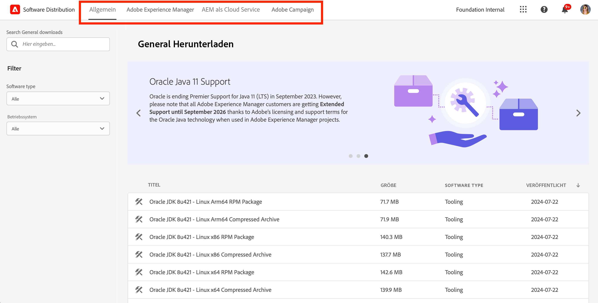
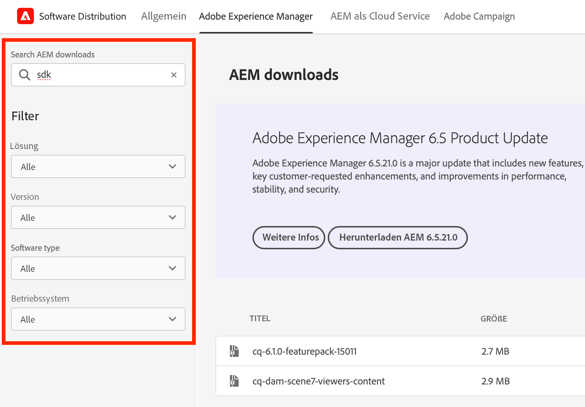
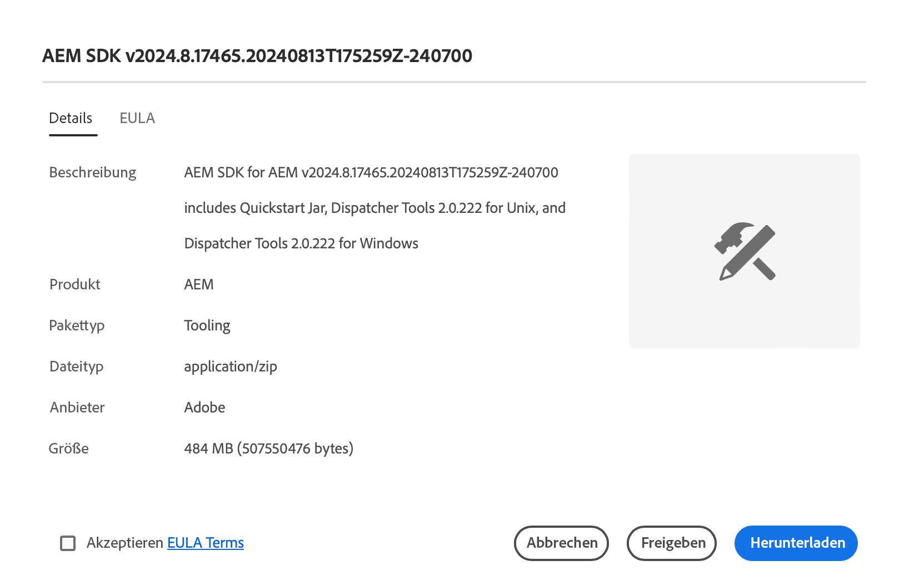

# Softwareverteilung

Erfahren Sie, wie Sie mit Softwareverteilung Ihre Adobe Experience Cloud-Software herunterladen können.

## Einführung

Softwareverteilung bietet eine effiziente Möglichkeit, Ihre Adobe Experience Cloud-Software zu finden und herunterzuladen. Für folgende Produkte stehen bestätigte Softwarepackages von Adobe und Packages von Partnerfirmen zur Verfügung:

1. **Adobe Experience Manager** – Alles rund um Service und Wartung, Sicherheit, Tooling und mehr – für alle unterstützten AEM-Versionen.
1. **Adobe Experience Manager as a [!UICONTROL Cloud Service]** – [!UICONTROL AEM Cloud-SDK], [!UICONTROL AEM Cloud]-Migrations-Tools und mehr.
1. **Adobe Campaign** – [!DNL Campaign]-Installationsprogramme in allen aktuellen Versionen und zugehörige Tools.
1. **Allgemein** – Tools für allgemeine Aufgaben wie etwa [!DNL Oracle]-JDKs für Adobe-Kunden.

Die Verwendung der Softwareverteilung ist einfach:

1. [Zugreifen auf die Softwareverteilung](#accessing)
1. [Auswählen Ihres Produkts](#selecting)
1. [Suchen des Downloads](#finding)
1. [Herunterladen der Software](#downloading)

## Zugriff auf Software-Verteilung {#accessing}

Um auf die Softwareverteilung zuzugreifen, rufen Sie [`https://experience.adobe.com/downloads`](https://experience.adobe.com/downloads)https://experience.adobe.com/downloads auf und melden Sie sich mit Ihrer Adobe ID bei [!UICONTROL Softwareverteilung] an.

## Auswählen Ihres Produkts {#selecting}

Die Benutzeroberfläche der Softwareverteilung ist nach Produkt geordnet, wie im Menü dargestellt.

Sie gelangen zur Registerkarte **Allgemein**, wo Sie allgemeine Softwaredownloads finden.

Tippen oder klicken Sie im Menü auf das Produkt, für das Sie die Software herunterladen möchten. Es können nur Produkte heruntergeladen werden, für die Ihre Organisation Lizenzen besitzt.

## Suchen des Downloads {#finding}

Nachdem Sie die Registerkarte für das gewünschte Produkt ausgewählt haben, werden alle zugehörigen Downloads angezeigt. Verwenden Sie die Suchfilter im linken Bereich, um Ihren Download schnell zu finden. Filteroptionen variieren je nach Produkt.

## Herunterladen der Software {#downloading}

Durch Tippen oder Klicken auf einen angezeigten Download wird ein Dialogfeld geöffnet, in dem Sie weitere Informationen zum Download erhalten. Sie können beispielsweise eine Beschreibung, den Namen des Anbieters und den Endbenutzer-Lizenzvertrag sehen.

Sie müssen den Endbenutzer-Lizenzvertrag akzeptieren, indem Sie **EULA-Bedingungen akzeptieren** auswählen, um die Schaltfläche **Herunterladen** zu aktivieren.

Sie können auch einen Link zu diesem Download freigeben, indem Sie auf **Freigeben** tippen oder klicken, um die URL zu kopieren.

## Package Share {#package-share}

Im Juni 2020 hat [!UICONTROL Softwareverteilung] [!UICONTROL Package Share] für AEM und [!DNL Neolane] für [!DNL Campaign] ersetzt. Eine intuitive Benutzeroberfläche, eine vereinfachte Suche und eine deutlich verbesserte Download-Geschwindigkeit machen das Herunterladen von Softwarepackages für Experience Cloud-Produkte mithilfe der Softwareverteilung zu einem angenehmeren Erlebnis.

>[!IMPORTANT]
>
>Die Anmeldedaten von [!UICONTROL Package Share] oder [!DNL Neolane] funktionieren nicht für die [!UICONTROL Softwareverteilung], da die Anmeldung auf dieser Seite auf Grundlage aller bei Adobe geltenden Sicherheitsstandards erfolgt. Wenn Sie Ihre Adobe ID nicht kennen, wenden Sie sich an Support-Admins in Ihrem Unternehmen.

>[!NOTE]
>
>[!UICONTROL Softwareverteilung] bietet nur Unterstützung für Downloads über einen Browser. Wenn Sie für neue Installationen AEM [!UICONTROL Package Manager] verwenden, wird empfohlen, das Package in einen lokalen Ordner herunterzuladen und von dort aus zu installieren.
