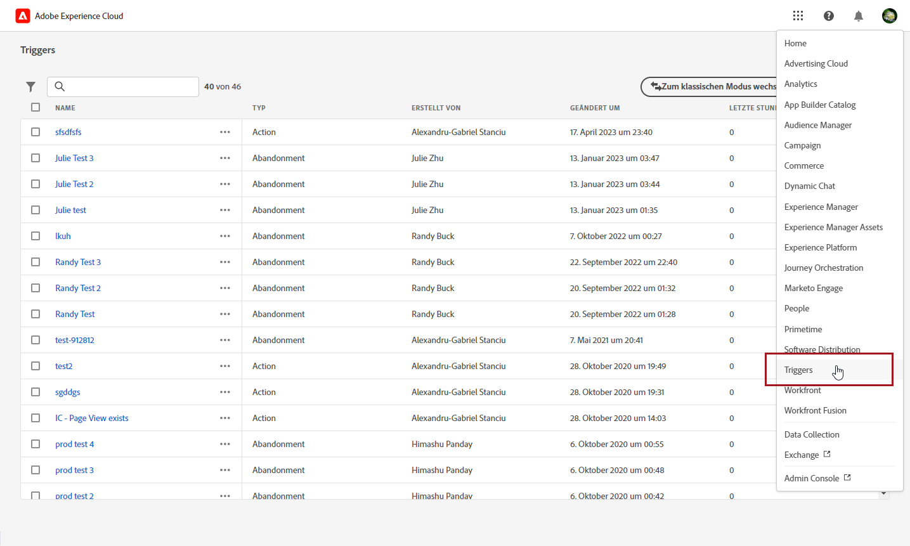
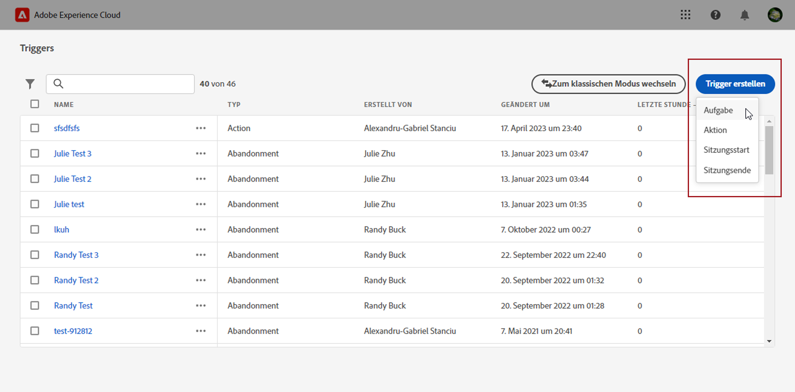
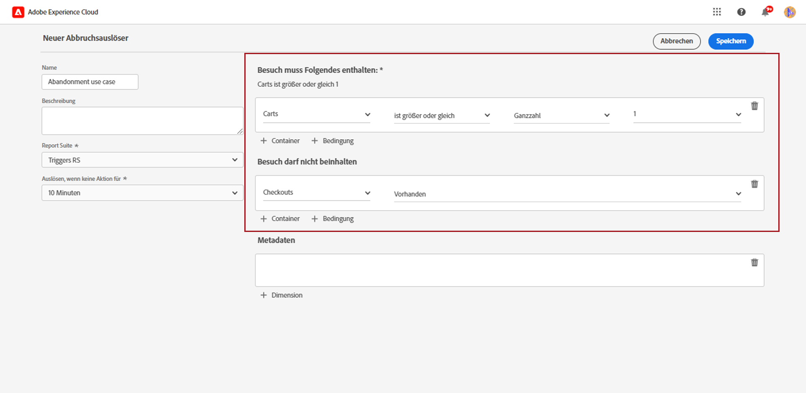
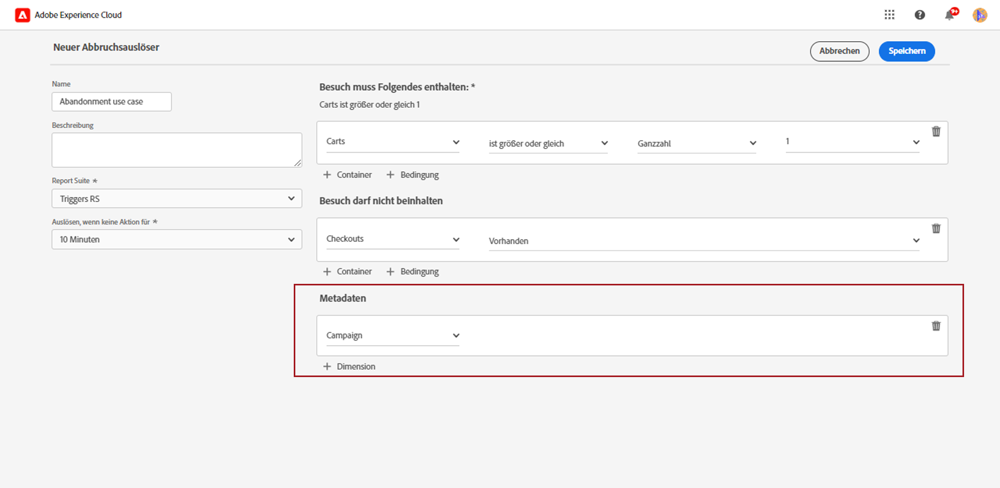
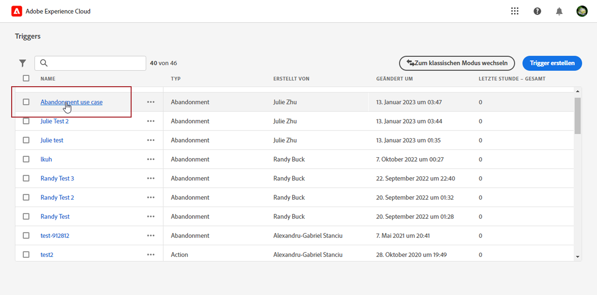
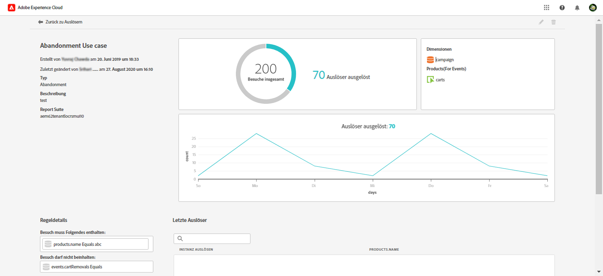

# Erstellen eines Experience Cloud-Triggers {#create-triggers}

>[!AVAILABILITY]
>
>Die neue Benutzeroberfläche von Adobe Experience Cloud Triggers wird nach und nach für alle Kunden ausgerollt. Weitere Informationen erhalten Sie vom Adobe-Support.

Erstellen Sie einen Trigger und konfigurieren Sie die Bedingungen für den Trigger. Sie können beispielsweise die Kriterien für die Regeln eines Triggers während eines Besuchs angeben, z. B. Metriken wie Warenkorbabbruch oder Dimensionen wie den Produktnamen. Wenn die Regeln erfüllt sind, wird der Trigger ausgeführt.

>[!NOTE]
>
> Die neue Benutzeroberfläche für Experience Cloud Triggers bietet ein intuitives Erlebnis für die Verwaltung von Verbraucherverhaltensweisen und die Personalisierung von Benutzererlebnissen. Um zur vorherigen Benutzeroberfläche zurückzukehren, klicken Sie auf die Schaltfläche **[!UICONTROL Zum klassischen Modus wechseln]**.

1. Wählen Sie in Experience Cloud das Lösungswechselmenü und dann **[!UICONTROL Triggers]** aus.

   

1. Klicken Sie auf Ihrer Trigger-Homepage auf **[!UICONTROL Trigger erstellen]** und geben Sie dann den Typ des Triggers an.

   Es stehen drei Typen von Triggern zur Verfügung:

   * **[!UICONTROL Abbruch]**: Sie können einen Trigger für den Fall erstellen, dass eine Besucherin oder ein Besucher sich ein Produkt ansieht, es jedoch nicht zum Warenkorb hinzufügt.

   * **[!UICONTROL Aktion]**: Sie können Trigger erstellen, die beispielsweise nach einer Newsletter-Anmeldung, E-Mail-Abonnements oder Kreditkartenanträgen (Bestätigungen) ausgelöst werden. Wenn Sie ein Händler sind, können Sie einen Trigger für einen Besucher erstellen, der sich für ein Treueprogramm anmeldet. Erstellen Sie in Medien und Unterhaltung Trigger für Besucher, die eine bestimmte Sendung ansehen. Sie können auch mit einer Umfrage reagieren.

   * **[!UICONTROL Sitzungsbeginn und Sitzungsende]**: Erstellen Sie einen Trigger für die Ereignisse „Sitzungsbeginn“ und „Sitzungsende“.

   

1. Fügen Sie Ihrem Trigger einen **[!UICONTROL Namen]** und eine **[!UICONTROL Beschreibung]** hinzu.

1. Wählen Sie die für diesen Trigger verwendete Analytics-**[!UICONTROL Report Suite]** aus. Diese Einstellung identifiziert die zu verwendenden Berichtsdaten.

   [Weitere Informationen zu Report Suites](https://experienceleague.adobe.com/docs/analytics/admin/admin-tools/manage-report-suites/c-new-report-suite/t-create-a-report-suite.html?lang=de){target="_blank"}.

1. Wählen Sie die Gültigkeitsdauer **[!UICONTROL Trigger nach ausbleibender Aktion für]** aus.

1. In den Kategorien **[!UICONTROL Besuch muss beinhalten]** und **[!UICONTROL Besuch darf nicht beinhalten]** können Sie Kriterien oder Besucherverhaltensweisen definieren, die auftreten sollen bzw. nicht auftreten sollen. Sie können Logik mit **Und** oder **Oder** innerhalb oder zwischen Bedingungen angeben, je nach den von Ihnen festgelegten Kriterien.

   Regeln für einen einfachen Warenkorbabbruchs-Trigger können beispielsweise die folgenden sein:

   * **[!UICONTROL Besuch muss beinhalten]**: `Carts (metric) Is greater or equal to 1`, um Besucherinnen und Besucher mit mindestens einem Artikel in ihrem Warenkorb zu berücksichtigen.
   * **[!UICONTROL Besuch darf nicht beinhalten]**: `Checkout (metric) Exists.`, um die Besucherinnen und Besucher zu entfernen, die die Artikel in ihrem Warenkorb gekauft haben.

   

1. Klicken Sie auf **[!UICONTROL Container]**, um Regeln, Bedingungen oder Filter zu erstellen und zu speichern, die einen Trigger definieren. Damit Ereignisse gleichzeitig auftreten, sollten Sie sie im selben Container platzieren.

   Jeder Container wird unabhängig auf der Trefferebene verarbeitet, d. h. wenn zwei Behälter mit dem **[!UICONTROL Und]**-Operator verknüpft sind, finden die Regeln nur Anwendung, wenn zwei Treffer die Anforderungen erfüllen.

1. Aus dem **[!UICONTROL Metadaten]** Feld, klicken Sie auf **[!UICONTROL + Dimension]** zur Auswahl einer bestimmten Kampagnendimension oder von Variablen, die für das Verhalten eines Besuchers relevant sind.

   

1. Klicken Sie auf **[!UICONTROL Speichern]**.

1. Wählen Sie die neu erstellten **[!UICONTROL Trigger]** aus der Liste, um auf den Detailbericht Ihres Triggers zuzugreifen.

   

1. Über die Detailansicht Ihres Triggers können Sie Berichte dazu aufrufen, wie viele Trigger ausgelöst wurden. Bei Bedarf können Sie Ihren Trigger mit dem Stiftsymbol bearbeiten.

   
