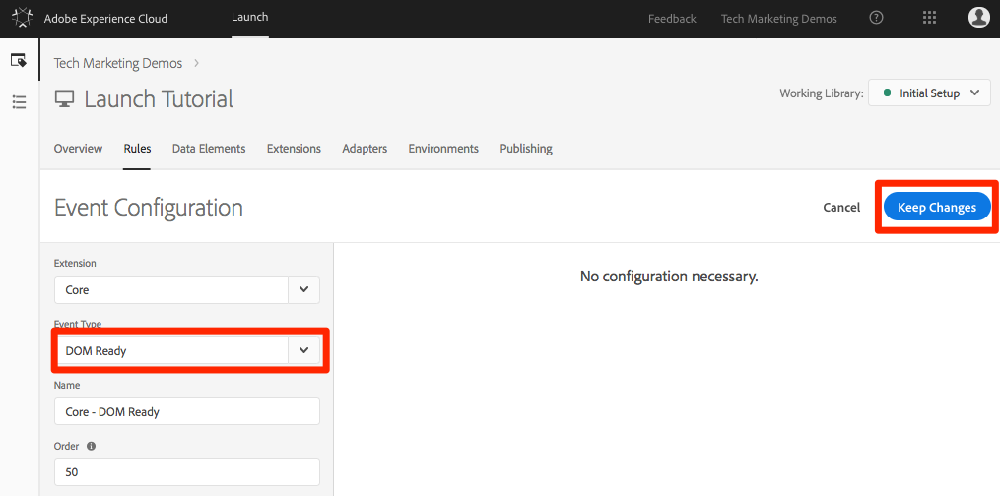
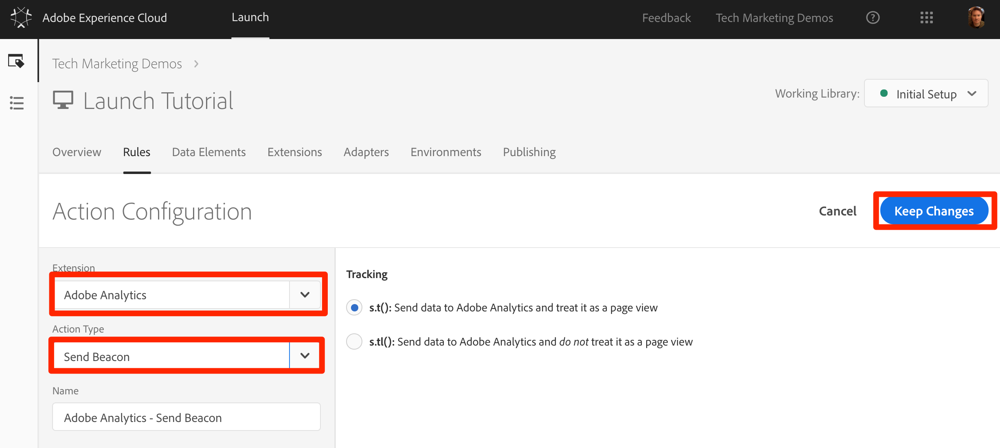
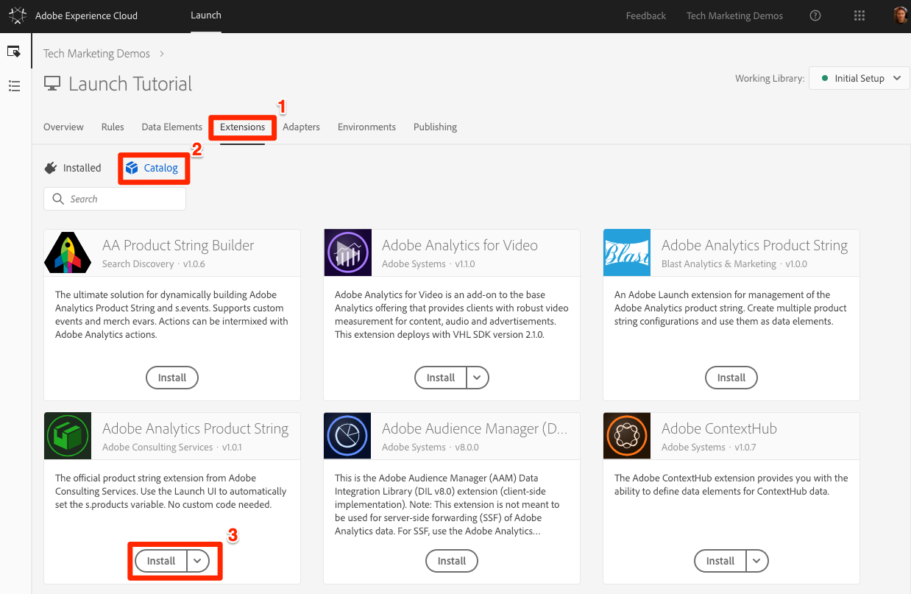
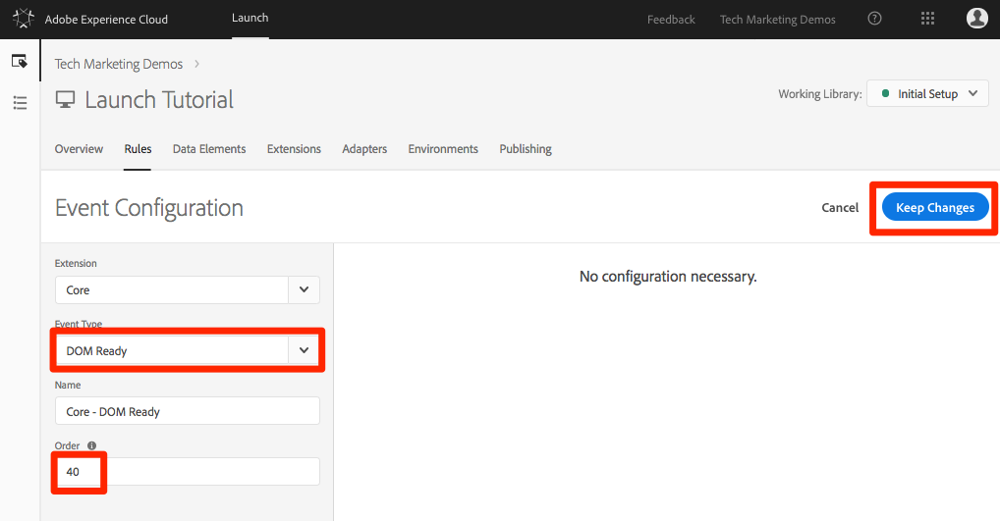
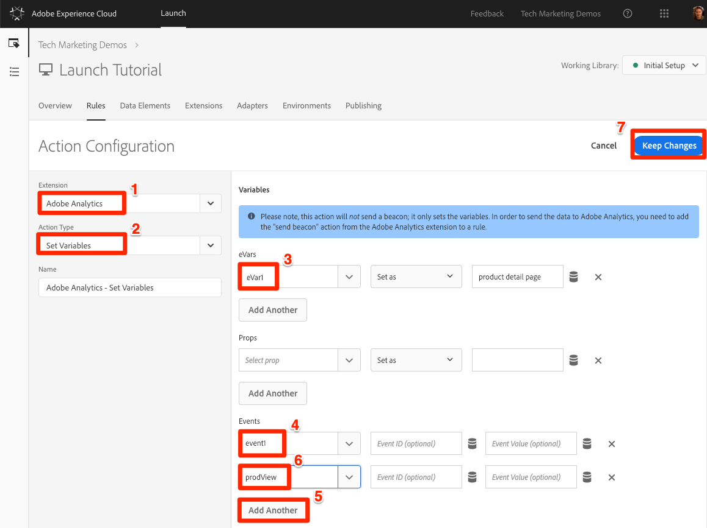
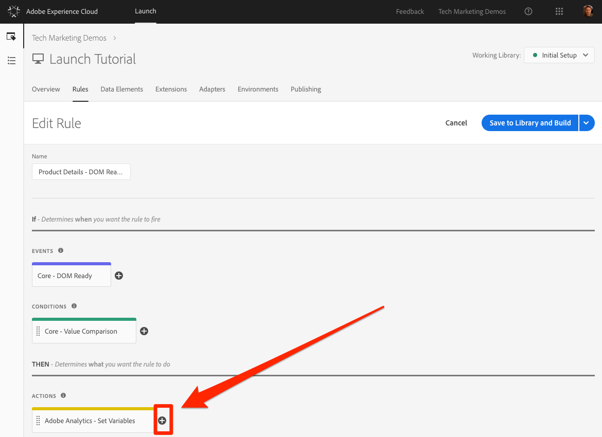
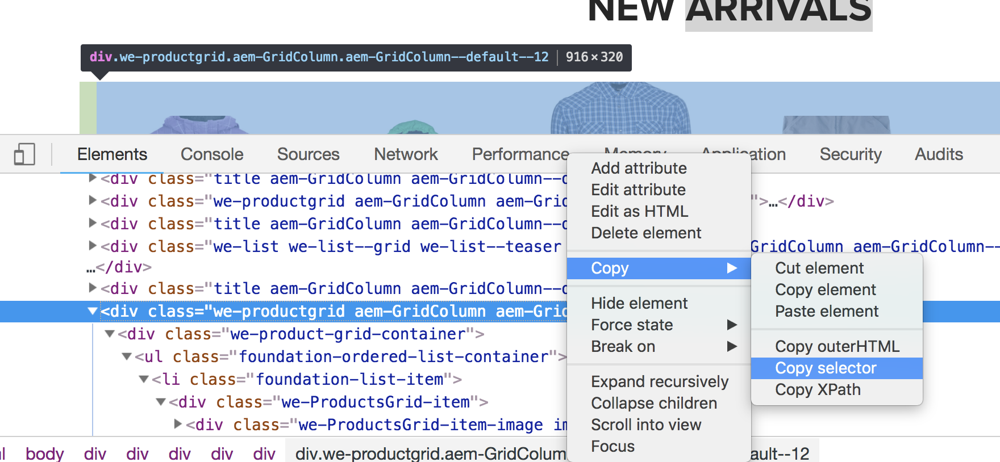
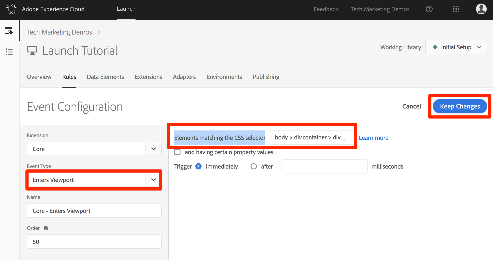

# Hinzufügen von Adobe Analytics

In dieser Lektion implementieren Sie die [Adobe Analytics-Erweiterung](https://docs.adobe.com/content/help/en/launch/using/extensions-ref/adobe-extension/analytics-extension/overview.html) und erstellen Regeln, um Daten an Adobe Analytics zu senden.

[Adobe Analytics](https://docs.adobe.com/content/help/en/analytics/landing/home.html) ist eine branchenführende Lösung, mit der Sie Ihre Kunden besser verstehen und Ihr Geschäft mit Customer Intelligence steuern können.

## Lernziele

Dies können Sie am Ende dieser Lektion:

1. Adobe Analytics-Erweiterung hinzufügen
1. Globale Variablen mithilfe der Erweiterung festlegen
1. Das Seitenansichts-Beacon hinzufügen
1. Zusätzliche Variablen mithilfe von Regeln hinzufügen
1. Klicktracking und andere ereignisbasierte Beacons hinzufügen
1. Hinzufügen von Analytics-Plugins

Es gibt viele Dinge, die in Analytics in Launch implementiert werden könnten. Diese Lektion ist nicht erschöpfend, sollte Ihnen aber einen soliden Überblick über die wichtigsten Techniken geben, die Sie für die Implementierung auf Ihrer eigenen Site benötigen.

## Voraussetzungen 

You should have already completed the lessons in [Configure Launch](launch.md) and [Add the Identity Service](id-service.md).

Darüber hinaus benötigen Sie mindestens eine Report Suite-ID und Ihren Tracking-Server. Wenn Sie keine Test/Dev-Report Suite haben, die Sie für dieses Lernprogramm verwenden können, erstellen Sie eine. Weitere Hilfestellung und Anweisungen finden Sie in der [Dokumentation](https://docs.adobe.com/content/help/en/analytics/admin/manage-report-suites/new-report-suite/new-report-suite.html). Sie können Ihren Tracking-Server von Ihrer aktuellen Implementierung, Ihrem Adobe-Berater oder Ihrem Kundendienstmitarbeiter abrufen.

## Hinzufügen der Analytics-Erweiterung

Die Analytics-Erweiterung besteht aus zwei Hauptteilen:

1. Die Konfiguration der Erweiterung, die die grundlegenden Bibliothekseinstellungen von AppMeasurement.js verwaltet und globale Variablen festlegen kann
1. Regelaktionen für folgende Funktionen:
   1. Variablen festlegen
   1. Variablen löschen
   1. Analytics-Beacon senden

**So fügen Sie die Analytics-Erweiterung hinzu**

1. Zu **[!UICONTROL Erweiterungen &gt; Katalog]**
1. Suchen Sie die Adobe Analytics-Erweiterung
1. Klicken Sie auf **[!UICONTROL Installieren]**

   

1. Geben Sie unter [!UICONTROL Bibliotheksverwaltung &gt; Report Suites]die Report Suite-IDs ein, die Sie für die einzelnen Launch-Umgebungen verwenden möchten. Beachten Sie, dass beim Eingeben des Feldes eine vorab ausgefüllte Liste aller Report Suites angezeigt wird. (Es ist in diesem Lernprogramm nicht möglich, eine Report Suite für alle Umgebungen zu verwenden, aber in Wirklichkeit sollten Sie separate Report Suites verwenden, wie in der Abbildung unten dargestellt.)

   

   >[!TIP] Es wird empfohlen, die Option[!UICONTROL  "Bibliothek für mich ]verwalten"wie die Einstellung " [!UICONTROL Bibliotheksverwaltung] "zu verwenden, da die `AppMeasurement.js` Bibliothek dadurch viel einfacher auf dem neuesten Stand gehalten werden kann.

1. Geben Sie unter [!UICONTROL Allgemein &gt; Tracking-Server]Ihren Tracking-Server ein, z. "`tmd.sc.omtrdc.net`." Enter your SSL Tracking Server if your site supports `https://`

   

1. Legen Sie im Abschnitt[!UICONTROL " ]Globale Variablen"die Variable " [!UICONTROL Seitenname] "mit Ihrem `Page Name` Datenelement fest. Klicken Sie auf das SymbolDatenelement, um das Modal zu öffnen und das `Page Name` Seitendatenelement auszuwählen.)

1. Klicken Sie auf In Bibliothek **[!UICONTROL speichern und erstellen]**

   

>[!NOTE] Globale Variablen können in der Erweiterungskonfiguration oder in Regelaktionen festgelegt werden. Be aware that when setting variables in the extension configuration, the data layer must be defined *before* the Launch embed codes.

## Seitenansichts-Beacon senden

Nun erstellen Sie eine Regel, die den Analytics-Beacon auslöst, der die in der Erweiterungskonfiguration festgelegte [!UICONTROL Seitennamenvariable] sendet.

You have already created an "All Pages - Library Loaded" rule in the [Add a Data Element, a Rule and a Library](launch-data-elements-rules.md) lesson of this tutorial, which is triggered on every page when the Launch library loads. Sie *können* diese Regel auch für Analytics verwenden. Bei diesem Setup müssen jedoch alle im Analytics-Beacon verwendeten Datenschichtattribute vor den Einbettungscodes vom Start definiert werden. Um mehr Flexibilität bei der Datenerfassung zu ermöglichen, erstellen Sie eine neue "Alle Seiten"-Regel, die bei DOM Ready ausgelöst wird, um den Analytics-Beacon auszulösen.

**So senden Sie den Seitenansichts-Beacon**

1. Gehen Sie zum Abschnitt **[!UICONTROL Regeln]** in der oberen Navigation und klicken Sie dann auf Regel **[!UICONTROL hinzufügen]**

   

1. Geben Sie einen Namen für die Regel ein `All Pages - DOM Ready`
1. Click **[!UICONTROL Events &gt; Add]** to open the `Event Configuration` screen

   

1. Wählen Sie **[!UICONTROL Ereignistyp &gt; DOM-bereit]** aus (Beachten Sie, dass die Regel in der Reihenfolge "50"angeordnet ist)
1. Click **[!UICONTROL Keep Changes]**
   

1. Under Actions, click the  to add a new action

   

1. Wählen Sie **[!UICONTROL Erweiterung &gt; Adobe Analytics]**

1. Wählen Sie **[!UICONTROL Aktionstyp &gt; Beacon senden.]**

1. Behalten Sie bei „Tracking“ `s.t()` bei. Note that if you wanted to make an `s.tl()` call in a click-event rule you could do that using the Send Beacon action, as well.

1. Klicken Sie auf die Schaltfläche Änderungen **[!UICONTROL beibehalten]** .

   

1. Klicken Sie auf In Bibliothek **[!UICONTROL speichern und erstellen]**

   

### Seitenansichts-Beacon überprüfen

Nachdem Sie eine Regel zum Senden eines Analytics-Beacons erstellt haben, sollte die Anforderung im Experience Cloud-Debugger angezeigt werden.

1. Open the [Luma site](https://luma.enablementadobe.com/content/luma/us/en.html) in your Chrome browser
1. Klicken Sie auf das Debugger-Symbol  , um den **[!UICONTROL Adobe Experience Cloud-Debugger zu öffnen]**
1. Make sure the Debugger is mapping the Launch property to *your* Development environment, as described in the [earlier lesson](launch-switch-environments.md)

   

1. Klicken Sie auf , um die Registerkarte Analytics zu öffnen
1. Erweitern Sie den Report Suite-Namen, um alle an der Report Suite gestellten Anforderungen anzuzeigen.
1. Vergewissern Sie sich, dass die Anfrage mit der Variablen „Seitenname“ und dem zugehörigen Wert ausgelöst wurde

   

>[!NOTE] Wenn Ihnen der Seitenname nicht angezeigt wird, gehen Sie die Schritte auf dieser Seite durch, um sicherzustellen, dass Sie nichts übersehen haben.

## Hinzufügen von Variablen mit Regeln

When you configured the Analytics Extension, you populated the `pageName` variable in the extension configuration. Dieser Ort eignet sich auch hervorragend, um andere globale Variablen wie eVars und Props einzugeben, sofern der Wert auf der Seite verfügbar ist, bevor der Launch-Einbettungscode geladen wird.

Eine flexiblere Position zum Festlegen von Variablen und Ereignissen ist in Regeln enthalten, die die `Set Variables` Aktion verwenden. Mit Regeln können Sie verschiedene Analytics-Variablen und -Ereignisse unter unterschiedlichen Bedingungen einstellen. For example, you could set the `prodView` only on product detail pages and the `purchase` event only on order confirmation pages. In diesem Abschnitt erfahren Sie, wie Sie Variablen mithilfe von Regeln festlegen.

### Anwendungsfall

Produktdetailseiten sind wichtige Punkte für die Datenerfassung auf Einzelhandelssites. In der Regel soll Analytics registrieren, dass eine Produktansicht aufgetreten ist und welches Produkt angezeigt wurde. Das ist hilfreich, um zu ermitteln, welche Produkte bei Ihren Kunden beliebt sind. Auf einer Medien-Site können Artikel- oder Videoseiten ähnliche Verfolgungstechniken wie die in diesem Abschnitt verwendeten verwenden.  When you load a Product Detail Page, you might want to put that value into a "Page Type" `eVar`, as well as set some events and the product id. Auf diese Weise können wir Folgendes in unserer Analyse sehen:

1. Wie oft werden Produktdetailseiten geladen
1. Welche spezifischen Produkte werden angezeigt und wie oft
1. Inwiefern beeinflussen andere Faktoren (Kampagnen, Suche usw.), wie viele Produktdetailseiten Kunden laden

### Erstellen eines Datenelements für den Seitentyp

Zuerst müssen Sie ermitteln, welche Seiten die Produktdetailseiten sind. Dies geschieht mit einem Datenelement.

**So erstellen Sie das Datenelement für den Seitentyp**

1. Klicken Sie in der oberen Navigation auf **[!UICONTROL Datenelemente]** .
1. Klicken Sie auf Datenelement **[!UICONTROL hinzufügen]**

   

1. Benennen Sie das Datenelement `Page Type`
1. Wählen Sie **[!UICONTROL Datenelementtyp &gt; JavaScript-Variable]**
1. Verwenden Sie `digitalData.page.category.type` als `JavaScript variable name`
1. Check the `Clean text` and `Force Lower Case` options
1. Klicken Sie auf In Bibliothek **[!UICONTROL speichern und erstellen]**

   

### Datenelement für Produkt-ID erstellen

Als Nächstes erfassen Sie die Produkt-ID der aktuellen Seite "Produktdetails"mit einem Datenelement

**So erstellen Sie das Datenelement für die Produkt-ID**

1. Klicken Sie in der oberen Navigation auf **[!UICONTROL Datenelemente]** .
1. Klicken Sie auf Datenelement **[!UICONTROL hinzufügen]**

   

1. Benennen Sie das Datenelement `Product Id`
1. Wählen Sie **[!UICONTROL Datenelementtyp &gt; JavaScript-Variable]**
1. Verwenden Sie `digitalData.product.0.productInfo.sku` als `JavaScript variable name`
1. Check the `Force lowercase value` option
1. Check the `Clean text` option
1. Klicken Sie auf In Bibliothek **[!UICONTROL speichern und erstellen]**

   

### Hinzufügen der Adobe Analytics-Erweiterung „Produktzeichenfolge“

If you are already familiar with Adobe Analytics implementations, you are probably familiar with the [products variable](https://docs.adobe.com/content/help/en/analytics/components/variables/dimensions-reports/reports-products.html). Die Variable products hat eine sehr spezifische Syntax und wird je nach Kontext unterschiedlich verwendet. Um die Population der Produktvariable in Launch zu vereinfachen, wurden bereits drei weitere Erweiterungen im Marktplatz für Launch Extension erstellt! In diesem Abschnitt fügen Sie eine von Adobe Consulting erstellte Erweiterung hinzu, die Sie auf der Seite "Produktdetails"verwenden können.

**So fügen Sie die Erweiterung hinzu`Adobe Analytics Product String`**

1. Gehen Sie zur Seite [!UICONTROL Erweiterungen &gt; Katalog] .
1. Suchen Sie die `Adobe Analytics Product String` Erweiterung durch Adobe Consulting Services und klicken Sie auf **[!UICONTROL Installieren]**
   
1. Nehmen Sie sich einen Moment Zeit, um die Anweisungen zu lesen
1. Klicken Sie auf In Bibliothek **[!UICONTROL speichern und erstellen]**

   

### Erstellen von Regeln für Produktdetailseiten

Jetzt verwenden Sie Ihre neuen Datenelemente und Erweiterungen, um Ihre Seitenregel für Produktdetails zu erstellen. Für diese Funktion erstellen Sie eine weitere Seitenladeregel, die von DOM Ready ausgelöst wird. However, you will use a condition so that it only fires on the Product Detail pages and the order setting so that it fires _before_ the rule that sends the beacon.

**So erstellen Sie eine Seitenregel für Produktdetails**

1. Gehen Sie zum Abschnitt **[!UICONTROL Regeln]** in der oberen Navigation und klicken Sie dann auf Regel **[!UICONTROL hinzufügen]**

   

1. Geben Sie einen Namen für die Regel ein `Product Details - DOM Ready - 40`
1. Click **[!UICONTROL Events &gt; Add]** to open the `Event Configuration` screen

   

1. Wählen Sie **[!UICONTROL Ereignistyp &gt; DOM-bereit.]**
1. Set the **[!UICONTROL Order]** to 40, so that the rule will run *before* the rule containing the Analytics &gt; Send Beacon action
1. Click **[!UICONTROL Keep Changes]**
   

1. Klicken Sie unter **[!UICONTROL Bedingungen]** auf das SymbolPlus, um den `Condition Configuration` Bildschirm zu öffnen
   

   1. Wählen Sie **[!UICONTROL Bedingungstyp &gt; Wertevergleich]**
   1. Use the data element picker, choose `Page Type` in the first field
   1. Wählen Sie **[!UICONTROL Enthält]** aus dem Dropdownmenü Vergleichsoperator.
   1. Im nächsten Feldtyp `product-page` (dies ist der eindeutige Teil des Seitentypwerts, der aus der Datenschicht auf PDPs gezogen wird)
   1. Click **[!UICONTROL Keep Changes]**

      

1. Under Actions, click the  to add a new action

   

1. Wählen Sie **[!UICONTROL Erweiterung &gt; Adobe Analytics]**
1. Wählen Sie **[!UICONTROL Aktionstyp &gt; Variablen festlegen]**
1. Wählen Sie **[!UICONTROL eVar1 &gt; Als]** festlegen und geben Sie `product detail page`
1. Set **[!UICONTROL event1]**, leaving the optional values blank
1. Klicken Sie unter "Ereignisse"auf die Schaltfläche **[!UICONTROL Weitere]** hinzufügen
1. Set the **[!UICONTROL prodView]** event, leaving the optional values blank
1. Click **[!UICONTROL Keep Changes]**

   

1. Under Actions, click the  to add a new action

   

1. Wählen Sie **[!UICONTROL Erweiterung &gt; Adobe Analytics-Produktzeichenfolge]**
1. Wählen Sie **[!UICONTROL Aktionstyp &gt; s.products festlegen]**

1. Wählen Sie im Abschnitt **[!UICONTROL Analytics E-Commerce-Ereignis]** die Option **[!UICONTROL prodView]**

1. Verwenden Sie im Abschnitt **[!UICONTROL Datenschichtvariablen für Produktdaten]** die Datenelementauswahl, um das `Product Id` Datenelement auszuwählen

1. Click **[!UICONTROL Keep Changes]**

   

1. Klicken Sie auf In Bibliothek **[!UICONTROL speichern und erstellen]**

   

### Validieren der Daten der Produktdetailseite

Sie haben soeben eine Regel erstellt, die Variablen festlegt, bevor der Beacon gesendet wird. Sie sollten nun die neuen Daten im Treffer im Experience Cloud-Debugger sehen können.

**So validieren Sie die Seitendaten der Produktdetails**

1. Open the [Luma site](https://luma.enablementadobe.com/content/luma/us/en.html) in your Chrome browser
1. Navigieren Sie zu einer beliebigen Produktdetailseite
1. Klicken Sie auf das Debugger-Symbol  , um Ihren **[!UICONTROL Adobe Experience Cloud-Debugger zu öffnen]**
1. Klicken Sie auf die Registerkarte Analytics
1. Report Suite erweitern
1. Notice the Product Detail Variables that are now in the debugger, namely that `eVar1` has been set to "product detail page", that the `Events` variable has been set to "event1" and "prodView", that the products variable is set with the product id of the product you are viewing, and that your Page Name is still set by the Analytics extension

   

## Tracking-Link-Beacon senden

Wenn eine Seite geladen wird, löst sie normalerweise über die Funktion `s.t()` ein Seitenlade-Beacon aus. This automatically increments a `page view` metric for the page listed in the `pageName` variable.

Manchmal möchten Sie die Seitenansichten auf Ihrer Site jedoch nicht inkrementieren, da die ausgeführte Aktion "kleiner"(oder vielleicht einfach anders) ist als eine Seitenansicht. In this case, you will use the `s.tl()` function, which is commonly referred to as a "track link" request. Die „Link verfolgen“-Anfrage muss jedoch trotz ihres Namens nicht beim Aufrufen eines Links ausgelöst werden. It can be triggered by *any* of the events that are available to you in the Launch rule builder, including your own custom JavaScript.

In diesem Lernprogramm lösen Sie einen `s.tl()` Aufruf mit einem der coolsten JavaScript-Ereignisse aus, einem `Enters Viewport` Ereignis.

### Anwendungsfall

Für diesen Verwendungsfall möchten Sie wissen, ob die Leute auf unserer Luma-Homepage nach unten blättern, um den Abschnitt " *Neu Eingetroffen* "auf unserer Seite zu sehen. In unserem Unternehmen herrscht Uneinigkeit darüber, ob Menschen diesen Abschnitt überhaupt sehen oder nicht. Daher sollten Sie Analytics verwenden, um die Wahrheit zu bestimmen.

### Regel beim Start erstellen

1. Gehen Sie zum Abschnitt **[!UICONTROL Regeln]** in der oberen Navigation und klicken Sie dann auf Regel **[!UICONTROL hinzufügen]**
   
1. Geben Sie einen Namen für die Regel ein `Homepage - New Arrivals enters Viewport`
1. Click **[!UICONTROL Events &gt; Add]** to open the `Event Configuration` screen

   

1. Wählen Sie **[!UICONTROL Ereignistyp &gt; Einstieg Viewport]**. Dadurch wird ein Feld eingeblendet, in das Sie den CSS-Selektor eingeben müssen, der das Element auf Ihrer Seite identifiziert, das die Regel auslösen soll, wenn es in die Ansicht des Browsers gelangt.
1. Gehen Sie zurück zur Startseite von Luma und blättern Sie nach unten zum Abschnitt "Neu Eingetroffen".
1. Klicken Sie mit der rechten Maustaste auf den Abstand zwischen dem Titel „NEUES SORTIMENT“ und den Elementen in diesem Abschnitt und wählen Sie `Inspect` aus dem Kontextmenü aus. Das bringt dich nahe an das, was du willst.
1. Direkt dort, vielleicht direkt unter dem ausgewählten Bereich, suchen Sie ein Div mit `class="we-productgrid aem-GridColumn aem-GridColumn--default--12"`. Suchen Sie dieses Element.
1. Klicken Sie mit der rechten Maustaste auf dieses Element und wählen Sie **[!UICONTROL Kopieren &gt; Auswahl kopieren]**

   

1. Gehen Sie zurück zum Start und fügen Sie diesen Wert aus der Zwischenablage in das Feld `Elements matching the CSS selector`.
   1. Es liegt in der Hand, wie Sie CSS-Selektoren identifizieren können. Diese Methode ist etwas fragil, da bestimmte Änderungen auf der Seite diese Auswahl möglicherweise umgehen. Beachten Sie dies, wenn Sie CSS-Selektoren in Launch verwenden.
1. Click **[!UICONTROL Keep Changes]**
   

1. Klicken Sie unter "Bedingungen"auf das  , um eine neue Bedingung hinzuzufügen
1. Wählen Sie **[!UICONTROL Bedingungstyp &gt; Wertevergleich]**
1. Use the data element picker, choose `Page Name` in the first field
1. Wählen Sie **[!UICONTROL Gleich]** aus der Dropdownliste Vergleichsoperator
1. Im nächsten Feldtyp `content:we-retail:us:en` (dies ist der Seitenname der Homepage, der aus der Datenschicht gezogen wurde - diese Regel soll nur auf der Homepage ausgeführt werden)
1. Click **[!UICONTROL Keep Changes]**

   

1. Under Actions, click the  to add a new action
1. Wählen Sie **[!UICONTROL Erweiterung &gt; Adobe Analytics]**
1. Wählen Sie **[!UICONTROL Aktionstyp &gt; Variablen festlegen]**
1. Set `eVar3` to `Home Page - New Arrivals`
1. Set `prop3` to `Home Page - New Arrivals`
1. Set the `Events` variable to `event3`
1. Click **[!UICONTROL Keep Changes]**

   

1. Under Actions, click the  to add another new action

   

1. Wählen Sie **[!UICONTROL Erweiterung &gt; Adobe Analytics]**
1. Wählen Sie **[!UICONTROL Aktionstyp &gt; Beacon senden.]**
1. Wählen Sie die Trackingoption **[!UICONTROL s.tl()]aus**
1. Geben Sie in das Feld **[!UICONTROL Linkname]** die Bezeichnung ein `Scrolled down to New Arrivals`. Dieser Wert wird in den Bericht Benutzerspezifische Links in Analytics eingefügt.
1. Click **[!UICONTROL Keep Changes]**

   

1. Klicken Sie auf In Bibliothek **[!UICONTROL speichern und erstellen]**

   

### Validieren des Beacon für die Verfolgen-Verknüpfung

Sie möchten nun sicherstellen, dass dieser Treffer eingeht, wenn Sie nach unten zum Abschnitt "Neu Eingetroffen"auf der Homepage unserer Site blättern. Wenn Sie die Homepage zum ersten Mal laden, sollte die Anforderung nicht gemacht werden, aber wenn Sie nach unten blättern und der Abschnitt angezeigt wird, sollte der Treffer mit unseren neuen Werten ausgelöst werden.

1. Öffnen Sie die [Luma-Site](https://luma.enablementadobe.com/content/luma/us/en.html) in Ihrem Chrome-Browser und stellen Sie sicher, dass Sie sich oben auf der Homepage befinden.
1. Klicken Sie auf das **[!UICONTROL Debugger-Symbol]**  , um Ihren [!UICONTROL Adobe Experience Cloud-Debugger zu öffnen]
1. Klicken Sie auf die Registerkarte Analytics
1. Erweitern des Treffers Ihrer Report Suite
1. Beachten Sie den normalen Seitenansichtstreffer für die Homepage mit dem Seitennamen usw. (aber nichts in eVar3 oder prop3).

   

1. Wenn Sie den Debugger geöffnet lassen, scrollen Sie nach unten auf Ihrer Site, bis der Abschnitt "Neue Eingänge"angezeigt wird.
1. Zeigen Sie den Debugger erneut an, und ein weiterer Analytics-Treffer sollte angezeigt werden. Bei diesem Treffer sollten die Parameter mit dem von Ihnen eingerichteten s.tl()-Treffer verknüpft sein, nämlich:
   1. `LinkType = "link_o"` (Das bedeutet, dass der Treffer ein benutzerspezifischer Link-Treffer ist, kein Seitenansichtstreffer)
   1. `LinkName = "Scrolled down to New Arrivals"`
   1. `prop3 = "Home Page - New Arrivals"`
   1. `eVar3 = "Home Page - New Arrivals"`
   1. `Events = "event3"`

      

## Plug-In hinzufügen

Ein Plug-in ist ein JavaScript-Code, den Sie Ihrer Implementierung hinzufügen können, um eine bestimmte Funktion auszuführen, die nicht im Produkt integriert ist. Plug-ins können von Ihnen, anderen Adobe-Kunden/Partnern oder von Adobe Consulting erstellt werden.

Zur Implementierung von Plug-Ins gibt es im Wesentlichen drei Schritte:

1. Schließen Sie die Funktion doPlugins ein, in der auf das Plug-In verwiesen wird.
1. Fügen Sie den Hauptfunktionscode für das Plug-in hinzu
1. Fügen Sie den Code ein, der die Funktion aufruft, die Variablen festlegt usw.

### Globalen Zugriff auf das Analytics-Objekt

Wenn Sie die doPlugins-Funktion (unten) hinzufügen und Plug-ins verwenden möchten, müssen Sie ein Kontrollkästchen aktivieren, um das Analytics-Objekt "s"global in der Analytics-Implementierung verfügbar zu machen.

1. Zu **[!UICONTROL Erweiterungen &gt; Installiert]**

1. Klicken Sie in der Adobe Analytics-Erweiterung auf **[!UICONTROL Konfigurieren]**

   

1. Wählen Sie unter **[!UICONTROL Bibliotheksverwaltung]** das Feld mit der Bezeichnung `Make tracker globally accessible`. Wie Sie in der Hilfeblase sehen können, wird der Tracker global unter window.s erfasst, was wichtig ist, wenn Sie in Ihrem Kunden JavaScript darauf verweisen.

### Einschließen der doPlugins-Funktion

Um Plug-ins hinzuzufügen, müssen Sie eine Funktion namens doPlugins hinzufügen. Diese Funktion wird nicht standardmäßig hinzugefügt, wird jedoch nach dem Hinzufügen von der AppMeasurement-Bibliothek verarbeitet und zuletzt aufgerufen, wenn ein Treffer an Adobe Analytics gesendet wird. Daher können Sie diese Funktion verwenden, um JavaScript-Code auszuführen und so auf einfachere Weise Variablen festzulegen.

1. Blättern Sie nach unten und erweitern Sie den Abschnitt mit dem Titel `Configure Tracker Using Custom Code.`
1. Click **[!UICONTROL Open Editor]**
1. Fügen Sie den folgenden Code in den Code-Editor ein:

   ```javascript
   /* Plugin Config */
   s.usePlugins=true
   s.doPlugins=function(s) {
   /* Add calls to plugins here */
   }
   ```

1. Lassen Sie dieses Fenster für den nächsten Schritt geöffnet

### Hinzufügen des Funktionscodes für das Plug-in

Sie werden in diesem Code zwei Plug-ins aufrufen, aber eines davon ist in der AppMeasurement-Bibliothek integriert, sodass Sie für dieses keine Funktion hinzufügen müssen, die aufgerufen werden soll. Für die zweite müssen Sie jedoch auch den Funktionscode hinzufügen. Diese Funktion heißt getValOnce().

### Das Plug-in getValOnce()

Mit diesem Plug-in soll verhindert werden, dass Werte fälschlicherweise im Code dupliziert werden, wenn ein Besucher eine Seite aktualisiert oder die Schaltfläche "Zurück"des Browsers verwendet, um zu einer Seite zurückzukehren, auf der ein Wert festgelegt wurde. In dieser Lektion können Sie damit verhindern, dass das `clickthrough` Ereignis dupliziert wird.

Der Code für dieses Plug-in befindet sich in der [Analytics-Dokumentation](https://docs.adobe.com/content/help/en/analytics/implementation/javascript-implementation/plugins/getvalonce.html) und ist hier zum einfachen Kopieren/Einfügen ebenfalls aufgeführt.

1. Kopieren Sie den folgenden Code:

   ```javascript
   /*
   * Plugin: getValOnce_v1.11
   */
   s.getValOnce=new Function("v","c","e","t",""
   +"var s=this,a=new Date,v=v?v:'',c=c?c:'s_gvo',e=e?e:0,i=t=='m'?6000"
   +"0:86400000,k=s.c_r(c);if(v){a.setTime(a.getTime()+e*i);s.c_w(c,v,e"
   +"==0?0:a);}return v==k?'':v");
   ```

1. Fügen Sie es in das Codefenster in der Analytics-Erweiterung ein (wenn Sie es noch nicht geöffnet haben, öffnen Sie es erneut gemäß dem vorherigen Schritt), **vollständig unterhalb** der doPlugins-Funktion (nicht innerhalb davon).

   

Sie können dieses Plug-in jetzt über doPlugins aufrufen.

### Aufrufen von Plug-ins aus doPlugins heraus

Nachdem der Code vorhanden ist und referenziert werden kann, können Sie die Aufrufe an Plug-ins in der Funktion doPlugins ausführen.

Zuerst rufen Sie ein Plug-in auf, das in die AppMeasurement-Bibliothek integriert wurde und auch als "Dienstprogramm"bezeichnet wird. It is referred to as `s.Util.getQueryParam`, because it is part of the s object, is a built-in utility, and will grab values (based on a parameter) from the query string in the URL.

1. Kopieren Sie den folgenden Code:

   ```javascript
   s.campaign = s.Util.getQueryParam("cid");
   ```

1. Fügen Sie es in die Funktion doPlugins ein. This will look for a parameter called `cid` in the current page URL and place it into the s.campaign variable.
1. Rufen Sie nun die Funktion getValOnce auf, indem Sie den folgenden Code kopieren und direkt unter den Aufruf von getQueryParam einfügen:

   ```javascript
   s.campaign=s.getValOnce(s.campaign,'s_cmp',30);
   ```

   Dieser Code stellt sicher, dass derselbe Wert 30 Tage lang nicht mehr als einmal in einer Zeile gesendet wird (Informationen zum Anpassen dieses Codes an Ihre Anforderungen finden Sie in der Dokumentation).

   

1. Speichern Sie das Codefenster
1. Klicken Sie auf In Bibliothek **[!UICONTROL speichern und erstellen]**

   

### Plug-ins überprüfen

Jetzt können Sie sicherstellen, dass die Plug-ins funktionieren.

**So validieren Sie die Plugins**

1. Open the [Luma site](https://luma.enablementadobe.com/content/luma/us/en.html) in your Chrome browser
1. Klicken Sie auf das Debugger-Symbol  , um den **[!UICONTROL Adobe Experience Cloud-Debugger zu öffnen]**
1. Klicken Sie auf die Registerkarte Analytics
1. Report Suite erweitern
1. Beachten Sie, dass der Analytics-Treffer keine Kampagnenvariable enthält
1. Leaving the Debugger open, go back to the Luma site and add  `?cid=1234` to the URL and hit Enter to refresh the page with that query string included

   

1. Check the Debugger and confirm that there is a second Analytics request with a Campaign variable set to `1234`

   

1. Gehen Sie zurück und aktualisieren Sie die Luma-Seite erneut, wobei die Abfragezeichenfolge weiterhin in der URL enthalten ist
1. Überprüfen Sie den nächsten Treffer im Debugger, und die Kampagnenvariable sollte **nicht** vorhanden sein, da das getValOnce-Plug-in sichergestellt hat, dass es nicht dupliziert wird und aussieht, als käme eine andere Person vom Kampagnen-Trackingcode herein.

   

1. BONUS: You can test this over and over by changing the value of the `cid` parameter in the query string. The Campaign variable should only be there if it is the **first** time you run the page with the value. If you are not seeing the Campaign value in the debugger, simply change the value of the `cid` in the query string of the URL, hit enter, and you should see it again in the debugger.

   >[!NOTE] Es gibt in der Tat einige verschiedene Möglichkeiten, einen Parameter aus der Abfragezeichenfolge der URL abzurufen, auch in der Analytics-Erweiterungskonfiguration. In diesen anderen Nicht-Plug-in-Optionen ist es jedoch nicht möglich, unnötige Duplikate zu verhindern, wie Sie es hier mit dem Plug-in getValOnce getan haben. Dies ist die bevorzugte Methode des Autors, aber Sie sollten festlegen, welche Methode am besten für Sie und Ihre Bedürfnisse geeignet ist.

Gute Arbeit! Sie haben die Analytics-Lektion abgeschlossen. Natürlich können Sie noch viele andere Dinge tun, um unsere Analytics-Implementierung zu verbessern, aber hoffentlich haben Sie dadurch einige der Kernkompetenzen erhalten, die Sie benötigen, um die restlichen Anforderungen zu erfüllen.

[Weiter "Adobe Audience Manager hinzufügen"&gt;](audience-manager.md)
