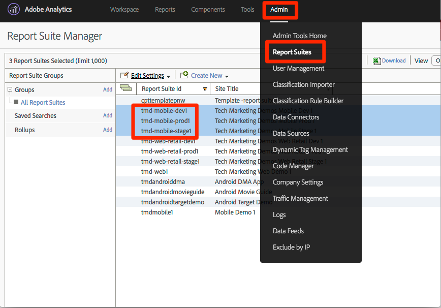

# Adobe Audience Manager hinzufügen

Diese Lektion führt Sie durch die Schritte zur Aktivierung von Adobe Audience Manager mithilfe der serverseitigen Weiterleitung.

[Adobe Audience Manager](https://docs.adobe.com/content/help/en/audience-manager/user-guide/aam-home.html) (AAM) bietet branchenführende Dienste für das Online-Management von Zielgruppendaten. So erhalten Digital-Advertiser und -Herausgeber die Werkzeuge, die sie zur Steuerung und Nutzung ihrer Datenelemente benötigen, um den Erfolg ihrer Verkäufe zu fördern.

## Lernziele

Dies können Sie am Ende dieser Lektion:

1. Beschreiben Sie die zwei Hauptmethoden zur Implementierung von Audience Manager in eine Website
1. Hinzufügen von Audience Manager mithilfe der serverseitigen Weiterleitung des Analytics-Beacons
1. Validieren der Implementierung von Audience Manager

## Voraussetzungen 

Um diese Lektion abzuschließen, benötigen Sie:

1. Um die unter Startkonfigurieren durchgeführten Lektionen abgeschlossen zu haben, [fügen Sie Adobe Analytics](analytics.md)hinzu und [fügen Sie den Identitätsdienst](id-service.md)hinzu.

1. Administratorzugriff auf Adobe Analytics, damit Sie die serverseitige Weiterleitung für die Report Suite aktivieren können, die Sie für dieses Lernprogramm verwenden. Alternativ können Sie auch einen Administrator in Ihrem Unternehmen bitten, dies anhand der unten stehenden Anweisungen für Sie zu übernehmen.

1. Ihre "Zielgruppen-Manager-Subdomäne"(auch bekannt als "Name des Partners"- "Partner-ID" oder "Partner-Subdomäne"). Wenn Sie Audience Manager bereits auf Ihrer eigentlichen Website implementiert haben, können Sie ihn am einfachsten abrufen, indem Sie Ihre eigentliche Website aufrufen und den Debugger öffnen. Die Subdomäne ist auf der Registerkarte Zusammenfassung im Abschnitt Audience Manager verfügbar:

   

Wenn Sie Audience Manager noch nicht implementiert haben, befolgen Sie diese Anweisungen, um Ihre Audience Manager-Subdomäneabzurufen.

## Implementierungsoptionen

Es gibt zwei Möglichkeiten, Audience Manager auf einer Website zu implementieren:

* **Serverseitige Weiterleitung (SSF)**- Für Kunden mit Adobe Analytics ist dies die einfachste und empfohlene Methode zur Implementierung. Adobe Analytics leitet Daten an AAM im Back-End von Adobe weiter, was eine weniger Anforderung auf der Seite ermöglicht. Dies ermöglicht auch wichtige Integrationsfunktionen und entspricht unseren Best Practices für die Implementierung und Bereitstellung von Audience Manager-Code.

* **Clientseitiges DIL**- Dieser Ansatz richtet sich an Kunden, die nicht über Adobe Analytics verfügen. DIL-Code (Data Integration Library Code, der AAM JavaScript-Konfigurationscode) sendet Daten direkt von der Webseite an Audience Manager.

Da Sie Adobe Analytics bereits in diesem Lernprogramm bereitgestellt haben, stellen Sie Audience Manager mithilfe der serverseitigen Weiterleitung bereit. For a complete description and requirements list for Server-Side forwarding, please review the [documentation](https://docs.adobe.com/content/help/en/analytics/admin/admin-tools/server-side-forwarding/ssf.html), so that you are familiar with how it works, what is required, and how to validate.

## Aktivieren der serverseitigen Weiterleitung

Es gibt zwei Hauptschritte bei der Durchführung einer SSF-Implementierung:

1. Aktivieren Sie einen "Switch"in der Analytics Admin-Konsole, um Daten von Analytics an Audience Manager *pro Report Suite* weiterzuleiten.
1. Platzieren des Codes, der über "Start"erfolgt. Damit dies korrekt ausgeführt werden kann, müssen die Adobe Experience Platform Identity Service Extension sowie die Analytics-Erweiterung installiert sein (Sie benötigen die AAM-Erweiterung *nicht* , wie nachfolgend beschrieben).

### Aktivieren der serverseitigen Weiterleitung in der Admin Console

Eine Konfiguration in der Adobe Analytics Admin-Konsole ist erforderlich, um Daten von Adobe Analytics an Adobe Audience Manager weiterzuleiten. Da es bis zu vier Stunden dauern kann, bis die Daten weitergeleitet werden, sollten Sie diesen Schritt zuerst ausführen.

#### So aktivieren Sie SSF in der Analytics Admin-Konsole

1. Melden Sie sich über die Experience Cloud-Benutzeroberfläche bei Analytics an. Wenn Sie keinen Administratorzugriff auf Analytics haben, müssen Sie mit Ihrem Experience Cloud- oder Analytics-Administrator sprechen, um Ihnen Zugriff auf diese Schritte zu gewähren oder sie abzuschließen.

   

1. Wählen Sie in der oberen Navigation in Analytics " **[!UICONTROL Admin"&gt; "Report Suites]**"und wählen Sie in der Liste die Report Suites aus (wählen Sie sie aus), die Sie an Audience Manager weiterleiten möchten.

   

1. Wählen Sie im Bildschirm "Report Suites"und bei Auswahl der Report Suite(s) "Einstellungen **[!UICONTROL bearbeiten"&gt; "Allgemein"&gt; "Serverseitige Weiterleitung]**".

   

   >[!WARNING] Wie oben angegeben, müssen Sie über Administratorberechtigungen verfügen, um dieses Menüelement anzuzeigen.

1. Lesen Sie auf der Seite "Serverseitige Weiterleitung"die Informationen und markieren Sie das Kästchen zum **[!UICONTROL Aktivieren der serverseitigen Weiterleitung]** für die Report Suite(s).

1. Klicken Sie auf **[!UICONTROL Speichern]**

   

>[!NOTE] Da die SSF pro Report Suite aktiviert werden muss, sollten Sie diesen Schritt für Ihre echten Report Suites wiederholen, wenn Sie SSF für die Report Suite Ihrer Site bereitstellen.
>
>Wenn die SSF-Option ausgegraut ist, müssen Sie die Report Suite(s) auch Ihrer Experience Cloud-Organisation zuordnen, um die Option zu aktivieren. Dies wird in der [Dokumentation](https://docs.adobe.com/content/help/en/core-services/interface/about-core-services/report-suite-mapping.html) näher erläutert.

Sobald dieser Schritt abgeschlossen ist und Sie den Identitätsdienst für Adobe Experience Platform aktiviert haben, werden die Daten von Analytics an AAM weitergeleitet. Um den Prozess abzuschließen, damit die Antwort von AAM zur Seite (und auch zu Analytics über die Funktion Zielgruppenanalyse) korrekt zurückgegeben wird, müssen Sie jedoch auch den folgenden Schritt in Launch ausführen. Mach dir keine Sorgen, das ist super einfach.

### Aktivieren der serverseitigen Weiterleitung in Launch

Dies ist der zweite von zwei Schritten zur Aktivierung des SSF. Sie haben den Switch bereits in der Analytics Admin-Konsole umgeschaltet. Jetzt müssen Sie nur noch den Code hinzufügen, den Launch für Sie ausführt, wenn Sie einfach das rechte Kästchen markieren.

>[!NOTE] Zur Implementierung der serverseitigen Weiterleitung von Analytics-Daten in AAM bearbeiten/konfigurieren wir die Analytics-Erweiterung in Launch, **nicht** die AAM-Erweiterung. Die AAM-Erweiterung wird ausschließlich für clientseitige DIL-Implementierungen verwendet, für diejenigen, die nicht über Adobe Analytics verfügen. Die folgenden Schritte sind daher korrekt, wenn Sie zur Einrichtung in die Analytics-Erweiterung gesendet werden.

#### So aktivieren Sie die SSF beim Start

1. Gehen Sie zu **[!UICONTROL Erweiterungen &gt; Installiert]** und klicken Sie auf , um die Analytics-Erweiterung zu konfigurieren.

   

1. Abschnitt erweitern `Adobe Audience Manager`

1. Markieren Sie das Kontrollkästchen, um Analytics-Daten **[!UICONTROL automatisch mit Audience Manager]** freizugeben. Dadurch wird der Analytics- `AppMeasurement.js` Implementierung das Audience Manager-Modul (Code) hinzugefügt.

1. Fügen Sie Ihre "Zielgruppen-Manager-Subdomäne"(auch als "Name des Partners", "Partner-ID"oder "Partner-Subdomäne"bezeichnet) hinzu. Befolgen Sie diese Anweisungen, um Ihre [Audience Manager-Subdomäne](https://docs.adobe.com/content/help/en/audience-manager-learn/tutorials/web-implementation/how-to-identify-your-partner-id-or-subdomain.html)abzurufen.

1. Klicken Sie auf In Bibliothek **[!UICONTROL speichern und erstellen]**

   

Server-Side Forwarding code ist jetzt implementiert!

### Validieren der serverseitigen Weiterleitung

Die wichtigste Methode zur Überprüfung, ob die serverseitige Weiterleitung betriebsbereit ist, besteht darin, die Antwort auf Ihre Adobe Analytics-Treffer zu überprüfen. Wir kommen gleich dazu. In der Zwischenzeit sollten wir ein paar andere Dinge überprüfen, die uns helfen, sicherzustellen, dass es so funktioniert, wie wir es wollen.

#### Überprüfen Sie, ob der Code korrekt geladen wird

Der Code, den Adobe Launch zur Verarbeitung der Weiterleitung installiert, und insbesondere die Antwort von AAM auf die Seite, wird als "Audience Manager"bezeichnet. Wir können den Experience Cloud-Debugger verwenden, um sicherzustellen, dass er geladen wurde.

1. Öffnen der Luma-Site
1. Klicken Sie auf das Debugger-Symbol in Ihrem Browser, um den Experience Cloud-Debugger zu öffnen
1. Blättern Sie auf der Registerkarte "Zusammenfassung"nach unten zum Abschnitt "Analytics"
1. Verify that **AudienceManagement** is listed under the Modules section

   

#### Überprüfen der Partner-ID im Debugger

Als Nächstes können wir auch überprüfen, ob der Debugger die richtige "Partner-ID" (AKA Partner-Subdomäne usw.) abruft. aus dem Code.

1. Blättern Sie im Debugger und weiterhin auf der Registerkarte "Zusammenfassung"zum Abschnitt "Audience Manager"
1. Überprüfen Sie Ihre Partner-ID/Subdomäne unter "Partner".

   

>[!WARNING] Sie werden feststellen, dass der Audience Manager-Abschnitt des Debuggers auf "DIL"verweist, die "Datenintegrationsbibliothek"und normalerweise auf eine clientseitige Implementierung verweist, im Gegensatz zu dem serverseitigen Ansatz, den wir hier implementiert haben. Die Wahrheit ist, dass das AAM "Module" (in diesem SSF-Ansatz verwendet) viel denselben Code wie die clientseitige DIL-Bibliothek verwendet, und daher meldet dieser Debugger es derzeit als solche. Wenn Sie die Schritte in diesem Lernprogramm ausgeführt haben und die übrigen Elemente in diesem Abschnitt zur Überprüfung korrekt sind, können Sie sicher sein, dass die serverseitige Weiterleitung funktioniert.

#### Analytics-Anforderung und -Antwort überprüfen

Okay, das ist der Biggie. Wenn Sie keine serverseitige Weiterleitung von Daten von Analytics an Audience Manager durchführen, gibt es keine Antwort auf den Analytics-Beacon (außer einem 2x2-Pixel). Wenn Sie jedoch SSF ausführen, gibt es Elemente, die Sie in der Analytics-Anforderung und -Antwort überprüfen können, um Sie darauf hinzuweisen, dass sie ordnungsgemäß funktionieren.
Leider unterstützt der Experience Cloud-Debugger derzeit nicht die Anzeige der Antwort auf die Beacons. Daher sollten Sie einen anderen Debugger/Paket-Sniffer verwenden, wie Charles Proxy oder die Entwickler-Tools des Browsers.

1. Öffnen Sie die Entwicklerwerkzeuge in Ihrem Browser und gehen Sie zur Registerkarte Netzwerk
1. Geben Sie in das Filterfeld ein, `b/ss` welche die Anzeige auf die Adobe Analytics-Anforderungen beschränkt
1. Aktualisieren Sie die Seite, um die Analytics-Anforderung anzuzeigen

   

1. Suchen Sie im Analytics-Beacon (Anforderung) nach einem "callback"-Parameter. Sie wird sich auf Folgendes einstellen: `s_c_il[1].doPostbacks`

   

1. Sie erhalten eine Antwort auf den Analytics-Beacon. Es enthält Verweise auf doPostbacks, wie in der Anforderung aufgerufen, und vor allem sollte es ein "stuff"-Objekt haben. Hier werden AAM-Segment-IDs zurück an den Browser gesendet. Wenn Sie das Objekt "stuff" haben, funktioniert SSF!

   

>[!WARNING] Achten Sie auf den falschen "Erfolg"- Wenn es eine Antwort gibt und alles funktioniert, stellen Sie **sicher** , dass Sie dieses "Zeug"-Objekt haben. Andernfalls wird in der Antwort möglicherweise eine Meldung angezeigt, die lautet "status":"SUCCESS". So verrückt das auch klingen mag, das ist tatsächlich ein Beweis dafür, dass es **NICHT** richtig funktioniert. Wenn Sie dies sehen, bedeutet dies, dass Sie diesen zweiten Schritt (den Code in "Launch") abgeschlossen haben, die Weiterleitung in der Analytics Admin-Konsole (erster Schritt dieses Abschnitts) jedoch noch nicht abgeschlossen haben. In diesem Fall müssen Sie sicherstellen, dass Sie SSF in der Analytics Admin-Konsole aktiviert haben. Wenn Sie das haben, und es war noch nicht 4 Stunden, dann seien Sie geduldig.

[Nächste "Experience Cloud-Integrationen"&gt;](integrations.md)