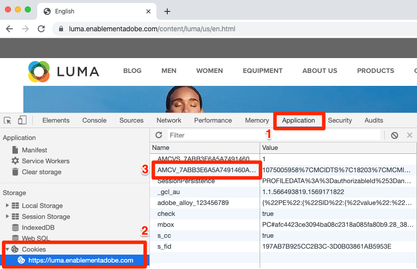
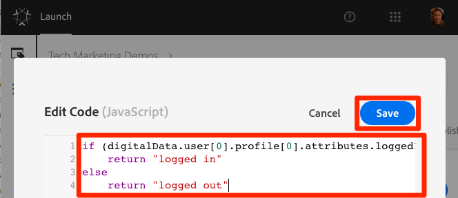
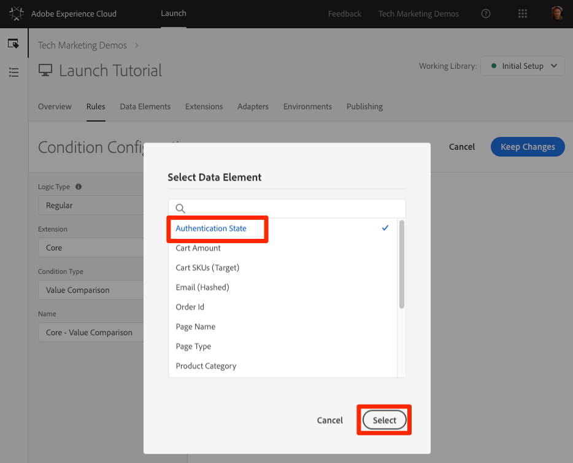
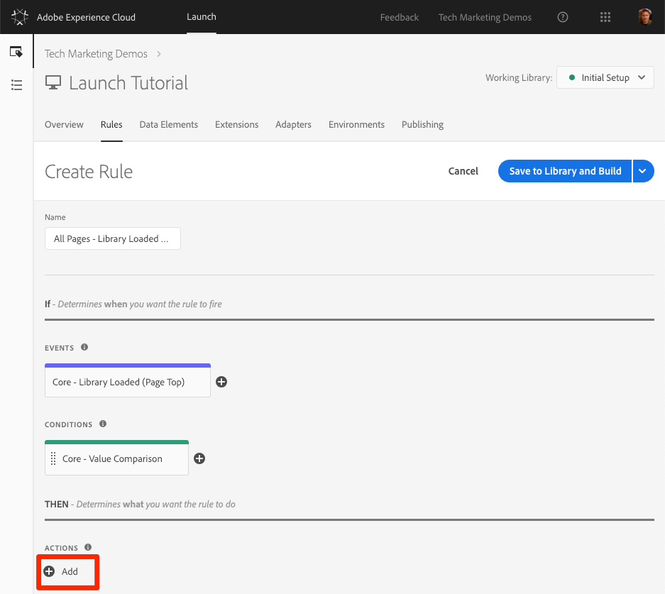
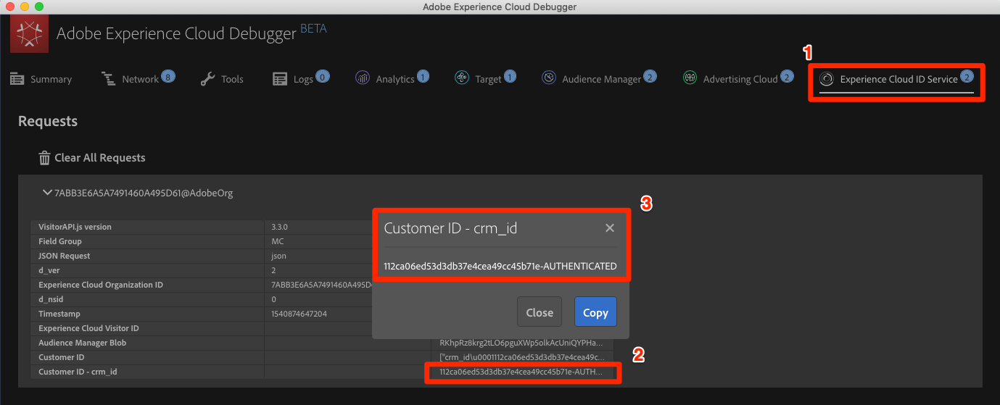
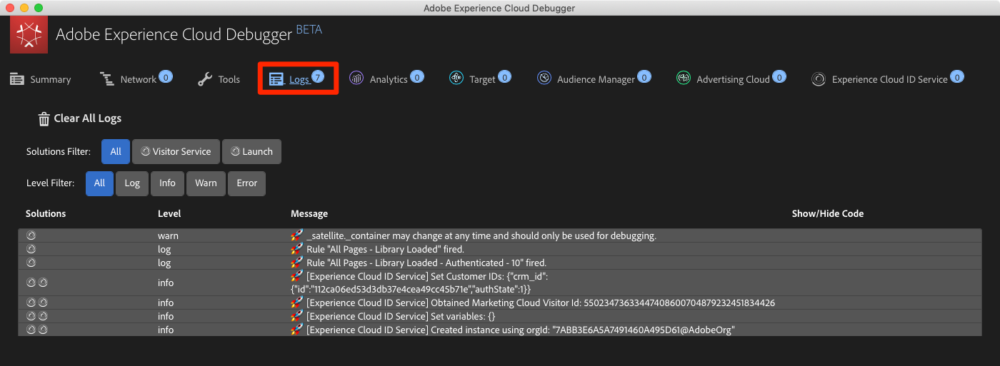

# Adobe Experience Platform Identity Service hinzufügen

Diese Lektion führt Sie durch die Schritte, die zur Implementierung der [Adobe Experience Platform Identity Service Extension](https://docs.adobe.com/content/help/en/launch/using/extensions-ref/adobe-extension/id-service-extension/overview.html) erforderlich sind, und sendet Kunden-IDs.

Der [Adobe Experience Platform-Identitätsdienst](https://docs.adobe.com/content/help/en/id-service/using/home.html) legt eine allgemeine Besucher-ID für alle Adobe-Lösungen fest, um Experience Cloud-Funktionen wie die Freigabe von Zielgruppen zwischen verschiedenen Lösungen zu nutzen.  Sie können auch Ihre eigenen Kunden-IDs an den Service senden, um geräteübergreifendes Targeting und Integrationen in Ihr CRM-System (Customer Relationship Management) zu aktivieren.

## Lernziele

Dies können Sie am Ende dieser Lektion:

* Erweiterung "Identitätsdienst"hinzufügen
* Erstellen Sie ein Datenelement, um Ihre Kunden-IDs zu erfassen.
* Erstellen Sie eine Regel, die die Aktion "Kunden-IDs festlegen"verwendet, um die Kunden-IDs an Adobe zu senden.
* Verwenden der Sortierreihenfolge für Regeln, die beim selben Ereignis ausgelöst werden

## Voraussetzungen

You should have already completed the lessons in the [Configure Launch](launch.md) section.

## Identitätsdiensterweiterung hinzufügen

Da dies die erste Erweiterung ist, die Sie hinzufügen, hier eine kurze Übersicht über Erweiterungen. Erweiterungen sind eine der Kernfunktionen von Launch. Eine Erweiterung ist eine Integration, die von Adobe, einem Adobe-Partner oder einem Adobe-Kunden entwickelt wurde und neue und endlose Optionen für die Tags bietet, die Sie auf Ihrer Website bereitstellen können. Wenn Sie sich Launch als Betriebssystem vorstellen, sind Erweiterungen die Apps, die Sie installieren, damit Launch die Dinge tun kann, die Sie benötigen.

**So fügen Sie die Extension des Identitätsdienstes hinzu**

1. In the top navigation, click **[!UICONTROL Extensions]**

1. Klicken Sie auf **[!UICONTROL Katalog]** , um zur Seite "Erweiterungskatalog"zu wechseln

   

1. Beachten Sie die verschiedenen Erweiterungen, die im Katalog verfügbar sind

1. Geben Sie oben im Filter "id"ein, um den Katalog zu filtern

1. Klicken Sie auf der Karte für den Identitätsdienst für Adobe Experience Platform auf **[!UICONTROL Installieren]**

   

1. Beachten Sie, dass Ihre Experience Cloud-Organisations-ID automatisch erkannt wurde.

1. Behalten Sie alle Standardeinstellungen bei und klicken Sie auf In Bibliothek **[!UICONTROL speichern und Erstellen]**

   

>[!NOTE] Jede Version der Extension für den Identitätsdienst enthält eine bestimmte Version von VisitorAPI.js, die in der Erweiterungsbeschreibung aufgeführt ist. Sie aktualisieren die Version VisitorAPI.js, indem Sie die Erweiterung des Identitätsdienstes aktualisieren.

### Erweiterung überprüfen

Die Erweiterung "Identitätsdienst"ist eine der wenigen Starterweiterungen, die eine Anforderung ausführt, ohne dass eine Regelaktion verwendet werden muss. Die Erweiterung stellt beim ersten Seitenladevorgang einer Website automatisch eine Anforderung an den Identitätsdienst. Sobald die ID angefordert wurde, wird sie in einem Erstanbieter-Cookie gespeichert, das mit "AMCV_"beginnt.

**So validieren Sie die Erweiterung des Identitätsdienstes**

1. Open the [Luma site](https://luma.enablementadobe.com/content/luma/us/en.html)

1. Make sure the Debugger is mapping the Launch property to *your* Development environment, as described in the [earlier lesson](launch-switch-environments.md).

1. Auf der Registerkarte "Zusammenfassung"des Debuggers sollte im Abschnitt "Start"angegeben werden, dass die Erweiterung des Identitätsdienstes für Adobe Experience Platform implementiert ist.

1. Auf der Registerkarte "Zusammenfassung"sollte der Abschnitt "Identitätsdienst"außerdem dieselbe Organisations-ID enthalten, die sich auf Ihrem Erweiterungskonfigurationsbildschirm in der Benutzeroberfläche "Starten"befand:

   

1. Die ursprüngliche Anforderung zum Abrufen der Besucher-ID wird möglicherweise auf der Registerkarte "Identitätsdienst"des Debuggers angezeigt. Sie wurde jedoch möglicherweise bereits angefordert; wenn sie also nicht angezeigt wird, ist dies kein Grund zur Sorge:
   

1. Nach der ersten Anfrage zum Abrufen der Besucher-ID wird die ID in einem Cookie gespeichert, dessen Name mit `AMCV_` beginnt. Sie können bestätigen, dass das Cookie festgelegt wurde, indem Sie wie folgt vorgehen:
   1. Öffnen Sie die Entwicklertools Ihres Browsers
   1. Go to the `Application` tab
   1. Expand `Cookies` on the left side
   1. Click on the domain `https://luma.enablementadobe.com`
   1. Suchen Sie auf der rechten Seite nach dem Cookie AMCV_. Möglicherweise werden mehrere angezeigt, seit Sie die Luma-Site geladen haben, und zwar sowohl mit der fest programmierten Launch-Eigenschaft als auch mit Ihrer eigenen.
      

Das ist alles! Du hast deine erste Erweiterung hinzugefügt! Weitere Informationen zu den Konfigurationsoptionen des Identitätsdienstes finden Sie in [der Dokumentation](https://docs.adobe.com/content/help/en/id-service/using/id-service-api/configurations/function-vars.html).

## Kunden-IDs senden

Als Nächstes senden Sie eine [Kunden-ID](https://docs.adobe.com/content/help/en/id-service/using/reference/authenticated-state.html) an den Identitätsdienst. This will allow you to [integrate your CRM](https://docs.adobe.com/content/help/en/core-services/interface/customer-attributes/attributes.html) with the Experience Cloud as well as track visitors across devices.

In the earlier lesson, [Add Data Elements, Rules, and Libraries](launch-data-elements-rules.md) you created a data element and used it in a rule. Jetzt verwenden Sie dieselben Methoden, um eine Kunden-ID zu senden, wenn der Besucher authentifiziert wird.

### Erstellen von Datenelementen für Kunden-IDs

Erstellen Sie zunächst zwei Datenelemente:

1. `Authentication State`—zur Erfassung, ob der Besucher angemeldet ist oder nicht
1. `Email (Hashed)`—zur Erfassung der Hashversion der E-Mail-Adresse (als Kunden-ID verwendet) aus der Datenschicht

**So erstellen Sie das Datenelement für den Authentifizierungsstatus**

1. Klicken Sie in der oberen Navigation auf **[!UICONTROL Datenelemente]** .
1. Klicken Sie auf die Schaltfläche **[!UICONTROL Datenelement]** hinzufügen

   

1. Benennen Sie das Datenelement `Authentication State`
1. Wählen Sie für den **[!UICONTROL Datenelementtyp]**" **[!UICONTROL Benutzerdefinierter Code"]**
1. Klicken Sie auf die Schaltfläche **[!UICONTROL Editor]** öffnen

   

1. Verwenden Sie im Fenster Code [!UICONTROL bearbeiten] den folgenden Code, um die Werte "angemeldet"oder "abgemeldet"basierend auf einem Attribut in der Datenschicht der Luma-Site zurückzugeben:

   ```javascript
   if (digitalData.user[0].profile[0].attributes.loggedIn)
       return "logged in"
   else
       return "logged out"
   ```

1. Click **[!UICONTROL Save]** to save the custom code

   

1. Behalten Sie bei allen anderen Einstellungen die Standardwerte bei.
1. Klicken Sie auf In Bibliothek **[!UICONTROL speichern und Erstellen]** , um das Datenelement zu speichern und zur Seite "Datenelemente"zurückzukehren

   

Indem Sie den Authentifizierungsstatus des Benutzers kennen, wissen Sie, wann eine Kunden-ID auf der Seite vorhanden sein sollte, die an den Identitätsdienst gesendet werden soll. Der nächste Schritt besteht darin, ein Datenelement für die Kunden-ID selbst zu erstellen. Auf der Luma Demo-Site verwenden Sie die Hash-Version der E-Mail-Adresse des Besuchers.

**So fügen Sie das Datenelement für die Hash-E-Mail hinzu**

1. Klicken Sie auf die Schaltfläche **[!UICONTROL Datenelement]** hinzufügen

   

1. Benennen Sie das Datenelement `Email (Hashed)`
1. Wählen Sie für den **[!UICONTROL Datenelementtyp]** die Option **[!UICONTROL JavaScript-Variable]**
1. Verwenden Sie als **[!UICONTROL JavaScript-Variablenname]** den folgenden Zeiger auf eine Variable in der Datenschicht der Luma-Site: `digitalData.user.0.profile.0.attributes.username`
1. Behalten Sie bei allen anderen Einstellungen die Standardwerte bei.
1. Klicken Sie auf In Bibliothek **[!UICONTROL speichern und Erstellen]** , um das Datenelement zu speichern

   

### Hinzufügen einer Regel zum Senden der Kunden-IDs

Der Identitätsdienst für Adobe Experience Platform übergibt die Kunden-IDs in Regeln mit der Aktion "Festlegen von Kunden-IDs".  Sie erstellen jetzt eine Regel, die diese Aktion auslöst, wenn der Besucher authentifiziert wird.

**So erstellen Sie eine Regel zum Senden der Kunden-IDs**

1. In the top navigation, click **[!UICONTROL Rules]**
1. Klicken Sie auf Regel **** hinzufügen, um den Regelaufbau zu öffnen

   

1. Geben Sie einen Namen für die Regel ein `All Pages - Library Loaded - Authenticated - 10`

   >[!TIP] Diese Benennungsregel bedeutet, dass Sie diese Regel oben auf allen Seiten auslösen, wenn der Benutzer authentifiziert ist und die Reihenfolge "10"lautet. Durch die Verwendung einer solchen Benennungsregel - anstatt sie für die in den Aktionen ausgelösten Lösungen zu benennen - können Sie die Gesamtzahl der Regeln, die für Ihre Implementierung erforderlich sind, minimieren.

1. Under **[!UICONTROL Events]** click **[!UICONTROL Add]**

   

   1. For the **[!UICONTROL Event Type]** select **[!UICONTROL Library Loaded (Page Top)]**
   1. For the  **[!UICONTROL Order]** enter `10`. Hiermit steuern Sie die Reihenfolge von Regeln, die durch dasselbe Ereignis ausgelöst werden. Regeln mit einer niedrigeren Reihenfolge werden vor Regeln mit einer höheren Reihenfolge ausgelöst. In this case, you want to set the customer ID before you fire the Target request, which you will do in the next lesson with a rule with an order of `50` .
   1. Klicken Sie auf die Schaltfläche Änderungen **** beibehalten, um zum Regel-Builder zurückzukehren
   

1. Klicken Sie unter **[!UICONTROL Bedingungen]** auf **[!UICONTROL Hinzufügen]**

   

   1. Wählen Sie für den **[!UICONTROL Bedingungstyp]** " **[!UICONTROL Wertevergleich"aus]**
   1. Click the  icon to open the Data Element modal

      

   1. Klicken Sie im Datenelementmodul auf **[!UICONTROL Authentifizierungsstatus]** und dann auf **[!UICONTROL Auswählen]**

      

1. Make sure `Equals` is the operator
1. Geben Sie "angemeldet"in das Textfeld ein, wodurch die Regel ausgelöst wird, sobald das Datenelement "Authentifizierungsstatus"den Wert "angemeldet"hat

1. Click **[!UICONTROL Keep Changes]**

   

1. Klicken Sie unter **[!UICONTROL Aktionen]** auf **[!UICONTROL Hinzufügen]**

   

   1. Wählen Sie für die **[!UICONTROL Erweiterung]** den Identitätsdienst für **[!UICONTROL Adobe Experience Platform]**
   1. Wählen Sie für den **[!UICONTROL Aktionstyp]** Kunden-IDs **[!UICONTROL festlegen]**
   1. Für den **[!UICONTROL Integrationscode]** geben Sie `crm_id`
   1. Geben Sie für den **[!UICONTROL Wert]** das Datenelement-Selektormodell ein und wählen Sie die `Email (Hashed)`
   1. Für den **[!UICONTROL Auth-Status]** wählen Sie **[!UICONTROL Authentifiziert]**
   1. Click the **[!UICONTROL Keep Changes]** button to save the action and return to the Rule Builder

      

1. Klicken Sie auf die Schaltfläche "In Bibliothek **[!UICONTROL speichern"und "Erstellen]** ", um die Regel zu speichern

   

Sie haben jetzt eine Regel erstellt, die die Kunden-ID als Variable sendet, `crm_id` wenn der Besucher authentifiziert wird. Da Sie die Reihenfolge angegeben haben, wird diese Regel ausgelöst, bevor die `10` Regel, die in der Lektion "Datenelemente, Regeln und Bibliotheken `All Pages - Library Loaded`hinzufügen[ "erstellt wurde, die den Standardbestellwert verwendet ](launch-data-elements-rules.md)`50` .

### Kunden-IDs überprüfen

Um Ihre Arbeit zu validieren, melden Sie sich bei der Luma-Site an, um das Verhalten der neuen Regel zu bestätigen.

**So melden Sie sich bei der Luma-Site an**

1. Open the [Luma site](https://luma.enablementadobe.com/content/luma/us/en.html)

1. Make sure the Debugger is mapping the Launch property to *your* Development environment, as described in the [earlier lesson](launch-switch-environments.md)

   

1. Klicken Sie oben rechts auf der Luma-Site auf den Link **[!UICONTROL LOGIN]** .

   

1. Als `test@adobe.com` Benutzernamen eingeben
1. Als `test` Kennwort eingeben
1. Klicken Sie auf die Schaltfläche **[!UICONTROL ANMELDEN]**

   

1. Kehren Sie zur Homepage zurück

Vergewissern Sie sich nun, dass die Kunden-ID mit der Debugger-Erweiterung an den Dienst gesendet wird.

**So überprüfen Sie, ob der Identitätsdienst die Kunden-ID weitergibt**

1. Stellen Sie sicher, dass die Registerkarte mit der Luma-Site im Fokus ist.
1. Wechseln Sie im Debugger zur Registerkarte "Identitätsdienst für Adobe Experience Platform"
1. Erweitern der Organisations-ID
1. Click on the cell with the `Customer ID - crm_id` value
1. In the modal, note the customer id value and that the `AUTHENTICATED` state is reflected:

   

1. Beachten Sie, dass Sie den Wert der Hash-E-Mail bestätigen können, indem Sie den Quellcode der Luma-Seite und die Eigenschaft "Benutzername"anzeigen. Es sollte mit dem Wert übereinstimmen, den Sie im Debugger sehen:

   

### Weitere Tipps zur Validierung

Launch verfügt auch über Rich Console-Protokollierungsfunktionen. Um sie zu aktivieren, wechseln Sie zur Registerkarte **[!UICONTROL Werkzeuge]** im Debugger und aktivieren Sie den Umschalter **[!UICONTROL Konsole Protokollierung]** starten.


Dadurch wird die Konsolenprotokollierung sowohl in Ihrer Browser-Konsole als auch auf der Registerkarte Protokolle des Debuggers aktiviert. Die Protokollierung aller bisher erstellten Regeln sollte angezeigt werden! Beachten Sie, dass oben in der Liste neue Protokolleinträge hinzugefügt werden. Daher sollte Ihre Regel "Alle Seiten - Bibliothek geladen - authentifiziert - 10"vor der Regel "Alle Seiten - Bibliothek geladen"ausgelöst und unter der Protokollfunktion der Debugger-Konsole angezeigt werden:



[Nächste "Adobe Target hinzufügen"&gt;](target.md)
