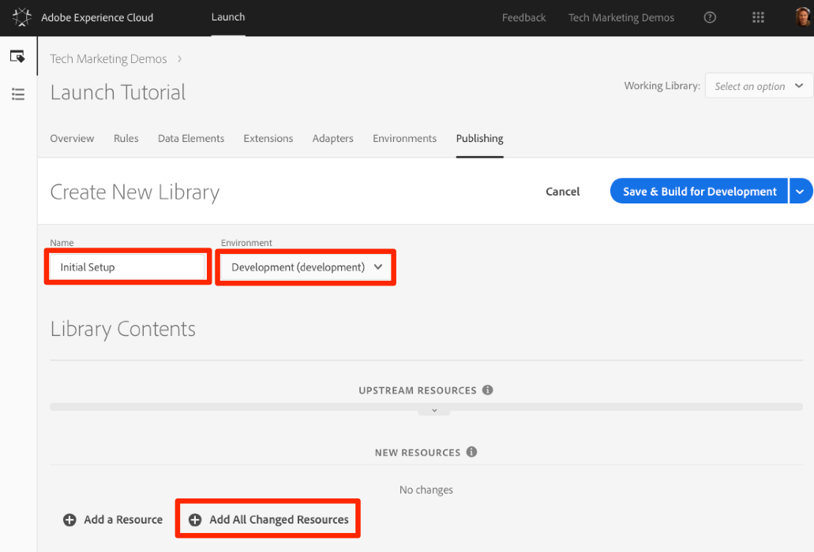
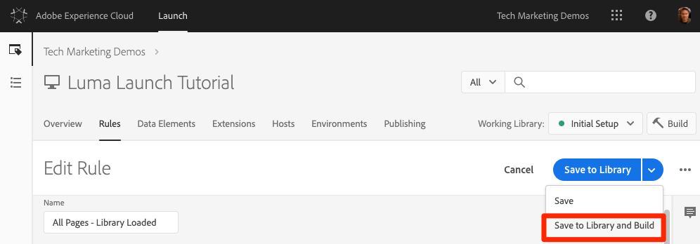

# Datenelement, Regel und Bibliothek hinzufügen

In dieser Lektion erstellen Sie Ihr erstes Datenelement, Ihre Regel und Ihre Bibliothek.

Datenelemente und Regeln sind die grundlegenden Bausteine des Starts. Datenelemente speichern die Attribute, die Sie an Ihre Marketing- und Werbelösungen senden möchten, während Regeln die Anforderungen an diese Lösungen unter den richtigen Bedingungen auslösen.  Bibliotheken sind die JavaScript-Dateien, die auf der Seite geladen werden, um die gesamte Arbeit zu erledigen. In dieser Lektion werden Sie alle drei verwenden, damit unsere Beispielseite etwas tut.

## Lernziele

Dies können Sie am Ende dieser Lektion:

* Datenelement erstellen
* Erstellen einer Regel
* Erstellen einer Bibliothek
* Hinzufügen von Änderungen zu einer Bibliothek
* Überprüfen, ob Ihre Bibliothek in Ihrem Webbrowser geladen wird
* Verwenden Sie die Funktion "Arbeitsbibliothek", um effizienter zu arbeiten

## Datenelement für Seitennamen erstellen

Bei Datenelementen handelt es sich um die Version einer Datenschicht von Launch. Sie können Werte aus eigenen Datenschichtobjekten, Cookies, lokalen Speicherobjekten, Abfragezeichenfolgen-Parametern, Seitenelementen, Meta-Tags usw. speichern. In dieser Übung erstellen Sie ein Datenelement für den Seitennamen, das Sie später in Ihren Target- und Analytics-Implementierungen verwenden werden.

**So erstellen Sie ein Datenelement**

1. Klicken Sie in der oberen Navigation auf **[!UICONTROL Datenelemente]**

1. Da Sie noch keine Datenelemente in dieser Eigenschaft erstellt haben, wird ein kurzes Video mit weiteren Informationen zu diesem Thema angezeigt. Sehen Sie sich dieses Video an, wenn Sie möchten.

1. Click the **[!UICONTROL Create New Data Element]** button:

   

1. Name the data element, e.g. `Page Name`

1. Use the [!UICONTROL JavaScript Variable] Data Element type to point to a value in your sample page's data layer: `digitalData.page.pageInfo.pageName`

1. Use "`not available`" as the [!UICONTROL Default Value]. The [!UICONTROL Default Value] tells Launch what value to use for the data element if your JavaScript Variable specified above is not found.

1. Markieren Sie die Kästchen für **[!UICONTROL Wert in Kleinbuchstaben erzwingen]** und **[!UICONTROL Text bereinigen]**, um die Groß-/Kleinschreibung zu standardisieren und unnötige Leerzeichen zu entfernen

1. Lassen Sie **[!UICONTROL Keine]** als **[!UICONTROL Speicherdauer]** , da dieser Wert auf jeder Seite normalerweise unterschiedlich ist

1. Klicken Sie auf die Schaltfläche **[!UICONTROL Speichern]** , um das Datenelement zu speichern

   "Seitenname".

>[!NOTE]**** DTM-Migratoren: Neue Datenelementtypen wurden zu Launch hinzugefügt, die in DTM nicht vorhanden waren. Einige der neuen Datenelementtypen sind „Lokaler Speicher“, „Sitzungsspeicher“, „Seiteninformationen“ und „Zufällige Nummer“.
<!-- -->
>[!NOTE]Datenelementfunktionen _können mit Erweiterungen_ erweitert werden. Beispielsweise können Sie mit der ContextHub-Erweiterung Datenelemente mit Funktionen der Erweiterung hinzufügen.

## Erstellen einer Regel

Als Nächstes verwenden Sie dieses Datenelement in einer einfachen Regel. Regeln sind eine der leistungsstärksten Funktionen von Launch und ermöglichen es Ihnen, festzulegen, was passieren soll, wenn der Besucher mit Ihrer Website interagiert. Wenn die in Ihren Regeln festgelegten Kriterien erfüllt sind, löst die Regel die von Ihnen angegebene Aktion aus.

Sie erstellen eine Regel, die den Datenelementwert "Seitenname"an die Browser-Konsole ausgibt.

**So erstellen Sie eine Regel**

1. In the top navigation, click **[!UICONTROL Rules]**

1. Da Sie noch keine Regeln in dieser Eigenschaft erstellt haben, wird ein kurzes Video mit weiteren Informationen zum Thema angezeigt. Sehen Sie sich dieses Video an, wenn Sie möchten.

1. Click the **[!UICONTROL Create New Rule]** button:

   

1. Name the Rule `All Pages - Library Loaded`. Diese Benennungsregel gibt an, wo und wann die Regel ausgelöst wird, was die Identifizierung und Wiederverwendung während der Laufzeit der Eigenschaft "Start"erleichtert.

1. Klicken Sie unter „Ereignisse“ auf **[!UICONTROL Hinzufügen]**. Das Ereignis gibt "Start"an, wann die Regel ausgelöst werden soll und kann vielerlei sein, darunter ein Laden der Seite, ein Klick, ein benutzerdefiniertes JavaScript-Ereignis usw.

   

   1. Wählen Sie als Ereignistyp **[!UICONTROL Bibliothek geladen (Seite oben)]** aus. Beachten Sie, dass bei Auswahl des Ereignistyps "Starten"ein Name für das Ereignis mit Ihrer Auswahl vorausgefüllt wird. Beachten Sie auch, dass die Standardreihenfolge für das Ereignis 50 beträgt. Die Bestellung ist eine leistungsstarke Funktion in Launch, mit der Sie die Reihenfolge der Aktionen präzise steuern können, wenn Sie über mehrere Regeln verfügen, die durch dasselbe Ereignis ausgelöst werden. Sie werden diese Funktion später im Tutorial verwenden.

   1. Klicken Sie auf die Schaltfläche Änderungen **[!UICONTROL beibehalten]** .
   

1. Da diese Regel auf allen Seiten ausgelöst werden soll, lassen Sie **[!UICONTROL Bedingungen]** leer. Wenn Sie das Bedingungsmodalfenster öffnen, können Sie erkennen, dass Bedingungen aufgrund einer Vielzahl von Optionen, wie URLs, Datenelementwerten und Datumsbereichen, sowohl Beschränkungen als auch Ausnahmen hinzufügen können.

1. Under Actions, click **[!UICONTROL Add]**

1. Wählen Sie " **[!UICONTROL Aktionstyp"&gt; "Benutzerdefinierter Code]**", was derzeit die einzige Option ist. Später im Tutorial werden weitere Optionen zur Verfügung stehen, nachdem Sie Erweiterungen hinzugefügt haben.

1. Wählen Sie **[!UICONTROL &lt;/&gt; Editor]** öffnen, um den Code-Editor zu öffnen

   

1. Fügen Sie Folgendes zum Code-Editor hinzu. Dieser Code gibt den Wert des Datenelements "Seitenname"an die Browser-Konsole aus, damit Sie bestätigen können, dass es funktioniert:

   ```javascript
   console.log('The page name is '+_satellite.getVar('Page Name'));
   ```

1. Codeeditor speichern

   

1. On the Action configuration screen click **[!UICONTROL Keep Changes]**

1. Click **[!UICONTROL Save]** to save the rule

>[!NOTE]**** DTM-Migratoren: Beim Start sind Regeln erforderlich, um die meisten Marketing-Pixel auszulösen. Um beispielsweise den Adobe Analytics-Beacon auszulösen, müssen Sie eine Regel verwenden, um Launch anzuweisen, dies zu tun.
>
> Der Rule Builder wurde in Launch dramatisch neu gestaltet und neu aufgebaut.
> Einige der Hauptänderungen sind:
>
> * Es gibt nur einen Regel-Builder. DTM-Regeltypen wie "Seitenende", "Klicken"und "Direktaufruf"sind alle nur Ereignistypen im Rule Builder. Dies erleichtert die Aktualisierung einer Regel, wenn Sie den Auslöser z. B. von einem DOM-Ready-Ereignis zu einem benutzerspezifischen Ereignis ändern müssen.
> * Es gibt einen neuen Ereignistyp "Benutzerdefinierter Code"
> * Mit Erweiterungen können dem Regel-Builder neue Ereignistypen hinzugefügt werden. Beispielsweise könnte mit der Zielerweiterung die integrierte Unterstützung für die [benutzerspezifischen at.js-Ereignisse](https://docs.adobe.com/content/help/en/target/using/implement-target/client-side/functions-overview/atjs-custom-events.html) hinzugefügt werden, sodass für die Nutzung dieser Funktion kein benutzerspezifischer Code erforderlich ist.
> * Erweiterungen können dem Rule Builder neue Aktionen hinzufügen, wodurch Probleme reduziert werden, indem die Abhängigkeit von benutzerspezifischem Code eingestellt wird. Sie werden viele dieser Erweiterungsaktionen in dieser Übung verwenden.
> * Regeln sind erforderlich, um Anfragen auszulösen, die den meisten Marketing-Werkzeugen zugeordnet sind. Dies erfordert eine Anpassung der Einstellung, insbesondere für Dinge wie das Festlegen von Kunden-IDs, das Auslösen von Analytics-Beacons und das Auslösen von Target-Anforderungen.


## Speichern Ihrer Änderungen in einer Bibliothek

Nachdem Sie eine Sammlung von Erweiterungen, Datenelementen und Regeln in der Startschnittstelle konfiguriert haben, müssen Sie diese Funktionen und Logik in einen Satz von JavaScript-Code verpacken, den Sie auf Ihrer Website bereitstellen können, damit Marketing-Tags ausgelöst werden, wenn Besucher die Site besuchen. Eine Bibliothek ist der Satz an JavaScript-Code, der dies tun wird.

In einer früheren Lektion haben Sie den Einbettungscode Ihrer Entwicklungsumgebung auf der Beispielseite implementiert. Beim Laden der Beispielseite wurde ein Fehler 404 für die Einbettungscode-URL zurückgegeben, da noch keine Startbibliothek erstellt und der Umgebung zugewiesen wurde. Jetzt legen Sie Ihr neues Datenelement und Ihre neue Regel in eine Bibliothek, damit Ihre Beispielseite etwas tun kann.

**So fügen Sie eine Bibliothek hinzu und erstellen sie**

1. Go to the [!UICONTROL Publishing] tab

1. Click **[!UICONTROL Add New Library]**

   

1. Benennen der Bibliothek "Anfängliches Setup"

1. Wählen Sie **[!UICONTROL Umgebung &gt; Entwicklung]**

1. Klicken Sie auf **[!UICONTROL Alle geänderten Ressourcen hinzufügen]**

   

1. Beachten Sie, dass nach dem Klicken auf Alle geänderten Ressourcen **[!UICONTROL hinzufügen]** starten die Änderungen, die Sie gerade vorgenommen haben, zusammengefasst werden.

1. Klicken Sie auf **[!UICONTROL Speichern und Build zur Entwicklung erstellen]**

   

Nach einigen Augenblicken wird der Statuspunkt grün, um die Bibliothek anzuzeigen, die erfolgreich erstellt wurde.


## Ihre Arbeit überprüfen

Überprüfen Sie jetzt, ob Ihre Regel erwartungsgemäß funktioniert.

Laden Sie Ihre Musterseite erneut. Wenn Sie sich die Registerkarte "Developer Tools"-&gt; "Netzwerk"ansehen, sollten Sie nun eine 200 Antwort für Ihre Launch Library sehen!


Wenn Sie sich die Developer Tools -&gt; Console ansehen, sehen Sie den Text "Der Seitenname ist zu Hause"


Herzlichen Glückwunsch, Sie haben Ihr erstes Datenelement und Ihre erste Regel erstellt und Ihre erste Launch-Bibliothek!

## Verwenden der Funktion "Arbeitsbibliothek"

Wenn Sie beim Start viele Änderungen vornehmen, ist es unpraktisch, zur Registerkarte "Veröffentlichung"zu wechseln, Änderungen hinzuzufügen und die Bibliothek jedes Mal zu erstellen, wenn Sie das Ergebnis sehen möchten.  Nachdem Sie Ihre Bibliothek "Erste Einrichtung"erstellt haben, können Sie die Änderungen mit der Funktion "Arbeitsbibliothek"schnell speichern und die Bibliothek in einem Schritt neu erstellen.

Nehmen Sie eine kleine Änderung an der Regel "Alle Seiten - Bibliothek geladen"vor. Klicken Sie in der oberen Navigation auf **[!UICONTROL Regeln]** und dann auf die `All Pages - Library Loaded` Regel, um sie zu öffnen.


Klicken Sie auf der `Edit Rule` Seite auf das Dropdownmenü ***[!UICONTROL Arbeitsbibliothek]*** und wählen Sie Ihre `Initial Setup` Bibliothek aus.


Nachdem Sie die Bibliothek ausgewählt haben, sollten Sie sehen, dass die Schaltfläche " **[!UICONTROL Speichern]** "jetzt standardmäßig auf "In Bibliothek **[!UICONTROL speichern"und "Erstellen]**"lautet. Wenn Sie eine Änderung beim Start vornehmen, können Sie diese Option verwenden, um die Änderung automatisch direkt Ihrer Arbeitsbibliothek hinzuzufügen und neu zu erstellen.

Testen Sie es. Öffnen Sie die Aktion "Benutzerdefinierter Code"und fügen Sie nach dem Text "Der Seitenname ist"einen Doppelpunkt hinzu, sodass der gesamte Codeblock wie folgt lautet:

```javascript
console.log('The page name is: '+_satellite.getVar('Page Name'));
```

Speichern Sie den Code, behalten Sie die Änderungen in der Aktion bei und klicken Sie jetzt auf die Schaltfläche "In Bibliothek **[!UICONTROL speichern"]** .



Warten Sie einen Augenblick, bis der grüne Punkt neben dem Dropdownmenü [!UICONTROL Arbeitsbibliothek] erneut angezeigt wird. Laden Sie jetzt Ihre Beispielseite neu und Sie sollten Ihre Änderung in der Konsolenmeldung sehen (Sie müssen möglicherweise Ihren Browser-Cache löschen und neu laden, um die Änderung an der Seite zu sehen):


Dies ist eine viel schnellere Arbeitsmethode und Sie werden diesen Ansatz für den Rest des Tutorials verwenden.

[Nächste "Umgebungen mit dem Experience Cloud-Debugger wechseln"&gt;](launch-switch-environments.md)
