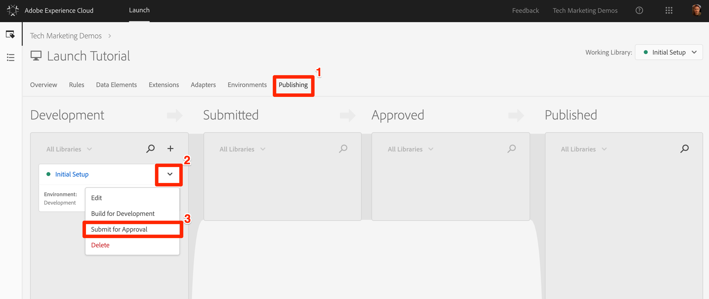
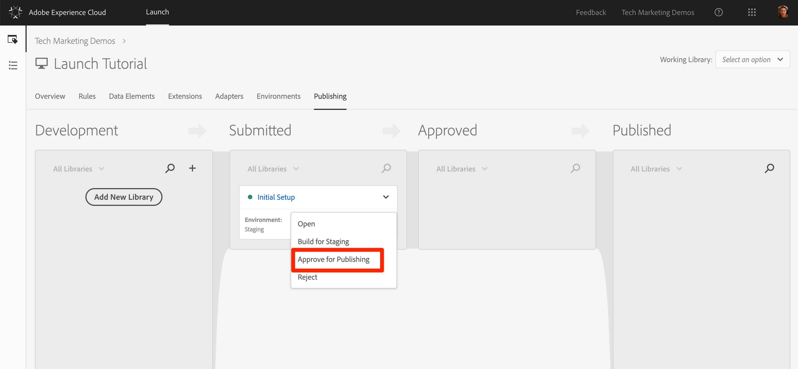
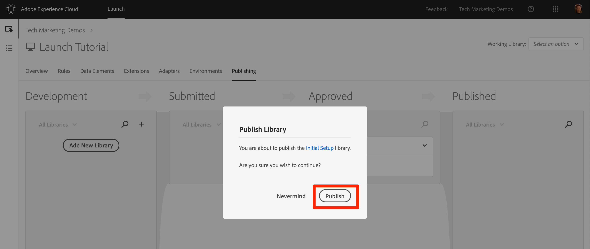
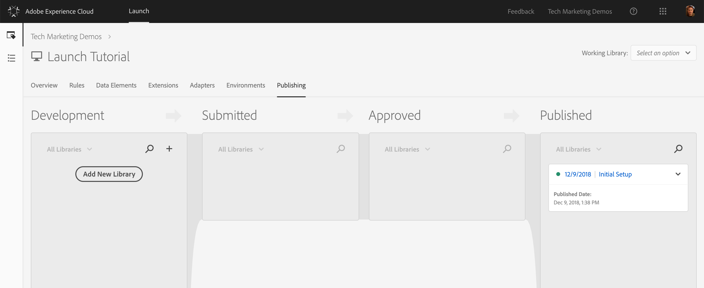

# Veröffentlichen der Starteigenschaft

Nachdem Sie einige wichtige Lösungen der Adobe Experience Cloud in Ihrer Entwicklungsumgebung implementiert haben, sollten Sie sich mit dem Veröffentlichungs-Workflow vertraut machen.

## Lernziele

Dies können Sie am Ende dieser Lektion:

1. eine Entwicklungsbibliothek in der Staging-Umgebung veröffentlichen
1. Ordnen Sie Ihrer Produktions-Website mithilfe des Debuggers eine Staging-Bibliothek zu
1. eine Staging-Bibliothek in der Produktionsumgebung veröffentlichen

## Veröffentlichung im Staging

Nachdem Sie Ihre Bibliothek in der Entwicklungsumgebung erstellt und validiert haben, ist es an der Zeit, sie in Staging zu veröffentlichen.

1. Go to the **[!UICONTROL Publishing]** page

1. Öffnen Sie das Dropdown-Menü neben Ihrer Bibliothek und wählen Sie " **[!UICONTROL Zur Genehmigung übermitteln"]**

   

1. Klicken Sie im Dialogfeld auf die Schaltfläche **[!UICONTROL Senden]** :

   

1. Ihre Bibliothek wird jetzt in der Spalte " [!UICONTROL Gesendet] "in einem nicht erstellten Status angezeigt:

1. Öffnen Sie das Dropdown-Menü und wählen Sie **[!UICONTROL Erstellen für Staging]**:

   

1. Sobald das grüne Symbol angezeigt wird, kann die Bibliothek in der Staging-Umgebung als Vorschau angezeigt werden.

In einem realen Szenario würde nun Ihr QA-Team die Änderungen in der Staging-Bibliothek validieren. Sie können dies mit dem Debugger tun.

**So validieren Sie die Änderungen in der Staging-Bibliothek**

1. Öffnen Sie in der Eigenschaft "Start"die Seite [!UICONTROL Umgebungen]

1. Klicken Sie in der Zeile [!UICONTROL Staging] auf das Symbol  Installation, um das Modal zu öffnen.

   

1. Klicken Sie auf das Symbol "  .

1. Click **[!UICONTROL Close]** to close the modal

   

1. Open the [Luma demo site](https://luma.enablementadobe.com/content/luma/us/en.html) in your Chrome browser

1. Öffnen Sie die [Experience Cloud Debugger-Erweiterung](https://chrome.google.com/webstore/detail/adobe-experience-cloud-de/ocdmogmohccmeicdhlhhgepeaijenapj) , indem Sie auf das Symbol  klicken

   

1. Wechseln Sie zur Registerkarte "Werkzeuge"

1. Klicken Sie auf " **[!UICONTROL Adobe Launch"&gt; "Dynamischer Start"&gt; "Code]** einbetten", um das Texteingabefeld zu öffnen (derzeit kann es die URL Ihres Entwicklungs-Einbettungscodes haben):

   

1. Einbettungscode für Staging in die Zwischenablage einfügen

1. Klicken Sie auf das Diskettensymbol, um zu speichern

   

1. Laden Sie die Registerkarte Zusammenfassung des Debuggers neu und aktivieren Sie sie. Im Abschnitt "Start"sollten Sie nun sehen, dass Ihre Staging-Eigenschaft implementiert ist und Ihren Eigenschaftsnamen (d. h. "Launch Tutorial" oder was auch immer Sie Ihre Eigenschaft genannt haben)!

   

Wenn sich Ihr Qualitätssicherungsteam in der Staging-Umgebung abgemeldet hat und die Änderungen überprüft, ist es in der Praxis an der Zeit, Inhalte in der Produktion zu veröffentlichen.

## Veröffentlichung in der Produktion

1. Go to the [!UICONTROL Publishing] page

1. Klicken Sie im Dropdownmenü auf **[!UICONTROL Genehmigung für Veröffentlichung]**:

   

1. Klicken Sie im Dialogfeld auf die Schaltfläche **[!UICONTROL Genehmigen]** :

   

1. Die Bibliothek wird nun in der Spalte " [!UICONTROL Genehmigt] "im nicht erstellten Status (gelber Punkt) angezeigt:

1. Öffnen Sie das Dropdown-Menü und wählen Sie **[!UICONTROL **Erstellen und in Produktion]** veröffentlichen:

   

1. Klicken Sie im Dialogfeld auf **[!UICONTROL Veröffentlichen]** :

   

1. Die Bibliothek wird nun in der Spalte [!UICONTROL Veröffentlicht] angezeigt:

   

Das ist's! Sie haben das Tutorial abgeschlossen und Ihre erste Eigenschaft in Launch veröffentlicht!