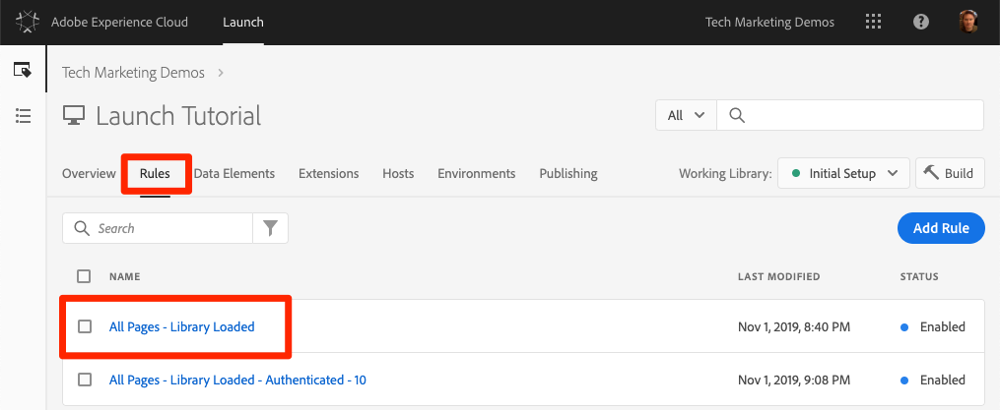
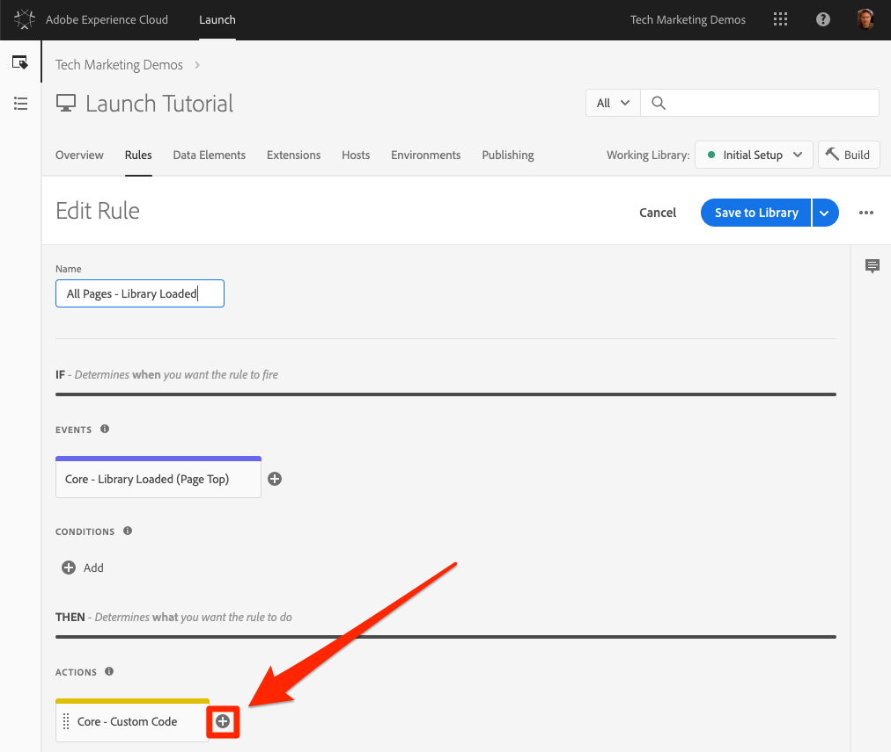
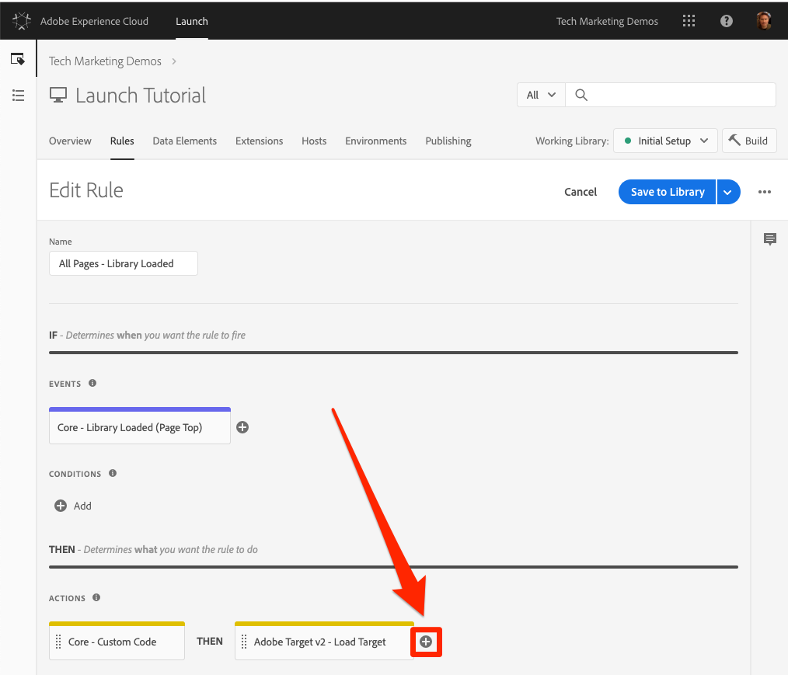
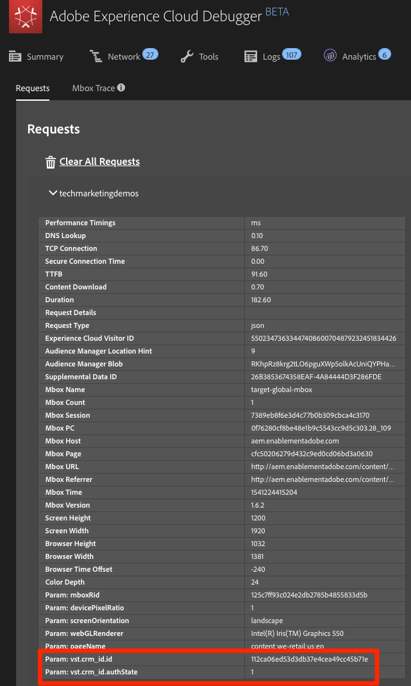

# Hinzufügen von Adobe Target

In dieser Lektion implementieren wir die [Adobe Target-Erweiterung](https://docs.adobe.com/content/help/en/launch/using/extensions-ref/adobe-extension/target-extension/overview.html) mit einer Seitenladeanforderung und benutzerdefinierten Parametern.

[Adobe Target](https://docs.adobe.com/content/help/en/target/using/target-home.html) ist die Adobe Marketing Cloud-Lösung, die alles bietet, was Sie zur Anpassung und Personalisierung der Kundenerfahrung benötigen, sodass Sie den Umsatz Ihrer Websites, mobilen Sites, Apps, sozialen Medien und anderer digitaler Kanäle maximieren können.

## Lernziele

Dies können Sie am Ende dieser Lektion:

* Fügen Sie das Snippet vor dem Ausblenden hinzu, mit dem Flackern verwaltet werden, wenn Sie Target mit asynchronen Starteinbettungscodes verwenden
* Hinzufügen der Target v2-Erweiterung
* Seitenladeanforderung starten (früher "globale Mbox")
* Parameter zur Seitenladeanforderung hinzufügen
* Erläuterung, wie Profil- und Entitätsparameter zur Seitenladeanforderung hinzugefügt werden können
* Bestellbestätigungsanforderung mit erforderlichen Parametern starten
* Erklären, wie Sie erweiterte Konfigurationen wie Bibliothekskopf- und -fußzeile hinzufügen
* Validieren einer Target-Implementierung

## Voraussetzungen 

To complete the lessons in this section, you must first complete the lessons in [Configure Launch](launch.md) and [Add the Identity Service](id-service.md).

## Hinzufügen des vorzeitigen Ausblendepunkts für das Ziel

Bevor wir beginnen, müssen wir die Einbettungscodes für Launch geringfügig aktualisieren. Wenn die Einbettungscodes vom Typ "Start"asynchron geladen werden, kann das Rendern der Seite beendet werden, bevor die Target-Bibliothek vollständig geladen ist und den Inhaltsaustausch durchgeführt hat. Dies kann zu einem so genannten Flackern führen, bei dem Standardinhalt kurz angezeigt wird, bevor er durch den von Target festgelegten personalisierten Inhalt ersetzt wird. Wenn Sie dieses Flackern vermeiden möchten, empfehlen wir dringend, ein spezielles Präventivausschnitt unmittelbar vor dem asynchronen Einbettungscode von Launch zu komprimieren.

Dies wurde bereits auf der Luma-Site durchgeführt, aber machen wir das auf der Beispielseite, damit Sie die Implementierung verstehen. Kopieren Sie die folgenden Codezeilen:

```html
<script>
    //prehiding snippet for Adobe Target with asynchronous Launch deployment
    (function(g,b,d,f){(function(a,c,d){if(a){var e=b.createElement("style");e.id=c;e.innerHTML=d;a.appendChild(e)}})(b.getElementsByTagName("head")[0],"at-body-style",d);setTimeout(function(){var a=b.getElementsByTagName("head")[0];if(a){var c=b.getElementById("at-body-style");c&&a.removeChild(c)}},f)})(window,document,"body {opacity: 0 !important}",3E3);
</script>
```

Öffnen Sie die Beispielseite und fügen Sie sie direkt vor dem Einbettungscode starten wie unten dargestellt ein (keine Sorge, wenn die Zeilennummern unterschiedlich sind):
Bewegen Sie den

Laden Sie Ihre Musterseite erneut. Sie werden feststellen, dass die Seite drei Sekunden lang ausgeblendet wird, bevor sie angezeigt wird. Dieses Verhalten ist temporär und verschwindet, nachdem Sie Target bereitgestellt haben. Dieses Verhalten vor dem Ausblenden wird durch zwei Konfigurationen am Ende des Snippets gesteuert, die angepasst werden können, die jedoch am besten auf den Standardeinstellungen belassen werden:

* `body {opacity: 0 !important}` gibt die CSS-Definition an, die für das Pre-Ausblenden verwendet werden soll, bis Target geladen wird. Standardmäßig wird der gesamte Körper ausgeblendet. Wenn Sie beispielsweise eine konsistente DOM-Struktur mit einem leicht identifizierbaren Containerelement haben, das den gesamten Inhalt unter Ihrer Navigation umschließt, und Sie Ihre Navigation nie testen oder personalisieren möchten, können Sie diese Einstellung verwenden, um das Vorausblenden auf dieses Containerelement zu beschränken.
* `3E3` , der die Timeout-Einstellung für das Pre-Ausblenden angibt. Wenn Target nicht innerhalb von drei Sekunden geladen wurde, wird die Seite standardmäßig angezeigt. Dieser Fall sollte nur extrem selten auftreten.

For more details and to obtain the un-minified pre-hiding snippet, please see [the Adobe Target extension with an asynchronous deployment&#x200B;](https://docs.adobe.com/content/help/en/launch/using/extensions-ref/adobe-extension/target-extension/overview.html#adobe-target-extension-with-an-asynchronous-deployment).

## Target-Erweiterung hinzufügen

Die Adobe Target-Erweiterung unterstützt clientseitige Implementierungen mit dem JavaScript-SDK von Target für das moderne Web "at.js". Customers still using Target's older library, mbox.js, [should upgrade to at.js 2.x](https://docs.adobe.com/content/help/en/target/using/implement-target/client-side/mbox-implement/migrate-mbox/target-atjs-implementation.html) in order to use Launch.

Die Target v2-Erweiterung besteht aus zwei Hauptteilen:

1. der Konfiguration der Erweiterung, die die Einstellungen der Hauptbibliothek verwaltet
1. Regelaktionen für folgende Funktionen:
   1. Load Target (at.js 2.x)
   1. Parameter zu Seitenladereforderungen hinzufügen
   1. Hinzufügen von Parametern zu allen Anfragen
   1. Auslösen einer Seitenladeanfrage

In dieser ersten Übung werden wir die Erweiterung hinzufügen und die Konfigurationen betrachten. In späteren Übungen werden wir die Aktionen nutzen.

**So fügen Sie die Erweiterung hinzu**

1. Zu **[!UICONTROL Erweiterungen &gt; Katalog]**
1. Geben Sie `target` den Filter ein, um die Adobe Target-Erweiterungen schnell zu finden. Es gibt zwei Erweiterungen: Adobe Target und Adobe Target v2. In diesem Tutorial wird die Version v2 der Erweiterung verwendet, die die neueste Version von at.js (derzeit 2.x) verwendet, die sowohl für traditionelle Websites als auch für Einzelseitenanwendungen (SPA) ideal ist.
1. Klicken Sie auf **[!UICONTROL Installieren]**

   

1. Wenn Sie die Erweiterung hinzufügen, werden viele, aber nicht alle at.js-Einstellungen aus der Target-Oberfläche importiert, wie unten dargestellt. Eine Einstellung, die nicht importiert wird, ist das Timeout, das immer 3000 ms nach dem Hinzufügen der Erweiterung beträgt. Behalten Sie für das Tutorial die Standardeinstellungen bei. Beachten Sie, dass auf der linken Seite die at.js-Version angezeigt wird, die mit der aktuellen Version der Erweiterung geliefert wird.

1. Klicken Sie auf In Bibliothek **[!UICONTROL speichern und erstellen]**

   

An diesem Punkt tut Target eigentlich nichts, daher gibt es nichts zu validieren.

>[!NOTE] Jede Version der Target-Erweiterung enthält eine bestimmte Version von at.js, die in der Erweiterungsbeschreibung aufgeführt ist. Sie aktualisieren die at.js-Version, indem Sie die Target-Erweiterung aktualisieren.

## Ziel laden und Seitenladeanforderung starten

Marketingexperten nutzen Target, um das Besuchererlebnis auf der Seite beim Testen und Targeting von Inhalten zu steuern. Aufgrund dieser wichtigen Rolle bei der Anzeige der Seite sollten Sie Target so früh wie möglich laden, um die Auswirkungen auf die Seitenanzeige zu minimieren. In diesem Abschnitt laden wir die JavaScript-Bibliothek von Target - at.js - und starten die Seitenladeanforderung (in früheren Versionen von at.js als "globale Mbox"bezeichnet).

Sie können die `All Pages - Library Loaded` Regel, die Sie in der Lektion "Datenelemente, Regeln und Bibliotheken[](launch-data-elements-rules.md)hinzufügen"erstellt haben, zur Implementierung von Target verwenden, da sie beim Laden der Seite bereits so früh wie möglich ausgelöst wird.

**So laden Sie Target**

1. Navigieren Sie in der oberen Navigationsleiste zu **[!UICONTROL Regeln]** und klicken Sie dann auf `All Pages - Library Loaded`, um den Regel-Editor zu öffnen

   

1. Under Actions, click the  to add a new action

   

1. Wählen Sie **[!UICONTROL Erweiterung &gt; Adobe Target v2]**

1. Aktionstyp auswählen &gt; **[!UICONTROL Ziel laden]**

1. Click **[!UICONTROL Keep Changes]**

   

Mit der `Load Target` hinzugefügten Aktion wird at.js auf der Seite geladen. Es werden jedoch keine Target-Anforderungen ausgelöst, bis die `Fire Page Load Request` Aktion hinzugefügt wurde.

**So laden Sie die Seite**

1. Klicken Sie unter Aktionen erneut auf das SymbolPlus, um eine weitere Aktion hinzuzufügen

   

1. Wählen Sie **[!UICONTROL Erweiterung &gt; Adobe Target v2]**

1. Wählen Sie **[!UICONTROL Aktionstyp &gt; Anforderung zum Laden der Feuerseite.]**

1. Es sind einige Konfigurationen für die Seitenladeanforderung verfügbar, die sich darauf beziehen, ob die Seite und die CSS-Auswahl, die zum Präventiv-Ausblenden verwendet werden sollen, ausgeblendet werden sollen. Diese Einstellungen funktionieren zusammen mit dem auf der Seite fest programmierten Ausblendeffekt. Behalten Sie die Standardeinstellungen bei.

1. Click **[!UICONTROL Keep Changes]**

   

1. Die neue Aktion wird nach der `Load Target` Aktion nacheinander hinzugefügt und die Aktionen werden in dieser Reihenfolge ausgeführt. Sie können die Aktionen per Drag &amp; Drop verschieben, um die Reihenfolge neu anzuordnen. In diesem Szenario `Load Target` müssen Sie jedoch davor stehen `Fire Page Load Request`.

1. Klicken Sie auf In Bibliothek **[!UICONTROL speichern und erstellen]**

   

### Validieren der Seitenladeanforderung

Nachdem Sie die Target v2-Erweiterung hinzugefügt und die Aktionen `Load Target` `Fire Page Load Request` und ausgelöst haben, sollte auf allen Seiten, auf denen Ihre Launch-Eigenschaft verwendet wird, eine Anforderung zum Laden der Seite gesendet werden.

**So validieren Sie die Anforderungsaktionen "Load Target"und "Fire Page Load"**

1. Laden Sie Ihre Musterseite erneut. Die Verzögerung von drei Sekunden sollte nicht mehr angezeigt werden, bevor die Seite sichtbar ist. If you are loading the sample page using the `file://` protocol, you should do this step in Firefox or Safari browsers since Chrome will not fire a Target request when using the `file://` protocol.

1. Open the [Luma site](https://luma.enablementadobe.com/content/luma/us/en.html)

1. Make sure the Debugger is mapping the Launch property to *your* Development environment, as described in the [earlier lesson](launch-switch-environments.md)

   

1. Wechseln Sie zur Registerkarte "Zusammenfassung"des Debuggers

1. Stellen Sie im Abschnitt `Launch` sicher, dass `Target` unter der Überschrift `Extensions` aufgeführt ist

1. Überprüfen Sie im `Target` Abschnitt, ob Ihre "at.js"-Bibliotheksversion angezeigt wird

   

1. Öffnen Sie abschließend die `Target` Registerkarte, erweitern Sie Ihren Clientcode und bestätigen Sie, dass Ihre Seitenladeanforderung angezeigt wird:

   

Herzlichen Glückwunsch! Sie haben Target implementiert!

## Parameter hinzufügen

Die Übergabe von Parametern in der Target-Anforderung erweitert Ihre Targeting-, Test- und Personalisierungsaktivitäten um leistungsstarke Funktionen. Die Erweiterung Launch bietet zwei Aktionen zum Übergeben von Parametern:

1. `Add Params to Page Load Request`, der Parameter zu Seitenladeanforderungen hinzufügt (entspricht der Methode [targetPageParams()](https://docs.adobe.com/content/help/en/target/using/implement-target/client-side/functions-overview/cmp-atjs-functions.html) )

1. `Add Params to All Requests`, der Parameter in allen Target-Anforderungen hinzufügt, z. B. die Seitenladeanforderung plus zusätzliche Anforderungen, die von Aktionen mit benutzerspezifischem Code ausgeführt oder auf Ihrer Site hartcodiert wurden (entspricht der [Methode targetPageParamsAll()](https://docs.adobe.com/content/help/en/target/using/implement-target/client-side/functions-overview/cmp-atjs-functions.html) )

These actions can be used *before* the `Load Target` action and can set different parameters on different pages based on your rule configurations. Verwenden Sie die Regelsortierungsfunktion, die Sie beim Festlegen von Kunden-IDs mit dem Identitätsdienst verwendet haben, um zusätzliche Parameter für das `Library Loaded` Ereignis festzulegen, bevor die Regel die Seitenladeanforderung auslöst.
>[!TIP] Da die meisten Implementierungen die Seitenladeanforderung für die Aktivitätsbereitstellung verwenden, reicht es in der Regel aus, nur die `Add Params to Page Load Requests` Aktion zu verwenden.

### Anforderungsparameter (mbox)

Parameter werden verwendet, um benutzerdefinierte Daten an Target weiterzugeben und damit Ihre Personalisierungsfunktionen zu erweitern. Sie eignen sich ideal für Attribute, die sich während einer Browsersitzung häufig ändern, z. B. den Seitennamen, die Vorlage usw. und nicht bestehen.

Fügen wir als Anforderungsparameter das zuvor erstellte `Page Name` Datenelement in der Lektion "Datenelemente, Regeln und Bibliotheken [hinzufügen](launch-data-elements-rules.md) "hinzu.

**So fügen Sie den Anforderungsparameter hinzu**

1. Navigieren Sie in der oberen Navigationsleiste zu **[!UICONTROL Regeln]** und klicken Sie dann auf `All Pages - Library Loaded`, um den Regel-Editor zu öffnen.

   

1. Under Actions, click the  to add a new action

   

1. Wählen Sie **[!UICONTROL Erweiterung &gt; Adobe Target v2]**

1. Wählen Sie **[!UICONTROL Aktionstyp &gt; Parameter zur Seitenladeanforderung hinzufügen]**

1. Als `pageName`**[!UICONTROL Name eingeben]**

1. Click the  to open the data element modal

1. Klicken Sie auf das `Page Name` Datenelement

1. Klicken Sie auf die Schaltfläche **[!UICONTROL Auswählen]**

   

1. Click **[!UICONTROL Keep Changes]**

   

1. Klicken Sie auf die linke Kante der `Add Params to Page Load Request` Aktion und ziehen Sie sie, um die Aktionen vor der `Fire Page Load Request` Aktion neu anzuordnen (sie können vor oder nach `Load Target`).

1. Klicken Sie auf In Bibliothek **[!UICONTROL speichern und erstellen]**

   

#### Anforderungsparameter überprüfen

Vorläufig sind benutzerdefinierte Parameter, die mit at.js 2.x-Anforderungen übergeben werden, im Debugger nicht leicht sichtbar. Daher werden die Entwicklerwerkzeuge des Browsers verwendet.

**So validieren Sie den pageName-Anforderungsparameter**

1. Laden Sie die Luma-Site neu, und stellen Sie sicher, dass sie Ihrer eigenen Launch-Eigenschaft zugeordnet ist.
1. Öffnen Sie die Entwicklertools Ihres Browsers
1. Klicken Sie auf die Registerkarte Netzwerk
1. Filtern Sie die Anforderungen in `tt.omtrdc` (oder Ihre CNAMEd-Domäne für Target-Anforderungen)
1. Erweitern Sie den Abschnitt `Headers` &gt; `Request Payload` &gt; `execute.pageLoad.parameters` , um den `pageName` Parameter und Wert zu validieren.
   

<!--Now go to the **[!UICONTROL Target]** tab in the Debugger. Expand your client code and look at the requests. You should see the new `pageName` parameter passed in the request:

-->

### Profilparameter

Ähnlich wie bei Anforderungsparametern werden Profilparameter auch über die Target-Anforderung weitergeleitet. However, profile parameters get stored in Target's visitor profile database and will persist for the [duration of the visitor's profile](https://docs.adobe.com/content/help/en/target/using/audiences/visitor-profiles/visitor-profile-lifetime.html). Sie können sie auf einer Seite Ihrer Site einstellen und sie in Target-Aktivitäten auf einer anderen Seite verwenden. Im Folgenden finden Sie ein Beispiel einer Automobilwebsite. Wenn ein Besucher zu einer Fahrzeugseite wechselt, können Sie einen Profilparameter "profile.lastViewed=sportscar"übergeben, um ihr Interesse an diesem bestimmten Fahrzeug aufzuzeichnen. Wenn der Besucher zu anderen, nicht fahrzeugbezogenen Seiten navigiert, können Sie Inhalte auf Basis des zuletzt angezeigten Fahrzeugs als Ziel auswählen.  Profilparameter eignen sich ideal für Attribute, die sich selten ändern oder nur auf bestimmten Seiten verfügbar sind

You won't pass any profile parameters in this tutorial, but the workflow is almost identical to what you just did when passing the `pageName` parameter. Der einzige Unterschied besteht darin, dass Sie Profilparametern ein `profile.`-Präfix voranstellen müssen. So würde ein Profilparameter namens "userType"in der `Add Params to Page Load Request` Aktion aussehen:


### Entitätsparameter

Entitätsparameter sind spezielle Parameter, die aus drei Hauptgründen in [Recommendations-Implementierungen](https://docs.adobe.com/content/help/en/target/using/recommendations/plan-implement.html) verwendet werden:

1. Als Schlüssel zum Auslösen von Produktempfehlungen: Wenn Sie beispielsweise einen Empfehlungsalgorithmus verwenden, z. B. „Personen, die Produkt X angesehen haben, haben auch Produkt Y angesehen“, ist „X“ der „Schlüssel“ der Empfehlung. Es handelt sich normalerweise um die Produkt-SKU (`entity.id`) oder -kategorie (`entity.categoryId`), die der Besucher gerade anzeigt.
1. So erfassen Sie Besucherverhalten, um Empfehlungsalgorithmen wie "Zuletzt angezeigte Produkte"oder "Am meisten angezeigte Produkte"zu aktivieren
1. Zur Füllung des Recommendations-Katalogs: Recommendations enthält eine Datenbank aller Produkte oder Artikel auf Ihrer Website, damit sie im Empfehlungsangebot bereitgestellt werden können. Wenn Sie beispielsweise Produkte empfehlen, möchten Sie normalerweise Attribute wie den Produktnamen (`entity.name`) und ein Produktbild (`entity.thumbnailUrl`) anzeigen. Einige Kunden füllen ihren Katalog mit Backend-Feeds, können aber auch mithilfe von Entitätsparametern in Target-Anforderungen gefüllt werden.

Sie müssen in diesem Lernprogramm keine Profilparameter weitergeben, aber der Arbeitsablauf ist identisch mit dem, was Sie zuvor beim Übergeben des `pageName` Anforderungsparameters getan haben. Geben Sie dem Parameter einfach einen Namen mit dem Präfix "entity"ein. und ordnen Sie sie dem relevanten Datenelement zu. Beachten Sie, dass einige allgemeine Entitäten reservierte Namen haben, die verwendet werden müssen (z. B. entity.id für den Produkt-Sku). So würde es aussehen, wenn Entitätsparameter in der `Add Params to Page Load Request` Aktion festgelegt werden:


### Hinzufügen von Kunden-ID-Parametern

Die Erfassung von Kunden-IDs mit dem Adobe Experience Platform Identity Service erleichtert den Import von CRM-Daten in Target mithilfe der Funktion [Kundenattribute](https://docs.adobe.com/content/help/en/target/using/audiences/visitor-profiles/working-with-customer-attributes.html) in der Adobe Experience Cloud. It also enables [cross-device visitor stitching](https://docs.adobe.com/content/help/en/target/using/integrate/experience-cloud-device-co-op.html), allowing you to maintain a consistent user experience as your customers switch between their laptops and their mobile devices.

Es ist unbedingt erforderlich, die Kunden-ID in der `Set Customer IDs` Aktion des Identitätsdienstes festzulegen, bevor die Seitenladeanforderung ausgelöst wird. Zu diesem Zweck müssen Sie die folgenden Funktionen auf Ihrer Site bereitstellen:

* Die Kunden-ID muss vor dem Einbettungscode starten auf der Seite verfügbar sein
* Die Adobe Experience Platform Identity Service Extension muss installiert werden
* You must use the `Set Customer IDs` action in a rule that fires at the "Library Loaded (Page Top)" event
* Use the `Fire Page Load Request` action in a rule that fires *after* the "Set Customer IDs" action

In der vorherigen Lektion [Hinzufügen des Adobe Experience Platform-Identitätsdiensts](id-service.md)`All Pages - Library Loaded - Authenticated - 10` haben Sie die Regel erstellt, um die Aktion "Kunden-ID festlegen"auszulösen. Da diese Regel eine `Order` Einstellung von hat, werden die Kunden-IDs festgelegt, bevor unsere Seitenladeanforderung von der `10` Regel ausgelöst wird, wobei die `All Pages - Library Loaded` Einstellung `Order``50`. Sie haben also bereits die Sammlung von Kunden-IDs für Target implementiert!

#### Kunden-ID überprüfen

Vorläufig sind benutzerdefinierte Parameter, die mit at.js 2.x-Anforderungen übergeben werden, im Debugger nicht leicht sichtbar. Daher werden die Entwicklerwerkzeuge des Browsers verwendet.

**So validieren Sie die Kunden-ID**

1. Open the [Luma site](https://luma.enablementadobe.com/content/luma/us/en.html)

1. Make sure the Debugger is mapping the Launch property to *your* Development environment, as described in the [earlier lesson](launch-switch-environments.md)

   

1. Melden Sie sich mit den Anmeldeinformationen `test@adobe.com`/`test`
1. Return to the [Luma homepage](https://luma.enablementadobe.com/content/luma/us/en.html)

1. Öffnen Sie die Entwicklertools Ihres Browsers
1. Klicken Sie auf die Registerkarte Netzwerk
1. Filtern Sie die Anforderungen in `tt.omtrdc` (oder Ihre CNAMEd-Domäne für Target-Anforderungen)
1. Erweitern Sie den Abschnitt `Headers` &gt; `Request Payload` &gt; `id.customerIds.0` , um die Einstellungen und den Wert der Kunden-ID zu überprüfen:
   
<!--
1. Open the Debugger
1. Go to the Target tab
1. Expand your client code
1. You should see parameters in the latest Target request for `vst.crm_id.id` and `vst.crm_id.authState`. `vst.crm_id.id` should have a value of the hashed email address and `vst.crm_id.authState` should have a value of `1` to represent `authenticated`. Note that `crm_id` is the `Integration Code` you specified in the Identity Service configuration and must align with the key you use in your [Customer Attributes data file](https://docs.adobe.com/content/help/en/core-services/interface/customer-attributes/t-crs-usecase.html):

-->

>[!WARNING] Mit dem Identitätsdienst für Adobe Experience Platform können Sie mehrere IDs an den Dienst senden. Es wird jedoch nur die erste ID an Target gesendet.

### Eigenschaften-Token-Parameter hinzufügen

>[!NOTE] Dies ist eine optionale Übung für Target Premium-Kunden.

The property token is a reserved parameter used with the Target Premium [Enterprise User Permissions](https://docs.adobe.com/content/help/en/target/using/administer/manage-users/enterprise/property-channel.html) feature. Es wird verwendet, um verschiedene digitale Eigenschaften zu definieren, sodass verschiedenen Mitgliedern eines Experience Cloud-Unternehmens unterschiedliche Berechtigungen für jede Eigenschaft zugewiesen werden können. Sie möchten z. B., dass eine Gruppe von Benutzern Target-Aktivitäten auf Ihrer Website, aber nicht in Ihrer mobilen Anwendung einrichten kann.

Target-Eigenschaften entsprechen den Eigenschaften "Start"und "Analytics-Report Suites". Ein Unternehmen mit mehreren Marken, Websites und Marketing-Teams kann für jede Website oder mobile App eine andere Target-Eigenschaft, Launch-Eigenschaft und Analytics-Report Suite verwenden. Starteigenschaften werden durch ihre Einbettungscodes differenziert, Analytics-Report Suites werden durch ihre Report Suite-ID und Target-Eigenschaften durch ihren Eigenschafts-Token-Parameter differenziert.

Das Eigenschafts-Token wird genau wie ein Anforderungsparameter implementiert. Benennen Sie einfach den Parameter "at_property"und fügen Sie ihn in den Wert ein, der in der Target-Oberfläche bereitgestellt wird.  Wenn Sie mehrere Sites mit einer einzelnen Launch-Eigenschaft implementieren, können Sie den Wert at_property über ein Datenelement verwalten.

Hier ist eine optionale Übung, wenn Sie Target Premium-Kunde sind und ein Eigenschafts-Token in Ihre Tutorial-Eigenschaft implementieren möchten:

1. Öffnen Sie auf einer separaten Registerkarte die Target-Benutzeroberfläche

1. Gehen Sie zu **[!UICONTROL Einstellungen &gt; Eigenschaften]**

1. Identifizieren Sie die Eigenschaft, die Sie verwenden möchten, und klicken Sie auf **[!UICONTROL &lt;/&gt;]** (oder erstellen Sie eine neue Eigenschaft).

1. Copy the `at_property` value to your clipboard

   

1. In your Launch tab, go to the **[!UICONTROL Rules]** in the top navigation and then click on `All Pages - Library Loaded` to open the rule editor.

   

1. Klicken Sie unter Aktionen auf die `Adobe Target - Add Params to Page Load Request` Aktion, um die `Action Configuration`

   

1. Klicken Sie unter dem `pageName` Parameter auf die Schaltfläche **[!UICONTROL Hinzufügen]**

   

1. Name the parameter `at_property` and paste in the value you copied from the Target interface

1. Click **[!UICONTROL Keep Changes]**

   

1. Klicken Sie auf In Bibliothek **[!UICONTROL speichern und erstellen]**
   

#### Validieren des Property-Tokens

Vorläufig sind benutzerdefinierte Parameter, die mit at.js 2.x-Anforderungen übergeben werden, im Debugger nicht leicht sichtbar. Daher werden die Entwicklerwerkzeuge des Browsers verwendet.

**So validieren Sie den Parameter Eigenschafts-Token**

1. Open the [Luma site](https://luma.enablementadobe.com/content/luma/us/en.html)
1. Make sure the Debugger is mapping the Launch property to *your* Development environment, as described in the [earlier lesson](launch-switch-environments.md)

   

1. Öffnen Sie die Entwicklertools Ihres Browsers
1. Klicken Sie auf die Registerkarte Netzwerk
1. Filtern Sie die Anforderungen in `tt.omtrdc` (oder Ihre CNAMEd-Domäne für Target-Anforderungen)
1. Erweitern Sie den Abschnitt `Headers` &gt; `Request Payload` &gt; `property.token` , um den Wert zu überprüfen.
   

<!--
1. Go to the `Target` tab
1. Expand your client code
1. You should see the parameter for "at_property" in every page load request request as you browse the site:

-->

## Benutzerspezifische Anforderungen hinzufügen

### Bestellbestätigungsanfrage hinzufügen

Die Bestellbestätigungsanfrage ist ein spezieller Anforderungstyp, mit dem Bestelldetails an Target gesendet werden. Die Einbeziehung von drei spezifischen Anforderungsparametern - orderId, orderTotal und productPurchasedId - macht eine regelmäßige Target-Anforderung zu einer Bestellanforderung. Neben der Berichterstellung zum Umsatz führt die Bestellanforderung auch folgende Schritte durch:

1. Dedupliziert unbeabsichtigte Wiedergaben von Bestellungen
1. Filtert extreme Bestellungen (Bestellungen, deren Summe mehr als drei Standardabweichungen vom arithmetischen Mittel beträgt).
1. Verwendet im Hintergrund einen anderen Algorithmus zur Berechnung der statistischen Genauigkeit.
1. Erstellt einen speziellen, herunterladbaren Auditbericht für einzelne Bestelldetails.

Die Best Practice ist die Verwendung und Bestellbestätigung in allen Bestellungsformeln, auch auf Nicht-Einzelhandels-Sites. Sites zur Lead-Generierung verfügen beispielsweise in der Regel über Lead-Trichter, bei denen am Ende eine eindeutige „Lead-ID“ generiert wird. Diese Sites sollten eine Bestellanforderung mithilfe eines statischen Werts implementieren (z. "1") für die orderTotal.

Kunden, die die Integration von Analytics for Target (A4T) für die meisten Berichte verwenden, sollten auch die Bestellanforderung implementieren, da A4T noch nicht mit Aktivitätstypen wie automatisierte Zuordnung, automatisierte Personalisierung und automatisches Targeting kompatibel ist. Darüber hinaus ist die Bestellanforderung ein kritisches Element in Recommendations-Implementierungen, das Algorithmen basierend auf dem Kaufverhalten aktiviert.

Die Bestellbestätigungsanfrage sollte von einer Regel ausgelöst werden, die nur auf Ihrer Bestellbestätigungsseite oder Ihrem Ereignis ausgelöst wird. Häufig kann sie mit einer Regel kombiniert werden, die das Kaufereignis von Adobe Analytics festlegt. Sie muss mithilfe der Aktion Benutzerdefinierter Code der Core-Erweiterung mithilfe der entsprechenden Datenelemente konfiguriert werden, um die Parameter orderId, orderTotal und productPurchasedId festzulegen.

Fügen wir die Datenelemente und die Regel hinzu, die wir benötigen, um eine Auftragsbestätigungsanfrage auf der Luma-Site auszulösen. Da Sie bereits mehrere Datenelemente erstellt haben, werden diese Anweisungen abgekürzt.

**So erstellen Sie das Datenelement für die Bestell-ID**

1. Klicken Sie in der oberen Navigation auf **[!UICONTROL Datenelemente]** .
1. Klicken Sie auf Datenelement **[!UICONTROL hinzufügen]**
1. Benennen Sie das Datenelement `Order Id`
1. Wählen Sie **[!UICONTROL Datenelementtyp &gt; JavaScript-Variable]**
1. Verwenden Sie `digitalData.cart.orderId` als `JavaScript variable name`
1. Check the `Clean text` option
1. Klicken Sie auf **[!UICONTROL In Bibliothek]** speichern (Wir werden die Bibliothek erst dann erstellen, wenn wir alle Änderungen für die Auftragsbestätigungsanforderung vorgenommen haben)

**So erstellen Sie das Datenelement für den Warenkorbbetrag**

1. Klicken Sie auf Datenelement **[!UICONTROL hinzufügen]**
1. Benennen Sie das Datenelement `Cart Amount`
1. Wählen Sie **[!UICONTROL Datenelementtyp &gt; JavaScript-Variable]**
1. Verwenden Sie `digitalData.cart.cartAmount` als `JavaScript variable name`
1. Check the `Clean text` option
1. Klicken Sie auf In Bibliothek **[!UICONTROL speichern]**

**So erstellen Sie das Datenelement für Warenkorb-SKUs (Target)**

1. Klicken Sie auf Datenelement **[!UICONTROL hinzufügen]**
1. Benennen Sie das Datenelement `Cart SKUs (Target)`
1. Wählen Sie **[!UICONTROL Datenelementtyp &gt; Benutzerdefinierter Code]**
1. Für Target müssen die SKUs in Form einer kommagetrennten Liste vorliegen. Dieser benutzerdefinierte Code formatiert das Datenschichtarray in das richtige Format. Fügen Sie im Editor für benutzerspezifischen Code Folgendes ein:

   ```javascript
   var targetProdSkus="";
   for (var i=0; i<digitalData.cart.cartEntries.length; i++) {
     if(i>0) {
       targetProdSkus = targetProdSkus + ",";
     }
     targetProdSkus = targetProdSkus + digitalData.cart.cartEntries[i].sku;
   }
   return targetProdSkus;
   ```

1. Check the `Force lowercase value` option
1. Check the `Clean text` option
1. Klicken Sie auf In Bibliothek **[!UICONTROL speichern]**

Nun müssen wir eine Regel erstellen, um die Auftragsbestätigungsanfrage mit diesen Datenelementen als Parameter auf der Bestellbestätigungsseite auszulösen.

**So erstellen Sie die Regel für die Seite "Auftragsbestätigung"**

1. Click **[!UICONTROL Rules]** in the top navigation
1. Klicken Sie auf **[!UICONTROL Regel hinzufügen]**
1. Geben Sie einen Namen für die Regel ein `Order Confirmation Page - Library Loaded - 60`
1. Klicken Sie auf **[!UICONTROL Ereignisse &gt; Hinzufügen]**
   1. Wählen Sie **[!UICONTROL Ereignistyp &gt; Bibliothek geladen (Seitenanfang)]**
   1. Ändern Sie die `Order` Einstellung, `60` sodass sie nach der `Load Target` Aktion ausgelöst wird (in unserer `All Pages - Library Loaded` Regel `Order` auf `50`)
   1. Click **[!UICONTROL Keep Changes]**
1. Klicken Sie auf **[!UICONTROL Bedingungen &gt; Hinzufügen]**
   1. Wählen Sie **[!UICONTROL Bedingungstyp &gt; Pfad ohne Abfragezeichenfolge]**
   1. Für `Path equals` Eingabe `thank-you.html`
   1. Schalten Sie die Regex-Option ein, um die Logik von `equals` in zu ändern `contains` (Sie können die `Test` Funktion verwenden, um zu bestätigen, dass der Test mit der URL bestehen wird. `https://luma.enablementadobe.com/content/luma/us/en/user/checkout/order/thank-you.html`

      

   1. Click **[!UICONTROL Keep Changes]**
1. Klicken Sie auf **[!UICONTROL Aktionen &gt; Hinzufügen]**
   1. Wählen Sie **[!UICONTROL Aktionstyp &gt; Benutzerdefinierter Code]**
   1. Click **[!UICONTROL Open Editor]**
   1. Paste the following code into the `Edit Code` modal

      ```javascript
      adobe.target.getOffer({
        "mbox": "orderConfirmPage",
        "params":{
           "orderId": _satellite.getVar('Order Id'),
           "orderTotal": _satellite.getVar('Cart Amount'),
          "productPurchasedId": _satellite.getVar('Cart SKUs (Target)')
        },
        "success": function(offer) {
          adobe.target.applyOffer({
            "mbox": "orderConfirmPage",
            "offer": offer
          });
        },
        "error": function(status, error) {
          console.log('Error', status, error);
        }
      });
      ```

   1. Click **[!UICONTROL Save]** to save the custom code
   1. Klicken Sie auf Änderungen **[!UICONTROL beibehalten]** , um die Aktion beizubehalten
1. Klicken Sie auf In Bibliothek **[!UICONTROL speichern und erstellen]**

#### Bestätigen der Auftragsbestätigungsanfrage

Vorläufig sind benutzerdefinierte Parameter, die mit at.js 2.x-Anforderungen übergeben werden, im Debugger nicht leicht sichtbar. Daher werden die Entwicklerwerkzeuge des Browsers verwendet.

1. Open the [Luma site](https://luma.enablementadobe.com/content/luma/us/en.html)

1. Make sure the Debugger is mapping the Launch property to *your* Development environment, as described in the [earlier lesson](launch-switch-environments.md)

   

1. Fügen Sie auf der Site mehrere Produkte zu Ihrem Einkaufswagen hinzu
1. Begeben Sie sich zum Checkout
1. During the checkout process the only required fields are `First Name` and `Last Name`

   

1. On the Review Order page, be sure to click the `Place Order` button
1. Öffnen Sie die Entwicklertools Ihres Browsers
1. Klicken Sie auf die Registerkarte Netzwerk
1. Filtern Sie die Anforderungen in `tt.omtrdc` (oder Ihre CNAMEd-Domäne für Target-Anforderungen)
1. Klicken Sie auf die zweite Anforderung
1. Erweitern Sie den Abschnitt `Headers` &gt; `Request Payload` &gt; `execute.mboxes.0` , um den Anforderungsnamen und die Bestellparameter zu validieren:
   
<!--
1. Look in the Debugger
1. Go to the Target tab
1. Expand your client code
1. You should see the `orderConfirmPage` request as the latest Target request with the orderId, orderTotal, and productPurchasedId parameters populated with the details of your order

   -->

### Benutzerspezifische Anforderungen

Es gibt seltene Fälle, in denen Sie Target-Anforderungen außer der Anforderung zum Laden und Bestätigen von Seiten anfordern müssen. Beispielsweise werden manchmal wichtige Daten, die Sie für die Personalisierung verwenden möchten, nicht auf der Seite vor den Einbettungscodes vom Typ "Start"definiert. Sie können am Ende der Seite fest codiert sein oder von einer asynchronen API-Anforderung zurückgegeben werden. Diese Daten können weiterhin mit einer zusätzlichen Anforderung an Target gesendet werden, obwohl es nicht optimal ist, diese Anforderung für die Inhaltsbereitstellung zu verwenden, da die Seite bereits sichtbar ist. Sie kann verwendet werden, um das Besucherprofil für eine spätere Verwendung (mithilfe von Profilparametern) zu bereichern oder den Recommendations-Katalog zu füllen.

In these circumstances, use the Custom Code action in the Core extension to fire a request using the
[getOffer()](https://docs.adobe.com/content/help/en/target/using/implement-target/client-side/functions-overview/adobe-target-getoffer.html)/[applyOffer()](https://docs.adobe.com/content/help/en/target/using/implement-target/client-side/functions-overview/adobe-target-applyoffer.html) and [trackEvent()](https://docs.adobe.com/content/help/en/target/using/implement-target/client-side/functions-overview/adobe-target-trackevent.html)
methods. This is very similar to what you just did in the [Order
Confirmation request](#order-confirmation-request) exercise, but you will just use a different request name and will not use the special order parameters. Be sure to use the **[!UICONTROL Load Target]** action before making Target requests from custom code.

## Bibliothekskopf- und -fußzeile

Im Bildschirm "at.js bearbeiten"der Benutzeroberfläche von Target können Sie benutzerdefinierte JavaScript-Elemente einfügen, die unmittelbar vor oder nach der Datei "at.js"ausgeführt werden. The Library Header is sometimes used to override at.js settings via the
[targetGlobalSettings()](https://docs.adobe.com/content/help/en/target/using/implement-target/client-side/functions-overview/targetgobalsettings.html) function or pass data from third parties using the [Data Providers](https://docs.adobe.com/content/help/en/target-learn/tutorials/integrations/use-data-providers-to-integrate-third-party-data.html) feature. Die Bibliotheksfußzeile wird manchmal verwendet, um [at.js benutzerdefinierte Ereignis](https://docs.adobe.com/content/help/en/target/using/implement-target/client-side/functions-overview/atjs-custom-events.html) -Listener hinzuzufügen.

Um diese Funktion beim Start zu replizieren, verwenden Sie einfach die Aktion Benutzerdefinierter Code in der Core-Erweiterung und sequenzieren Sie die Aktion vor (Bibliothekskopfzeile) oder nach (Bibliotheksfußzeile) der Aktion Ziel laden. This can be done in the same rule as the `Load Target` action (as pictured below) or in separate rules with events or order settings that will reliably fire before or after the rule containing `Load Target`:


Weitere Informationen zu Anwendungsfällen für benutzerdefinierte Kopf- und Fußzeilen finden Sie in den folgenden Ressourcen:

* [Verwenden von dataProviders zur Integration von Drittanbieterdaten in Adobe Target](https://docs.adobe.com/content/help/en/target-learn/tutorials/integrations/use-data-providers-to-integrate-third-party-data.html)
* [Implementierung von dataProviders zur Integration von Drittanbieterdaten in Adobe Target](https://docs.adobe.com/content/help/en/target-learn/tutorials/integrations/implement-data-providers-to-integrate-third-party-data.html)
* [Verwenden von Antwort-Token und benutzerspezifischen at.js-Ereignissen mit Adobe Target](https://docs.adobe.com/content/help/en/target-learn/tutorials/integrations/use-response-tokens-and-atjs-custom-events.html)

[Nächste "Adobe Analytics hinzufügen"&gt;](analytics.md)
